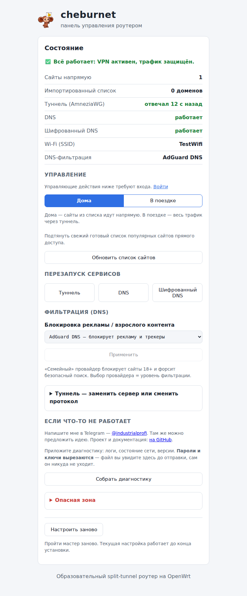

<div align="center">


# cheburnet-router

### Automatic split tunneling for your whole home: chosen sites go direct, everything else through the VPN.

Set up an OpenWrt router once — every device on the Wi-Fi is covered: phones, laptops, smart TVs,
consoles. No app to install per device. The router decides per request: domains on **your** direct
list take the plain route (full speed, real IP — banks and local services keep working), all other
traffic goes into an encrypted tunnel. Three VPN protocols to pick from, switchable in the web
panel without reinstalling.

[](https://openwrt.org/)
[](LICENSE)

<a href="assets/web-mgmt.png"></a>

</div>

> **Full documentation is in Russian** — see [README.md](README.md) and [`docs/`](docs/).
> This page is a summary for English-speaking visitors.

## Why it might interest you

- **Split tunneling driven by DNS, not by an app.** `dnsmasq-nftset` drops resolved IPs of your
  direct-list domains into an nftables set, nftables marks the packets, policy routing sends them
  out through the WAN. Everything else defaults to the tunnel — a list miss leaks *into* the VPN,
  never out.
- **No resident proxy on the fast path.** The data plane is pure kernel: dnsmasq + nftables +
  `ip rule` + AmneziaWG. Runs on a 128 MB RAM router; throughput is not bound by a userspace hop.
- **Three protocols by failure mode, not by menu.** AmneziaWG (default, kernel, fastest),
  VLESS+Reality (when the connection is not established at all), Hysteria2 (when the link is lossy
  — measured: holds ~100% of throughput at 5% packet loss vs 9–14% for TCP-based transports).
  The extra two run on `sing-box-tiny` and are gated by a hardware preflight.
- **Engine written in [ucode](https://github.com/jow-/ucode)**, not shell or Python: real types and
  exceptions, native uci/ubus bindings, zero runtime footprint, architecture-independent package
  (`PKGARCH:=all`). Setup wizard is Svelte talking to the router over ubus RPC.
- **Encrypted DNS (DoH), network-wide ad/tracker filtering, family filter, kill-switch** — all
  configured by the browser wizard, no config files to hand-edit.

## Installation

Requires a router running OpenWrt 25.12+ (≥128 MB RAM, ≥16 MB free flash) and an AmneziaWG `.conf`
from your own VPS or any compatible provider.

```sh
ssh root@192.168.1.1
```
```sh
wget -O /tmp/cheburnet.sh https://raw.githubusercontent.com/andreiyurik/cheburnet-router/master/bootstrap/bootstrap.sh
sh /tmp/cheburnet.sh
```

The installer prints a one-time link to the web wizard at `http://192.168.1.1/cheburnet/?token=…`.
Upload the `.conf`, set passwords and Wi-Fi, press Install. Failed steps roll back automatically.

## Design notes

The project is educational first: no black boxes, only standard primitives you can inspect with
`nft list ruleset` and `ip rule show`. That is also why sing-box was rejected as the default
data plane — see [ADR 0001](docs/kb/decisions/0001-why-not-singbox.md) (Russian) and the
[architecture document](docs/architecture.md).

Contributions welcome — [CONTRIBUTING.md](CONTRIBUTING.md). Security reports —
[SECURITY.md](SECURITY.md). Questions and problems — please
[open an issue](https://github.com/andreiyurik/cheburnet-router/issues/new/choose) (preferred: the
answer stays where the next person will find it), or write to
[Telegram @industrialprofi](https://t.me/industrialprofi).

[MIT License](LICENSE)
