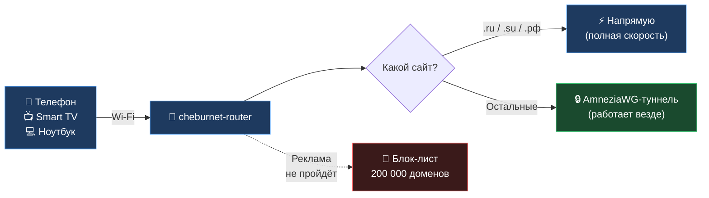
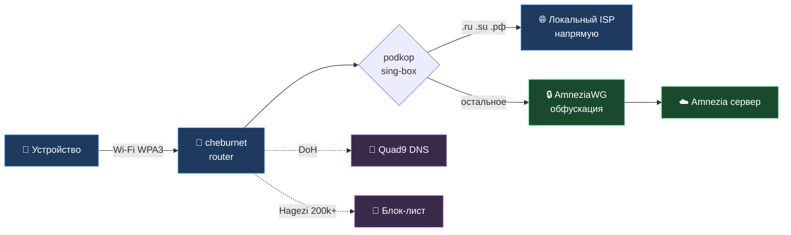

<div align="center">


# cheburnet-router

### Один роутер — защищённый интернет для всех устройств в доме

Роутер **АВТОМАТИЧЕСКИ** разделяет трафик: локальные сайты, банки и государственные сервисы — напрямую, на полной скорости, без сбоев; зарубежные ресурсы — через зашифрованный туннель; реклама не загружается. На телефоне, на Smart TV, на консоли. **Роутер настроен и делает всё сам — нет необходимости переключать руками.**

Весь код открыт — каждую строчку можно проверить.  
Проект показывает, что современный open-source для роутеров даёт профессиональную защиту без закрытых приложений.

[](https://github.com/yurik2718/cheburnet-router/stargazers)
[](https://openwrt.org/)
[](https://amnezia.org/)
[](LICENSE)
[](https://t.me/industrialprofi)

[**🚀 Установить за вечер**](#-установка-за-один-вечер) · [**💸 Сколько это стоит**](#-сколько-это-стоит) · [**🧒 Семейный режим**](#-семейный-режим) · [**❓ FAQ**](#-faq) · [**🔬 Под капотом**](#-под-капотом)

<a href="assets/web-mgmt.png"></a>

<sub>Веб-панель <code>/cheburnet/</code> — статус сервисов, переключение режимов, семейный фильтр, замена VPN-конфига одним кликом</sub>

</div>

---

## 💡 Зачем всё это?

> **Интернет — как электричество.** Одно и то же напряжение лечит в больнице, светит детям над уроками, питает холодильник — и убивает за две секунды без автомата защиты в щитке. Никто не отказывается от электричества. Специалисты им грамотно управляют.

У большинства людей интернет ворует часы в лентах соцсетей, спроектированных так, чтобы нельзя было оторваться; затаскивает детей в контент, который никто не выбирал смотреть; продаёт внимание тому, кто заплатил больше. У меньшинства, кто учится с ним работать — это библиотека всего человечества, мировой рынок труда и связь с людьми на любом континенте.

Разница не в самом интернете, а в **точке, через которую он входит к тебе домой**. Этот проект — про эту точку. Роутер на OpenWrt — открытая, программируемая база: ты сам решаешь, что блокируется, что шифруется, куда идёт трафик. Не «кнопка VPN» из чужого приложения, которая завтра может исчезнуть, а собственный сетевой щит, настроенный под твою семью.

**Компетентность — это твой автомат защиты.** Чем лучше ты понимаешь, как устроено оборудование вокруг тебя, тем меньше у тебя зависимости от чужих решений и тем больше контроля над собственной жизнью. Этот проект — рабочий стенд для того, чтобы разобраться, как реально устроены VPN-туннели (AmneziaWG/WireGuard), шифрованный DNS, split-routing, фильтрация трафика. Те же технологии — в корпоративных сетях, банкинге, в любой защищённой работе из публичных Wi-Fi. Их применение **легально в большинстве стран**. Проект не призывает нарушать законы — он про осознанное использование своего железа.

---

## 🎯 Кому подойдёт, а кому нет

**Подойдёт, если ты:**
- Хочешь, чтобы реклама не загружалась ни на одном устройстве в доме — включая Smart TV и игровую приставку
- Устал настраивать VPN на каждом устройстве отдельно (а на телевизоре и принтере его и не поставить)
- Платишь за 2–3 VPN-сервиса, потому что один не покрывает все устройства
- Готов потратить вечер на установку, чтобы потом не думать об этом годами
- Хочешь понимать, как реально работает твоя сеть, а не доверяться чёрному ящику

**Не подойдёт, если ты:**
- Ищешь «кнопку», которую ставят на телефон за 30 секунд — это про настройку роутера, не приложения
- Не готов потратить ~$45 на роутер + ~325 ₽/мес на VPN-сервер — бесплатной альтернативы нет

---

## 🎁 Что ты получишь

| До установки | После установки |
|---|---|
| Реклама в YouTube, на сайтах, в приложениях | Не загружается ни на одном устройстве в Wi-Fi |
| На каждом устройстве настраиваешь VPN отдельно | Подключился к Wi-Fi — всё работает. Любое устройство, любая ОС |
| Smart TV и приставка — без защиты | Работают так же, как телефон с VPN |
| Банковские приложения отваливаются с VPN | Финансы и `.ru` идут напрямую (split-routing) |
| Платишь 3 раза за разные VPN-сервисы | Один сервер на всю семью, до 7 устройств |
| Провайдер видит каждый сайт, который ты открыл | Шифрованный DNS — провайдер видит только зашифрованный поток |

---

## 🔄 Как это работает



Роутер сам решает, куда отправить трафик. `.ru/.su/.рф` идут напрямую — на полной скорости, без задержки VPN. Остальное — через зашифрованный туннель: приватность DNS, защита от отслеживания на уровне сети, стабильная работа из публичных Wi-Fi. Реклама режется сразу на роутере, до того как успеет дойти до устройства.

**На устройствах ничего настраивать не надо.** Подключился к Wi-Fi — всё работает.

---

## 🚀 Установка за один вечер

| # | Шаг | Время | Стоимость |
|---|---|---|---|
| 1 | Купить роутер c поддержкой OpenWrt 25.12+ и ≥ 256 МБ RAM | 5 мин + ~неделя ожидания | **~$35–60 разово** |
| 2 | Прошить OpenWrt — [пошаговая инструкция](docs/00-flash-openwrt.md) | ~30 мин | бесплатно |
| 3 | Купить VPN-подписку (см. ниже) | ~5 мин | **от 325 ₽/мес** на 7 устройств |
| 4 | Запустить установщик — 4 экрана с вопросами | ~15 мин | бесплатно |

**Итого:** один вечер субботы. Дальше работает годами без вмешательства.

### Команда для шага 4

Когда роутер прошит и `.conf` VPN-сервера у тебя в руках — открой терминал и вставь команду. Она скачает установщик и проверит его подпись (защита от подмены).

> **Где взять терминал:** **Windows** — правый клик по «Пуск» → **PowerShell**. **macOS** — Spotlight (⌘+Space) → `Terminal`. **Linux** — `Ctrl+Alt+T`.

**Linux / macOS:**
```bash
ssh-keygen -R 192.168.1.1 2>/dev/null; ssh -o StrictHostKeyChecking=accept-new root@192.168.1.1 'wget -qO- https://raw.githubusercontent.com/yurik2718/cheburnet-router/master/install.sh | sh'
```

**Windows (PowerShell):**
```powershell
ssh-keygen -R 192.168.1.1 2>$null; ssh -o StrictHostKeyChecking=accept-new root@192.168.1.1 "wget -qO- https://raw.githubusercontent.com/yurik2718/cheburnet-router/master/install.sh | sh"
```

<details>
<summary>Почему команды разные и что делать, если не работает</summary>

<br>

`ssh-keygen -R` нужен тем, кто уже ставил роутер раньше: после прошивки или factory reset роутер генерирует новый SSH host key, а ноутбук помнит старый и ругается `WARNING: REMOTE HOST IDENTIFICATION HAS CHANGED!` При первой установке этот префикс молча ничего не делает.

Команда **разная** для Linux/macOS и Windows: (1) `2>/dev/null` в PowerShell пишет в файл `C:\dev\null` — нужно `2>$null`; (2) одинарные кавычки `'...'` PowerShell передаёт в ssh иначе, чем bash, из-за чего `| sh` может перехватиться как оператор пайпа — используем двойные кавычки.

**Не работает?** Убедись, что запущен **PowerShell**, а не cmd (в заголовке окна должно быть «PowerShell»). Если `ssh` не найден — обнови Windows до 1809+.

</details>

После запуска открой в браузере **`http://192.168.1.1/cheburnet/`** — пройдёшь 4 экрана: загрузишь `.conf`, придумаешь пароль администратора, имя и пароль Wi-Fi, нажмёшь «Начать установку». Дальше роутер сделает всё сам — установка идёт ~12 минут, прогресс видно прямо в браузере.

<div align="center">


<sub>Веб-мастер установки — шаг 1 из 4, загрузка <code>.conf</code> VPN-сервера</sub>

</div>

После установки на том же адресе открывается **панель управления** — статус сервисов, переключение режимов, рестарт VPN/DNS/блок-листа, семейный режим, замена `.conf` без переустановки, factory reset.

---

## 💸 Сколько это стоит

**Разово:** ~$45 за роутер (например, Cudy TR3000 на AliExpress).
**Подписка:** от 325 ₽/мес за VPN-сервер на 7 устройств.

<div align="center">

### 👉 [Купить Amnezia Premium со скидкой 15% →](https://storage.googleapis.com/amnezia/amnezia.org?m-path=premium&arf=EB5KDKXCJYQYP4MG&coupon=CHEBURNET15)

*Промокод `CHEBURNET15` — скидка 15%, поддерживает развитие проекта.*

</div>

**Почему именно AmneziaWG?** Это форк WireGuard с настраиваемым transport layer — устойчив там, где обычный WireGuard теряет handshake (агрессивный трафик-шейпинг, публичные Wi-Fi, мобильные операторы с нестандартной маршрутизацией). Открытый протокол, открытые клиенты под все ОС, открытый сервер — если сервис когда-то исчезнет, ты поднимешь то же самое на своём VPS по той же документации.

**Можно ли бесплатно?** Нет — и это честно. VPN-туннелю нужно где-то заканчиваться: на сервере за рубежом, за который кто-то платит. Бесплатные VPN либо медленные, либо продают твои данные, либо отключатся через месяц. Чудес не бывает.

**Зато выгода считается:** обычная семья платит 3–5 × ~400 ₽/мес = **1200–2000 ₽/мес** за разные VPN-сервисы. Один сервер на всю семью — **от 325 ₽/мес**, и Smart TV/приставка тоже работают.

---

## 🧒 Семейный режим

Один тумблер в веб-панели — и роутер делает **две вещи сразу** для всех устройств в Wi-Fi:

1. **Блокирует ~95 600 NSFW-сайтов** — список [Hagezi NSFW](https://github.com/hagezi/dns-blocklists) добавляется к обычному блок-листу. Браузер не получает IP, видит обычную ошибку «сайт недоступен».
2. **Принудительно включает SafeSearch** в Google, Bing, DuckDuckGo, Yandex и YouTube (Strict) — даже если в самом сервисе он выключен. Закрывается дыра, через которую дети обычно находят контент: поиск картинок и YouTube-рекомендации.

Включается мгновенно, можно ставить только на время — например, пока дети не спят.

<details>
<summary>Что важно понимать про ограничения семейного режима</summary>

<br>

- Это **DNS-фильтр**, а не родительский контроль внутри сервисов. TikTok / Instagram-feed / Telegram-чат фильтру не виден — контент идёт по HTTPS внутри одного домена; для них нужны встроенные ограничения возраста.
- Не действует на устройство, у которого включён **свой VPN или свой DoH** в браузере — оно ходит мимо роутера. Для подростков, которые умеют это обходить, нужны другие методы.
- Покрытие — крупные NSFW-домены и зеркала; нишевые могут не попадать. Список обновляется автоматически.

Технические детали и полный список SafeSearch-перенаправлений — [docs/04-adblock.md](docs/04-adblock.md#-семейный-фильтр).

</details>

---

## ❓ FAQ

<details>
<summary><b>Это легально?</b></summary>

<br>

В большинстве стран — да. VPN, шифрованный DNS, split-routing — стандартные технологии, которые используют банки, корпорации и удалённые сотрудники. Проект образовательный, не призывает обходить блокировки в странах, где это запрещено. Ответственность за соблюдение местного законодательства — на пользователе.

</details>

<details>
<summary><b>Безопасно ли запускать <code>wget | sh</code>?</b></summary>

<br>

Установщик подписан, и команда проверяет подпись перед запуском. Исходный код полностью открыт — можно прочитать [install.sh](install.sh) и [setup/](setup/) перед запуском. Альтернатива — клонировать репозиторий и запустить `./setup.sh` вручную (см. раздел «Под капотом»).

</details>

<details>
<summary><b>Скорость интернета упадёт?</b></summary>

<br>

На локальные сайты (`.ru/.su/.рф`) — нет, они идут напрямую через провайдера. На остальные — зависит от качества VPN-сервера и твоего канала; AmneziaWG работает на уровне ядра ОС, потолок для бытового роутера обычно 200–500 Мбит/с. Для просмотра видео, мессенджеров и веба разница не ощущается.

</details>

<details>
<summary><b>Что если VPN-сервер недоступен?</b></summary>

<br>

Включаются три независимых слоя kill switch — трафик не утечёт в открытую сеть. Локальные сайты (`.ru/.su/.рф`) продолжают работать. В веб-панели видно, что VPN упал, и можно одним кликом перезапустить или сменить `.conf`. Подробнее: [docs/08-killswitch.md](docs/08-killswitch.md).

</details>

<details>
<summary><b>Чем это лучше NordVPN / Proton / любого коммерческого VPN?</b></summary>

<br>

Коммерческие сервисы — закрытый клиент на твоём устройстве. Здесь — открытый код на твоём роутере, защита автоматически на всех устройствах в Wi-Fi, без приложений и без передачи списка посещённых сайтов закрытой компании. Плюс настраиваемый split-routing, который коммерческие сервисы делают плохо или не делают вообще.

</details>

<details>
<summary><b>А если я переезжаю или меняю провайдера?</b></summary>

<br>

Роутер можно брать с собой. Подключил к новому интернету — всё работает как раньше.

**Не хочешь менять основной роутер дома?** Подключи `cheburnet-router` через Ethernet (WAN-портом) к старому роутеру — получишь **вторую Wi-Fi-сеть** рядом со старой. Устройства, которые подключаются к новой сети, идут через VPN и блок рекламы; остальные продолжают работать через старый роутер как обычно. Удобно для постепенного перехода и для того, чтобы решать, какие именно устройства защищать.

Если нужен полный туннель (весь трафик через VPN, без исключений для `.ru`) — есть **TRAVEL-режим**: переключается одной командой `vpn-mode travel` или из веб-панели. Подробнее: [docs/07-modes.md](docs/07-modes.md).

</details>

<details>
<summary><b>Мой роутер подойдёт?</b></summary>

<br>

Любой современный с OpenWrt 25.12+ и ≥ 256 МБ RAM. Проверенные модели и совместимость — в разделе «Под капотом».

</details>

---

## 💬 Если что-то не получается

Я веду этот проект сам. Если ты застрял на любом шаге, или что-то не работает после установки, или просто есть вопросы — **пиши мне напрямую в Telegram: [@industrialprofi](https://t.me/industrialprofi)**.

Я отвечаю всем. Цель — чтобы установка реально работала у обычных людей, а не только у программистов. Если у тебя не получается — значит, мне есть что улучшить, и твоё сообщение поможет.

---

## ❤️ Поддержать проект

Я делаю всё один — код, документация, ответы в Telegram, разбор багов у конкретных людей. Это часы после основной работы. У меня большая семья, и каждый вечер на cheburnet-router конкурирует с подработкой. **Поэтому я считаю поддержку в часах: 100 ₽ ≈ 15 минут разбора чьего-то бага в TG, 500 ₽ ≈ вечер кода, 2000 ₽ ≈ выходной на новую фичу.** Любая сумма, действительно, помогает — и это сигнал, что проект нужен, и мотивация продолжать каждый день.

**Три способа помочь** (от бесплатного к платному):

### ⭐ 1. Поставь звезду на GitHub — 2 секунды, бесплатно

Каждая звезда поднимает проект в поиске; больше людей, кому он реально нужен, его находят. Для open-source это самая ценная бесплатная поддержка.

[](https://github.com/yurik2718/cheburnet-router/stargazers)

### 🔗 2. Купи Amnezia Premium со скидкой 15% — [промокод CHEBURNET15](https://storage.googleapis.com/amnezia/amnezia.org?m-path=premium&arf=EB5KDKXCJYQYP4MG&coupon=CHEBURNET15)

Промокод уже встроен в ссылку. Тебе −15% к цене, проекту — поддержка.

### 💳 3. Донат — от 100 ₽

| Способ | Реквизиты |
|---|---|
| 💳 **CloudTips** (карта / СБП) | [pay.cloudtips.ru/p/61fe8ef3](https://pay.cloudtips.ru/p/61fe8ef3) |

<div align="center">

<a href="https://pay.cloudtips.ru/p/61fe8ef3"></a>

<sub>Отсканируй камерой телефона — откроется страница оплаты</sub>

</div>

<details>
<summary>💎 Криптовалюта (TON, Bitcoin)</summary>

<br>

| Сеть | Адрес |
|---|---|
| **TON** | `UQC2KsPX-Ad9P8x_VbN3GHbpacOMvYPIbZvLppb-sxJ88KfV` |
| **Bitcoin** | `bc1qen3tutepyqjtsn7meggcertp6x4m0492vkg4m2` |

Deep-link для Tonkeeper и нюансы по сетям — [docs/support.md](docs/support.md).

</details>

> Другие способы поддержать: поставь ⭐, расскажи друзьям, пришли PR или баг-репорт. Большое спасибо! 🙏

---

## ⚠️ Что нужно знать заранее

- 🟡 **Это не антивирус** — защищает сеть, не лечит malware на устройствах.
- 🟡 **Нужен VPN-сервер** — без подписки или своего VPS работает только локальная часть: блок рекламы и прямой роутинг `.ru/.su/.рф`.

---

<details>
<summary><h2>🔬 Под капотом — для тех, кто хочет понимать что внутри</h2></summary>

<br>

> Этот раздел для технически подкованных читателей и контрибьюторов. Архитектура, использованные технологии, CLI, документация.


### Архитектура потока трафика



Трафик от устройств идёт через роутер, где `podkop + sing-box` решает по домену — `.ru/.su/.рф` напрямую, остальное в `AmneziaWG`-туннель с обфускацией. Параллельно DNS шифруется через Quad9 DoH, а реклама режется DNS-фильтром на роутере.

### Использованные технологии

| Технология | Роль | Подробно |
|---|---|---|
| **AmneziaWG 2.0 + I1 CPS** | VPN-туннель с обфускацией: decoy-пакеты, маскировка под HTTPS, custom protocol signature | [docs/02](docs/02-amneziawg.md) |
| **Podkop + sing-box** | Policy-based routing на FakeIP: `.ru/.su/.рф` напрямую, остальное через VPN | [docs/03](docs/03-podkop-routing.md) |
| **Three-layer kill switch** | Defense-in-depth: sing-box bind + TPROXY + fw4 — три независимых слоя | [docs/08](docs/08-killswitch.md) |
| **Quad9 DoH** | DNS-over-HTTPS, провайдер не видит DNS-запросы | [docs/05](docs/05-dns.md) |
| **adblock-lean + Hagezi** | DNS-фильтр, ~200k рекламных доменов; защита для всех устройств в Wi-Fi | [docs/04](docs/04-adblock.md) |
| **WPA3 SAE + PMF** | Современное шифрование Wi-Fi: SAE handshake, защита фреймов управления | [docs/06](docs/06-wifi.md) |
| **AWG watchdog** | Авто-перезапуск туннеля при зависании handshake | cron + `awg-watchdog` |

### Альтернативы AmneziaWG, которые я рассматривал

- **Голый WireGuard** — отлично, если у тебя свой VPS и канал к нему стабильный.
- **OpenVPN** — заметно медленнее, выше нагрузка на CPU, без выигрыша в домашнем сценарии.
- **Shadowsocks / V2Ray / Xray** — мощные, но требуют ручной настройки и обслуживания.
- **Коммерческие VPN-сервисы** — закрытые клиенты, слабая интеграция с OpenWrt, нет настраиваемой обфускации.

### Альтернатива веб-мастеру — CLI

Для тех, кто предпочитает командную строку:

```bash
git clone https://github.com/yurik2718/cheburnet-router.git
cd cheburnet-router && ./setup.sh
```

`setup.sh` пройдёт через те же шаги, что и веб-мастер: скопирует репо в `/opt/cheburnet/` на роутере по SSH и запустит там `setup/install.sh` — тот же оркестратор, что использует и веб-мастер.

### Управление после установки

**Через веб (`/cheburnet/`):** статус компонентов и handshake, перезапуск VPN/DNS/Adblock одним кликом, переключение **HOME** ↔ **TRAVEL**, выбор тира Hagezi (light → ultimate), семейный режим (NSFW + Force SafeSearch), замена `.conf`, factory reset.

**Через CLI (SSH):**

```bash
ssh root@192.168.1.1
vpn-mode home      # .ru напрямую + остальное через VPN (по умолчанию)
vpn-mode travel    # весь трафик через VPN (полный туннель)
vpn-mode status    # текущий режим
logread | tail -50 # последние события системы
awg show awg0      # статус VPN-туннеля
```

### Совместимое железо

Архитектура и версия awg-openwrt **определяются автоматически** из `/etc/openwrt_release` — установка работает на любой совместимой платформе без правок кода.

**Минимальные требования:**

- **OpenWrt 25.12+** (с пакетным менеджером `apk`)
- **≥ 256 МБ RAM** (рекомендуется 512 МБ)
- **≥ 64 МБ flash**
- Архитектура с готовыми пакетами в [awg-openwrt releases](https://github.com/Slava-Shchipunov/awg-openwrt/releases) (aarch64, x86_64, mipsel и др.)

**Модели, проверенные лично:**

| Модель | SoC | RAM/Flash | Цена | Особенности |
|---|---|---|---|---|
| **Cudy TR3000 v1** ⭐ | MT7981B | 512/128 МБ | ~$40–55 | Travel-форм-фактор, USB-C 5V, 2.5 GbE |
| Cudy WR3000P v1 | MT7981B | 512/128 МБ | ~$50–65 | Стационарный, 4×GbE LAN + 2.5 GbE WAN |
| Cudy AP3000 v1 | MT7981B | 512/256 МБ | ~$60–75 | Больше flash для overlay |
| GL.iNet Beryl AX | MT7981B | 512/256 МБ | ~$110–140 | Кулер, мощное железо |

> ⚠️ Cudy с серийником `2543...` (ноябрь 2025+) — нужна OpenWrt 24.10.5+, иначе кирпич.
> ❌ MT7621-роутеры (WR1300, M1300, X6) **не подходят** — 128 МБ RAM не хватит.

**На 16–32 МБ flash-роутере** (Cudy WR3000 без P, Xiaomi 4A Gigabit, TP-Link Archer C7, и подобные) полный cheburnet не поместится — один подкоп требует 15 МБ. Покупать новое железо ради эксперимента готов не каждый, поэтому отдельный гайд: [**split-routing без подкопа на маленьком роутере**](docs/router-too-small.md) — VPN-туннель + домен-роутинг на штатных OpenWrt-пакетах (`dnsmasq-full` + `pbr`, ~300 КБ). Менее удобно, без блокировки рекламы и killswitch'а, но работает на вашем железе.

Подробнее про портирование: [setup/README.md](setup/README.md).

### Документация

| # | Тема | Что внутри |
|---|---|---|
| 📐 01 | [Архитектура](docs/01-architecture.md) | Большая схема потока трафика, слои защиты |
| 🌐 02 | [AmneziaWG](docs/02-amneziawg.md) | Туннель, обфускация по байтам, watchdog, hex-анализ |
| 🧭 03 | [Podkop и маршрутизация](docs/03-podkop-routing.md) | Split-routing, FakeIP, TPROXY, настройка списков |
| 🚫 04 | [Блокировка рекламы](docs/04-adblock.md) | adblock-lean, Hagezi Pro, выбор тира |
| 🔒 05 | [DNS](docs/05-dns.md) | Quad9 DoH, защита от подмены, failover |
| 📡 06 | [Wi-Fi](docs/06-wifi.md) | WPA3 SAE, PMF, country code |
| 🎚 07 | [Управление режимами](docs/07-modes.md) | HOME/TRAVEL, vpn-mode CLI, hotplug-кнопка |
| 🛡 08 | [Kill switch](docs/08-killswitch.md) | Три независимых слоя, threat model |
| 🔧 09 | [Диагностика](docs/09-troubleshooting.md) | «что-то не работает — куда смотреть» |
| 🔄 10 | [Обновления](docs/10-upgrades.md) | sysupgrade, apk upgrade, восстановление |
| 🔬 — | [Лаборатория сетей](docs/education.md) | tcpdump, DNS query logging, упражнения |

В каждой главе: «Что», «Зачем», «Как работает», «Какие альтернативы рассматривались», «Проверь себя» (Q&A), ссылки на RFC и whitepapers.

### Полный список ограничений

- ❌ Не защищает от физического доступа к роутеру
- ❌ Не гарантирует невидимость при продвинутом статистическом DPI
- ❌ Не блокирует 100% рекламы (YouTube-реклама идёт с тех же серверов, что и видео)
- ❌ Не лечит malware на устройствах в сети
- ❌ Нужен AmneziaWG-сервер — Premium-подписка или свой VPS

</details>

---

## 📜 Дисклеймер

Этот проект — образовательная демонстрация сетевых технологий. **AmneziaWG, WireGuard, DoH, split-routing — стандартные индустриальные технологии**, применяются в корпоративных сетях, удалённой работе, банкинге и для защиты трафика в публичных Wi-Fi. Их применение легально в большинстве стран.

Проект **не предназначен** для нарушения законов вашей юрисдикции. Автор не несёт ответственности за то, как читатель применяет описанные технологии — ответственность за соблюдение применимого законодательства лежит на пользователе.

---

## 🙏 Благодарности

**Open-source проекты:** [AmneziaVPN](https://amnezia.org/) · [itdoginfo/podkop](https://github.com/itdoginfo/podkop) · [SagerNet/sing-box](https://github.com/SagerNet/sing-box) · [Slava-Shchipunov/awg-openwrt](https://github.com/Slava-Shchipunov/awg-openwrt) · [lynxthecat/adblock-lean](https://github.com/lynxthecat/adblock-lean) · [hagezi/dns-blocklists](https://github.com/hagezi/dns-blocklists) · [Quad9](https://www.quad9.net/) · [OpenWrt](https://openwrt.org/)

**Люди:** проект живёт благодаря тем, кто тестирует, находит баги, предлагает улучшения и просто пишет — спасибо каждому. 
Особая благодарность **Сергею Ш.** — за активное участие в развитии проекта, ценные идеи и постоянную обратную связь.

---

[MIT License](LICENSE) — форкайте, адаптируйте, шлите PR.
