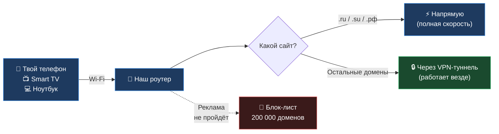
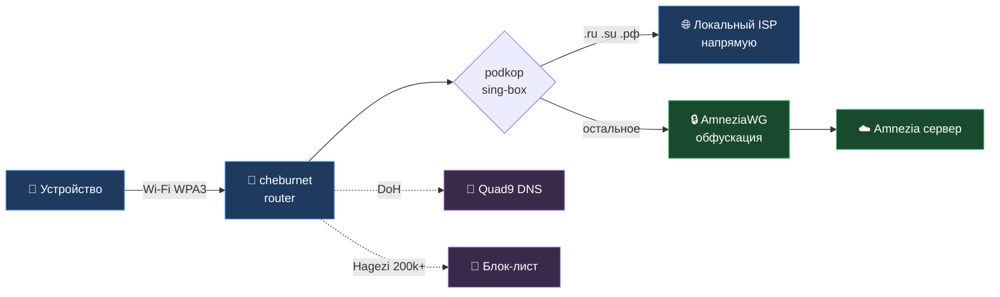

<div align="center">


# 🔐 cheburnet-router

### Защищённый интернет на уровне роутера

Куда направить трафик — **роутер решает сам АВТОМАТИЧЕСКИ**:

  🏠 Локальные сайты (.ru/.su/.рф) — напрямую, на полной скорости
  🔒 Остальной трафик — через зашифрованный туннель
  🚫 Реклама — блокируется ещё до загрузки

Никаких VPN-кнопок, переключений и настроек на устройствах.

[🚀 Что нужно сделать](#-что-нужно-сделать) · [ Написать мне в TG — @industrialprofi](https://t.me/industrialprofi) · [🔬 Технические детали](#-технические-детали)

</div>

> 🧭 **Интернет — как электричество.** Одно и то же напряжение лечит в больнице, светит детям над уроками, питает холодильник — и убивает за две секунды без автомата защиты в щитке. Никто не отказывается от электричества; все просто ставят правильную разводку.
>
> У большинства людей интернет ворует часы на лентах соцсетей, спроектированных так, чтобы нельзя было оторваться; затаскивает детей в контент, который никто не выбирал смотреть; продаёт внимание тому, кто заплатил больше. У меньшинства, кто учится с ним работать — это библиотека всего человечества, мировой рынок труда и связь с людьми на любом континенте.
>
> Разница не в самом интернете, а в **точке, через которую он входит к тебе домой**. Этот проект — про эту точку. Роутер на OpenWrt — открытая, программируемая база: ты сам решаешь, что блокируется, что шифруется, куда идёт трафик. Не «кнопка VPN» из чужого приложения, а собственный сетевой щит, настроенный под твою семью. Ответственность — твоя, как взрослого человека; и контроль — тоже.

> ℹ️ **Образовательный проект.** Это рабочая сборка для изучения сетевых технологий — VPN-туннели (AmneziaWG/WireGuard), DNS-шифрование, фильтрация трафика — всё то, что используется в корпоративных сетях, банкинге и для защищённой работы из публичных Wi-Fi. Их применение **легально** в большинстве стран.

---

## 👋 Зачем тебе это

**Знакомо?**

- 🚫 Реклама везде — на сайтах, в приложениях, в YouTube, даже на Smart TV
- 🏠 На каждом устройстве в доме нужно ставить и настраивать VPN отдельно
- 📺 На Smart TV вообще VPN не поставить — там «голый» интернет, дети смотрят с рекламой
- 📱 Один VPN не покрывает всё: банковские приложения часто блокируют VPN-подключение, и приходится включать-выключать
- 💸 Платишь за 2–3 разных VPN-сервиса, потому что один не покрывает все устройства и сценарии
- ☕ Общественный Wi-Fi (кафе, отель) небезопасен — провайдер сети видит твой трафик
- 👀 Домашний интернет-провайдер видит каждый сайт, на который ты заходишь

Это можно решить один раз — на уровне роутера, для всех устройств в доме сразу.

---

## 🎯 Что ты получаешь после установки

| Сейчас | После установки |
|---|---|
| Реклама в YouTube, на сайтах, в приложениях | Не показывается ни на одном устройстве в Wi-Fi |
| На каждом устройстве свой VPN, всё надо настраивать | Подключился к Wi-Fi — всё уже работает. На любом устройстве |
| Smart TV без защиты, дети смотрят с рекламой | Smart TV работает как все остальные устройства |
| Банковские приложения отваливаются с включённым VPN | Финансовые приложения идут напрямую (split-routing), VPN им не мешает |
| Платишь 3 раза за разные VPN-сервисы | Платишь один раз — за один сервер для всей семьи |
| Провайдер видит каждый сайт | Шифрованный DNS, провайдер видит только зашифрованный поток |
| Дети случайно натыкаются на взрослый контент | Включил семейный режим — ~95 000 NSFW-сайтов закрыты для всех устройств в сети |

**В двух словах:** ты ставишь у себя дома специально настроенный роутер. Все устройства, которые подключаются к нему по Wi-Fi, автоматически получают защищённый интернет — без рекламы, с VPN там где он нужен, без VPN там где он не нужен (онлайн-банкинг, локальные сервисы — там важнее скорость и совместимость), и с шифрованным DNS.

---

## 🔄 Как это работает (простыми словами)



Роутер сам решает, куда отправить трафик. Сайты в зонах .ru/.su/.рф идут напрямую через провайдера — на полной скорости, без задержки VPN-туннеля. Остальной трафик — через зашифрованный канал: это даёт приватность DNS-запросов, защиту от отслеживания на уровне сети и стабильную работу из публичных Wi-Fi. А реклама режется сразу на роутере, до того как успеет загрузиться на твоё устройство.

**Тебе не надо ничего делать на телефоне, на ноутбуке, на телевизоре.** Подключился к Wi-Fi — всё работает.

---

## 🚀 Что нужно сделать

| # | Шаг | Время | Стоимость |
|---|---|---|---|
| 1 | Купить роутер c поддержкой OpenWRT 25.12+ и ≥ 256 МБ RAM (рекомендуется 512 МБ)| 5 минут заказать + ~неделя ожидания | ~$35-60 разово |
| 2 | Прошить роутер OpenWrt — [пошаговая инструкция](docs/00-flash-openwrt.md) | ~30 минут с инструкцией | бесплатно |
| 3 | Купить подписку на VPN-сервер ([👇 кнопка ниже](#-сколько-это-стоит)) | ~5 минут | от 325 рублей в месяц (до 7 устройств) |
| 4 | Запустить установщик — пройти 4 экрана с вопросами | ~15 минут | бесплатно |

**Всего:** один вечер субботы. Дальше работает годами без вмешательства.

### Команда для шага 4

Когда роутер прошит и `.conf` от VPN-сервера у тебя в руках — открой терминал на ноутбуке и вставь одну команду. Она сама скачает установщик и проверит его подпись (защита от подмены):

> **Где взять терминал:**
> · **Windows:** правый клик по «Пуск» → выбери **Windows PowerShell** или **Terminal**.
> · **macOS:** Spotlight (⌘+Space) → набери `Terminal`.
> · **Linux:** Ctrl+Alt+T (на большинстве дистрибутивов).

**Linux / macOS** (Terminal, bash/zsh):

```bash
ssh-keygen -R 192.168.1.1 2>/dev/null; ssh -o StrictHostKeyChecking=accept-new root@192.168.1.1 'wget -qO- https://raw.githubusercontent.com/yurik2718/cheburnet-router/main/bootstrap.sh | sh'
```

**Windows** (PowerShell или Terminal):

```powershell
ssh-keygen -R 192.168.1.1 2>$null; ssh -o StrictHostKeyChecking=accept-new root@192.168.1.1 "wget -qO- https://raw.githubusercontent.com/yurik2718/cheburnet-router/main/bootstrap.sh | sh"
```

> 💡 Префикс `ssh-keygen -R` нужен тем, кто уже ставил наш роутер раньше: после прошивки или factory reset роутер генерирует новый SSH host key, а ваш ноутбук помнит старый и ругается `WARNING: REMOTE HOST IDENTIFICATION HAS CHANGED!` При первой установке этот префикс молча ничего не делает — вреда нет.
>
> ⚠ Команда **разная** для Linux/macOS и Windows по двум причинам: (1) `2>/dev/null` в PowerShell пишет в файл `C:\dev\null` — нужно `2>$null`; (2) одинарные кавычки `'...'` PowerShell передаёт в ssh иначе, чем bash, из-за чего `| sh` может перехватиться как оператор пайпа и bootstrap.sh не запустится — используем двойные кавычки `"..."`.
>
> ❗ **Не работает?** Убедись, что запущен **PowerShell**, а не cmd. В заголовке окна должно быть «Windows PowerShell» или «PowerShell» — иначе закрой и открой нужный через правый клик по «Пуск». Если `ssh` не найден — обнови Windows до версии 1809+.

После этого открой в браузере **`http://192.168.1.1/cheburnet/`** — там пройдёшь 4 простых экрана: загрузишь `.conf`, придумаешь пароль администратора, придумаешь название Wi-Fi и пароль к нему, нажмёшь «Начать установку». Дальше роутер сделает всё сам — установка идёт ~12 минут, прогресс видно прямо в браузере.

<div align="center">


<sub>Веб-мастер установки — шаг 1 из 4, загрузка конфига VPN</sub>

</div>

После установки на том же адресе `http://192.168.1.1/cheburnet/` открывается **панель управления** — оттуда видно статус всех сервисов и можно переключать режимы, рестартовать VPN/DNS/блок-лист, менять тир Hagezi, включать семейный режим и обновлять `.conf` без переустановки.

<div align="center">


<sub>Веб-панель `/cheburnet/` после установки — статус, переключение HOME ↔ TRAVEL, тиры Hagezi, тумблер семейного режима, замена VPN-конфига и factory reset</sub>

</div>

---

## 🌐 Почему именно AmneziaWG

Для шифрованного туннеля нужен VPN-сервер. Протоколов много (WireGuard, OpenVPN, Shadowsocks, V2Ray), но для сценария «всегда включён, для всей семьи через роутер» я выбрал AmneziaWG по четырём причинам.

**1. Это WireGuard, не «свой велосипед».**
WireGuard — современный VPN-протокол с производительностью на уровне ядра ОС: в разы быстрее OpenVPN, проще конфигурация, аудированная криптография. AmneziaWG — его форк, добавляющий настраиваемый transport layer (junk-пакеты, кастомные сигнатуры, переменный размер заголовков). Если параметры маскировки обнулить — получаешь обычный WireGuard. Никакого экзотического протокола, база проверенная.

**2. Устойчивость на сложных каналах.**
Обычный WireGuard теряет handshake там, где агрессивный трафик-шейпинг, фильтрация в публичных Wi-Fi, корпоративные firewall, нестандартная маршрутизация у мобильных операторов. AmneziaWG за счёт настраиваемых параметров стабильнее в таких условиях — инженерное решение, не магия.

**3. Open-source целиком.**
Протокол, клиенты для iOS / Android / Windows / macOS / Linux и серверная часть открыты на GitHub. Подписка не запирает тебя в закрытом софте — если сервис когда-то исчезнет, ты поднимаешь то же самое на своём VPS по той же документации.

**4. Простой онбординг.**
Купил → скачал `.conf` → загрузил в роутер. Без регистрации в проприетарных клиентах, без привязки к конкретному устройству, конфиг работает с этим проектом из коробки.

<details>
<summary>📊 Альтернативы, которые я рассматривал</summary>

- **Голый WireGuard** — отлично, если у тебя свой VPS и канал к нему стабильный.
- **OpenVPN** — заметно медленнее, выше нагрузка на CPU, без выигрыша в домашнем сценарии.
- **Shadowsocks / V2Ray / Xray** — мощные, но требуют ручной настройки и обслуживания.
- **Коммерческие VPN-сервисы** — закрытые клиенты, слабая интеграция с OpenWrt, нет настраиваемой обфускации.

</details>

---

## 🧒 Семейный режим (опционально)

Один тумблер в веб-панели `/cheburnet/` — и роутер делает **две вещи сразу** для всех устройств в Wi-Fi: телефонов детей, планшетов, Smart TV, игровых консолей.

1. **Блокирует ~95 600 сайтов взрослого контента** — куратируемый список [Hagezi NSFW](https://github.com/hagezi/dns-blocklists) добавляется к обычному блок-листу рекламы. Работает на DNS-уровне: браузер пытается открыть NSFW-домен → не получает IP-адрес → видит обычную ошибку «сайт недоступен», без всплывающих окон.
2. **Принудительно включает SafeSearch** в Google, Bing, DuckDuckGo, Yandex и YouTube (Strict-режим) — даже если в самом сервисе SafeSearch выключен. Делается через CNAME-перенаправление: запрос к `www.google.com` роутер прозрачно подменяет на `forcesafesearch.google.com`, и поисковик возвращает уже отфильтрованную выдачу. Это закрывает дыру, через которую дети обычно находят контент: поиск по картинкам и YouTube-рекомендации.

Включается и выключается мгновенно, можно ставить только на время — например, пока дети не спят.

**Что важно понимать:**

- Это **DNS-фильтр**, а не родительский контроль внутри сервисов. Уже открытый TikTok / Instagram-feed / Telegram-чат фильтру не виден — там контент идёт по HTTPS внутри одного и того же домена; для них нужны встроенные ограничения возраста.
- Не действует на устройство, у которого включён **свой VPN или свой DoH** в браузере — оно ходит мимо роутера. Для подростков, которые умеют это обходить, нужны другие методы.
- Покрытие — крупные NSFW-домены и их зеркала; нишевые сайты в список могут не попадать. Список обновляется автоматически вместе с adblock-листом.

Технические детали, CLI-команды и полный список SafeSearch-перенаправлений — [docs/04-adblock.md § Семейный фильтр](docs/04-adblock.md#-семейный-фильтр).

---

## 💸 Сколько это стоит

> **Разово:** ~$45 за роутер (Cudy TR3000 на AliExpress).
> **Подписка:** от 325 рублей в месяц — за VPN-сервер (до 7 устройств).

<div align="center">

### 👉 [🔑 Купить Amnezia Premium →](https://storage.googleapis.com/amnezia/amnezia.org?m-path=premium&arf=EB5KDKXCJYQYP4MG)

*5 минут до готового `.conf` · работает с нашим роутером из коробки*

<sub>Это реферальная ссылка — переход поддерживает развитие проекта (с твоей стороны цена не меняется). Если не хочешь использовать реф — [amnezia.org](https://amnezia.org) напрямую.</sub>

</div>

**Можно ли бесплатно?** — Нет, и я объясню почему. VPN-туннелю нужно где-то заканчиваться — на сервере за рубежом. Аренда такого сервера стоит денег. Бесплатные VPN либо медленные, либо продают твои данные, либо отключатся через месяц. Чудес не бывает.

**Зато выгода считается легко.** В семье обычно 3–5 устройств с VPN: телефоны родителей, ноутбук, телевизор, планшет. По отдельности это 3–5 × ~400₽/мес = **1200–2000₽/мес**. Один наш сервер на всю семью = **от 325 рублей в месяц** (до 7 устройств), и Smart TV/приставка тоже работают.

---

## 💬 Если что-то не получается

Я веду этот проект сам. Если ты застрял на любом шаге, или что-то не работает после установки, или просто есть вопросы — **пиши мне напрямую в Telegram: [@industrialprofi](https://t.me/industrialprofi)**.

Я отвечаю всем. Цель проекта — чтобы установка реально работала у обычных людей, а не только у программистов. Если у тебя не получается — это значит, мне есть что улучшить, и твоё сообщение поможет.

---

## ⭐ Если зашло — поставь звезду

Каждая звезда на GitHub поднимает проект в поиске, и больше людей, кому он нужен, его находит. Это занимает 2 секунды и ничего не стоит — но для open-source-проекта это самая ценная и при этом бесплатная поддержка.

<div align="center">

[](https://github.com/yurik2718/cheburnet-router/stargazers)

</div>

---

## ❤️ Поддержать проект

Я веду проект сам — пишу код, держу актуальной документацию, отвечаю в Telegram, разбираю баги. Это много часов, которые я не трачу на основную работу. Если cheburnet-router сэкономил вам время, нервы или деньги — поддержите его донатом, чтобы он жил дальше. Любая сумма — это сигнал, что проект нужен, и я продолжаю вкладываться.

| Способ | Реквизиты |
|---|---|
| 💳 **CloudTips** (карта / СБП) | [pay.cloudtips.ru/p/61fe8ef3](https://pay.cloudtips.ru/p/61fe8ef3) |
| 💎 **TON** | `UQC2KsPX-Ad9P8x_VbN3GHbpacOMvYPIbZvLppb-sxJ88KfV` |
| ₿ **Bitcoin** | `bc1qen3tutepyqjtsn7meggcertp6x4m0492vkg4m2` |

<div align="center">

<a href="https://pay.cloudtips.ru/p/61fe8ef3"></a>

<sub>Отсканируйте QR камерой телефона — откроется страница оплаты CloudTips</sub>

</div>

Подробнее (deep-link для Tonkeeper, нюансы по сетям) — [docs/support.md](docs/support.md).

> Если денег нет — это тоже помогает: поставьте ⭐ на GitHub, расскажите друзьям, пришлите PR или баг-репорт. Спасибо. 🙏

---

## 📦 Что внутри

Если коротко — **семь технологий**, работающих вместе:

🌐 **AmneziaWG 2.0** — VPN-туннель ·
🧭 **Podkop + sing-box** — split-routing ·
🛡 **3-layer kill switch** — защита от утечек ·
🔒 **Quad9 DoH** — шифрованный DNS ·
🚫 **Hagezi Pro 200k+** — блок-лист рекламы ·
📡 **WPA3 SAE** — современный Wi-Fi ·
🔧 **AWG watchdog** — авто-восстановление

Подробно про каждый компонент — раскрой блок «🔬 Технические детали» ниже.

---

## ⚠️ Что нужно знать заранее

- 🟡 **YouTube-реклама внутри видео не блокируется** — она идёт с тех же серверов что и видео, отрезать её нельзя без поломки самого YouTube
- 🟡 **Не защитит от вирусов** на устройствах — это не антивирус, а сетевой стенд
- 🟡 **Нужен VPN-сервер** — без подписки или своего VPS работает только локальная часть (прямой роутинг для .ru/.su/.рф и блок рекламы — да; зашифрованный туннель — нет)

Полный список ограничений — внутри раздела «🔬 Технические детали» ниже.

---

<details>
<summary><h2>🔬 Технические детали — для тех, кто хочет понимать что под капотом</h2></summary>

<br>

> Этот раздел для технически подкованных читателей и контрибьюторов. Если ты просто хочешь чтобы всё работало — листай выше, **[там всё что нужно](#-что-нужно-сделать)**. Здесь — архитектура, использованные технологии и документация.


---

### 🌊 Архитектура потока трафика



Трафик от устройств идёт через роутер, где `podkop + sing-box` решает по домену — `.ru/.su/.рф` идут напрямую через провайдера на полной скорости, остальное идёт в `AmneziaWG`-туннель с обфускацией. Параллельно DNS-запросы шифруются через Quad9 DoH, а реклама режется DNS-фильтром на роутере (блок-лист Hagezi Pro, ~200k доменов, защита покрывает все устройства в Wi-Fi автоматически).

---

### 📦 Использованные технологии

| Технология | Роль | Подробно |
|---|---|---|
| 🌐 **AmneziaWG 2.0 + I1 CPS** | VPN-туннель с обфускацией: decoy-пакеты, маскировка под HTTPS, custom protocol signature | [docs/02](docs/02-amneziawg.md) |
| 🧭 **Podkop + sing-box** | Policy-based routing на FakeIP: `.ru/.su/.рф` напрямую, остальное через VPN | [docs/03](docs/03-podkop-routing.md) |
| 🛡 **Three-layer kill switch** | Defense-in-depth: sing-box bind + TPROXY + fw4 — три независимых слоя | [docs/08](docs/08-killswitch.md) |
| 🔒 **Quad9 DoH** | DNS-over-HTTPS, провайдер не видит DNS-запросы | [docs/05](docs/05-dns.md) |
| 🚫 **adblock-lean + Hagezi** | DNS-фильтр на роутере, блокирует ~200k рекламных доменов; защита для всех устройств в Wi-Fi автоматически | [docs/04](docs/04-adblock.md) |
| 📡 **WPA3 SAE + PMF** | Современное шифрование Wi-Fi: SAE handshake, защита фреймов управления | [docs/06](docs/06-wifi.md) |
| 🔧 **AWG watchdog** | Авто-перезапуск туннеля при зависании handshake | (cron + `awg-watchdog`) |

---

### 🚀 Альтернатива веб-мастеру — CLI

Для тех, кто предпочитает командную строку (Linux/macOS):

```bash
git clone https://github.com/yurik2718/cheburnet-router.git
cd cheburnet-router && ./setup.sh
```

`setup.sh` пройдёт через те же 5 шагов, что и веб-мастер: скопирует репо в `/opt/cheburnet/` на роутере по SSH и запустит там `setup/install.sh` — тот же оркестратор, что использует и веб-мастер.

---

### 🎯 Управление после установки

**Через `/cheburnet/`** (требуется пароль root, заданный при установке) — скриншот выше, в основной части README. Доступно:
- Статус компонентов и handshake
- Перезапуск VPN/DNS/Adblock одним кликом
- Переключение режимов **HOME** ↔ **TRAVEL**
- Выбор тира блок-листа Hagezi (light → ultimate)
- 🧒 Семейный режим — NSFW-блок (~95k доменов) + Force SafeSearch (Google/Bing/DuckDuckGo/Yandex/YouTube)
- Замена VPN-конфига без переустановки
- Factory reset (если что-то пошло не так)

**Через CLI (SSH):**

```bash
ssh root@192.168.1.1
vpn-mode home      # .ru напрямую + остальное через VPN (по умолчанию)
vpn-mode travel    # весь трафик через VPN (полный туннель)
vpn-mode status    # текущий режим
logread | tail -50 # последние события системы
awg show awg0      # статус VPN-туннеля
```

---

### 🛠 Совместимое железо

Архитектура и версия awg-openwrt **определяются автоматически** из `/etc/openwrt_release` — установка работает на любой совместимой платформе без правок кода.

> 💡 **Скрипт работает на любом современном роутере с OpenWrt 25.12+ и ≥ 256 МБ RAM.** Привязки к Cudy/MT7981 нет — ваш Xiaomi, GL.iNet, TP-Link, Banana Pi, x86-мини-ПК и т.д. подойдут, если попадают в требования ниже. Cudy в списке как самый доступный проверенный вариант, но не единственный.

#### Минимальные требования

- **OpenWrt 25.12+** (с пакетным менеджером `apk`)
- **≥ 256 МБ RAM** (рекомендуется 512 МБ)
- **≥ 64 МБ flash**
- Архитектура с готовыми пакетами в [awg-openwrt releases](https://github.com/Slava-Shchipunov/awg-openwrt/releases) (aarch64, x86_64, mipsel и др.)

> Подробнее про портирование: [setup/README.md](setup/README.md)

#### Модели, проверенные лично

| Модель | SoC | RAM/Flash | Цена | Особенности |
|---|---|---|---|---|
| **Cudy TR3000 v1** ⭐ | MT7981B | 512/128 МБ | ~$40–55 | Travel-форм-фактор, USB-C 5V, 2.5 GbE |
| Cudy WR3000P v1 | MT7981B | 512/128 МБ | ~$50–65 | Стационарный, 4×GbE LAN + 2.5 GbE WAN |
| Cudy AP3000 v1 | MT7981B | 512/256 МБ | ~$60–75 | Больше flash для overlay |
| GL.iNet Beryl AX | MT7981B | 512/256 МБ | ~$110–140 | Физический слайдер HOME/TRAVEL, кулер |

> ⚠️ Cudy с серийником `2543...` (ноябрь 2025+) — нужна OpenWrt 24.10.5+, иначе кирпич.
> ❌ MT7621-роутеры (WR1300, M1300, X6) **не подходят** — 128 МБ RAM не хватит.

---

### 📚 Документация

| # | Тема | Что внутри |
|---|---|---|
| 📐 01 | [Архитектура](docs/01-architecture.md) | Большая схема потока трафика, слои защиты |
| 🌐 02 | [AmneziaWG](docs/02-amneziawg.md) | Туннель, обфускация по байтам, watchdog, hex-анализ |
| 🧭 03 | [Podkop и маршрутизация](docs/03-podkop-routing.md) | Split-routing, FakeIP, TPROXY, настройка списков |
| 🚫 04 | [Блокировка рекламы](docs/04-adblock.md) | adblock-lean, Hagezi Pro, выбор тира |
| 🔒 05 | [DNS](docs/05-dns.md) | Quad9 DoH, защита от подмены, failover |
| 📡 06 | [Wi-Fi](docs/06-wifi.md) | WPA3 SAE, PMF, country code |
| 🎚 07 | [Управление режимами](docs/07-modes.md) | HOME/TRAVEL, vpn-mode CLI, hotplug-кнопка |
| 🛡 08 | [Kill switch](docs/08-killswitch.md) | Три независимых слоя, threat model |
| 🔧 09 | [Диагностика](docs/09-troubleshooting.md) | «что-то не работает — куда смотреть» |
| 🔄 10 | [Обновления](docs/10-upgrades.md) | sysupgrade, apk upgrade, восстановление |
| 🎒 11 | [TRAVEL-режим](docs/11-travel.md) | WISP, captive portal, работа из отеля |
| 🔬 — | [Лаборатория сетей](docs/education.md) | tcpdump, DNS query logging, упражнения |

В каждой главе: «Что», «Зачем», «Как работает», «Какие альтернативы рассматривались», «Проверь себя» (Q&A), ссылки на RFC и whitepapers.

---

### ⚠️ Полный список ограничений

- ❌ Не защищает от физического доступа к роутеру
- ❌ Не гарантирует невидимость при продвинутом статистическом DPI
- ❌ Не блокирует 100% рекламы (например, YouTube-реклама идёт с тех же серверов что и видео)
- ❌ Не лечит malware на устройствах в сети
- ❌ Нужен AmneziaWG-сервер — Premium-подписка или свой VPS

</details>

---

## 📜 Дисклеймер

Этот проект — образовательная демонстрация сетевых технологий. **AmneziaWG, WireGuard, OpenVPN, DoH, split-routing — стандартные индустриальные технологии**, применяются в корпоративных сетях, для удалённой работы, в банкинге и для защиты трафика в публичных Wi-Fi. Их применение легально в большинстве стран.

Проект **не предназначен** для нарушения законов вашей юрисдикции. Автор не несёт ответственности за то, как читатель применяет описанные технологии — ответственность за соблюдение применимого законодательства лежит на пользователе.

---

## 🙏 Благодарности

### Open-source проекты

- [AmneziaVPN](https://amnezia.org/) — open-source VPN с обфускацией ([Amnezia Premium](https://storage.googleapis.com/amnezia/amnezia.org?m-path=premium&arf=EB5KDKXCJYQYP4MG) — подписка через реф-ссылку)
- [itdoginfo/podkop](https://github.com/itdoginfo/podkop) — split-routing для OpenWrt
- [SagerNet/sing-box](https://github.com/SagerNet/sing-box) — прокси-роутер
- [Slava-Shchipunov/awg-openwrt](https://github.com/Slava-Shchipunov/awg-openwrt) — kmod-amneziawg
- [lynxthecat/adblock-lean](https://github.com/lynxthecat/adblock-lean) — DNS-блокировка
- [hagezi/dns-blocklists](https://github.com/hagezi/dns-blocklists) — блок-списки доменов
- [Quad9](https://www.quad9.net/) — DoH-резолвер
- [OpenWrt](https://openwrt.org/) — свободная ОС для роутеров

### Люди

Проект живёт благодаря тем, кто тестирует, находит баги, предлагает улучшения и просто пишет — спасибо каждому.

Особая благодарность **Сергею Ш.** — за активное участие в развитии проекта, ценные идеи и постоянную обратную связь.

---

[MIT License](LICENSE) — форкайте, адаптируйте, шлите PR.
