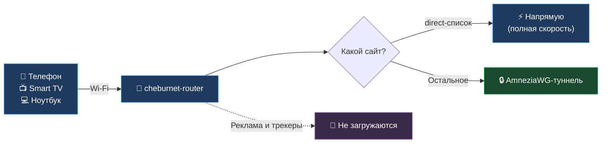

<!--
  README v2. Consumer-first.
  ⚠️ ГЕЙТ ПУБЛИЧНОГО ЗАПУСКА: install-однострочник ниже тянет bootstrap.sh с master,
     который ставит cheburnet.apk из GitHub Releases (--allow-untrusted; apk доверяет только
     подписанному индексу репо, не одиночному файлу). Однострочник работает только когда:
     (1) ✅ смержено в master, (2) ✅ опубликован Release v2.0.0 с cheburnet.apk,
     (3) ✅ путь проверен живым прогоном на роутере ЦЕЛИКОМ (GL-MT3000, 2026-07-08, заводской
        OpenWrt → однострочник → мастер → живой туннель): split доказан живым трафиком
        LAN-клиента, kill-switch блокирует при упавшем туннеле, DoH-фильтрация работает,
        fail-safe откат и идемпотентная пере-установка подтверждены.
     (4) ⏳ Release v2.0.1: прогон нашёл 2 бага в v2.0.0 (direct-путь мёртв на ethernet-WAN —
        маршрут без шлюза; DoH-фильтрация дырявая — пакет вписывал dns.google мимо выбранного
        провайдера). Фиксы в master; снять гейт ПОСЛЕ тега v2.0.1 с ними — иначе однострочник
        поставит пользователям битую версию.
     После этого — удалить этот комментарий отдельным коммитом. До этого не рекламировать.
-->
<div align="center">


# cheburnet-router

### VPN, блокировка рекламы и шифрованный DNS — для всего дома, на одном роутере.

Настраиваешь **один** роутер — и все устройства в Wi-Fi получают защиту: телефоны, ноутбуки,
Smart TV, консоли. Без приложений на каждом гаджете, без подписок на разных устройствах.
Один раз настроил через веб-мастер — работает годами.

[](https://openwrt.org/)
[](https://amnezia.org/)
[](LICENSE)
[](https://github.com/andreiyurik/cheburnet-router/stargazers)
[](https://t.me/industrialprofi)

### [🚀 Установить](#-установка-за-пару-шагов) · [💸 Что нужно и сколько стоит](#-что-нужно-и-сколько-стоит) · [🧒 Семейный режим](#-семейный-режим) · [❓ FAQ](#-faq)

<a href="assets/web-mgmt.png"></a>

<sub>Веб-панель <code>/cheburnet/</code> — статус сервисов, переключение режимов, семейный фильтр, замена VPN-конфига одним кликом</sub>

</div>

---

## 💡 Что это даёт

Одно подключение к Wi-Fi — и на **всех** устройствах в доме сразу:

- 🔒 **VPN-туннель** через [AmneziaWG](https://amnezia.org/) — форк WireGuard с обфускацией: быстрый и устойчивый.
- ⚡ **Split-tunnel.** Домены из вашего списка идут **напрямую** (полная скорость, реальный IP — удобно для банков и локальных сервисов), остальное — через VPN.
- 🚫 **Блокировка рекламы и трекеров** на уровне сети — для каждого устройства, включая те, куда adblock не поставить (Smart TV, консоли).
- 🔐 **Шифрованный DNS (DoH).** Провайдер не видит, на какие сайты вы заходите.
- 🧒 **Семейный режим** — фильтр нежелательного контента + принудительный SafeSearch, одним выбором в панели.
- 🛡 **Kill-switch.** Если VPN отвалился — трафик не утекает в открытую сеть, а не идёт «как получится».

**Что обычно болит — и как это решается здесь:**

| Проблема | С cheburnet-router |
|---|---|
| VPN-приложение надо ставить на каждое устройство. На Smart TV — вообще никак. | Настраиваешь роутер один раз — покрыты все устройства в Wi-Fi. |
| Платишь за VPN на несколько устройств отдельно. | Один VPN-сервер на весь дом. |
| Провайдер видит твои DNS-запросы. | DNS шифруется (DoH) — провайдер видит только зашифрованный поток. |
| Реклама и трекеры на каждом экране. | Блок-лист режет их для всей сети сразу. |

---

## 🔄 Как это работает



Роутер сам решает по каждому запросу, куда его отправить: домены из твоего **direct-списка** —
напрямую через провайдера (быстро, с реальным IP), **весь остальной** трафик — в зашифрованный
туннель. Направление по умолчанию — туннель, так что даже если домен не попал в списки, он уйдёт
через VPN, а не утечёт в открытую сеть.

---

## 🚀 Установка за пару шагов

Когда роутер с OpenWrt под рукой, а VPN-конфиг (`.conf`) у тебя в руках — установка cheburnet
это буквально **одна команда + мастер в браузере**. Всё остальное роутер делает сам, ~12 минут.

| Шаг | Что делаешь | Время |
|---|---|---|
| 1 | Роутер с OpenWrt 25.12+ и ≥ 256 МБ RAM ([какой купить](#-совместимое-железо), [как прошить](docs/00-flash-openwrt.md)) | ~30 мин (один раз) |
| 2 | Взять VPN-подписку или поднять свой сервер — получить `.conf` ([подробнее](#-что-нужно-и-сколько-стоит)) | ~5 мин |
| 3 | Вставить **одну команду** по SSH — она поставит cheburnet и напечатает ссылку на мастер | ~2 мин |
| 4 | Открыть ссылку в браузере, пройти мастер (`.conf`, пароль, Wi-Fi, «Установить») | ~15 мин |

### Команда для шага 3

Открой терминал на компьютере в той же сети, что и роутер, и вставь команду. Она подключит
пакетный feed cheburnet, поставит пакет (`apk` сам подберёт нужную сборку под твою модель) и
напечатает ссылку на веб-мастер с одноразовым токеном.

> **Где взять терминал:** **Windows** — правый клик по «Пуск» → **Терминал** / **PowerShell**.
> **macOS** — Spotlight (⌘+Space) → `Terminal`. **Linux** — `Ctrl+Alt+T`.
> **Пароль `root@…`** на свежем OpenWrt пустой — просто нажми **Enter** (свой зададишь в мастере).

**Linux / macOS:**
```bash
ssh-keygen -R 192.168.1.1 2>/dev/null; ssh -o StrictHostKeyChecking=accept-new -o ConnectTimeout=10 root@192.168.1.1 'for i in 1 2 3 4 5; do wget -qO /tmp/cheburnet-setup.sh https://raw.githubusercontent.com/andreiyurik/cheburnet-router/master/bootstrap/bootstrap.sh && break; rm -f /tmp/cheburnet-setup.sh; echo "скачивание не удалось (попытка $i из 5) — повторяю через 3 сек..."; sleep 3; done; if [ -s /tmp/cheburnet-setup.sh ]; then sh /tmp/cheburnet-setup.sh; else echo "ОШИБКА: не удалось скачать установщик. Проверьте, что кабель интернета подключён к роутеру, и запустите команду ещё раз."; fi'
```

**Windows (PowerShell / Терминал):**
```powershell
ssh-keygen -R 192.168.1.1 2>$null; ssh -o StrictHostKeyChecking=accept-new -o ConnectTimeout=10 root@192.168.1.1 'for i in 1 2 3 4 5; do wget -qO /tmp/cheburnet-setup.sh https://raw.githubusercontent.com/andreiyurik/cheburnet-router/master/bootstrap/bootstrap.sh && break; rm -f /tmp/cheburnet-setup.sh; echo "скачивание не удалось (попытка $i из 5) — повторяю через 3 сек..."; sleep 3; done; if [ -s /tmp/cheburnet-setup.sh ]; then sh /tmp/cheburnet-setup.sh; else echo "ОШИБКА: не удалось скачать установщик. Проверьте, что кабель интернета подключён к роутеру, и запустите команду ещё раз."; fi'
```

<!-- Почему не `wget -qO- … | sh`: raw.githubusercontent.com в реальных сетях флапает
     (замерено на живой сети: до 1/3 запросов — 0 байт), а `sh` на пустом вводе молча выходит
     с кодом 0 — пользователь запускает команду, и «ничего не происходит». Поэтому: скачивание
     в файл с 5 попытками, запуск только непустого файла, внятная ошибка. PowerShell-вариант
     в ОДИНАРНЫХ кавычках намеренно: в двойных PowerShell сам подставил бы $i. -->


> **🌍 Не ставится? `apk update не прошёл` / «не достучаться до зеркала пакетов»?** В некоторых
> сетях зеркало OpenWrt недоступно. Пока cheburnet не установлен, помочь себе он не может —
> нужно на 10 минут дать роутеру интернет через сторонний VPN. Готовая инструкция (2 схемы):
> **[docs/install-blocked.md](docs/install-blocked.md)**. После установки роутер сам уйдёт под
> VPN — проблема исчезнет навсегда.

### Что дальше — веб-мастер

Команда около минуты ставит пакеты, потом печатает ссылку с одноразовым токеном:

<div align="center">
<a href="assets/install-terminal.png"></a>
<sub>Скопируй ссылку <code>http://192.168.1.1/cheburnet/?token=…</code> и открой в браузере</sub>
</div>

> **Зачем токен.** Одноразовый ключ доказывает, что мастер запустил именно ты — с доступом к
> роутеру. Без него любой в той же Wi-Fi мог бы перехватить установку. После установки токен
> удаляется автоматически.

Дальше — несколько экранов: загрузка `.conf`, пароль администратора, имя и пароль Wi-Fi,
кнопка «Установить». Роутер всё сделает сам, прогресс виден прямо в браузере.

<div align="center">

<sub>Веб-мастер — загрузка <code>.conf</code> VPN-сервера</sub>
</div>

После установки на том же адресе `http://192.168.1.1/cheburnet/` открывается **панель
управления**: статус сервисов, перезапуск VPN/DNS/блок-листа одним кликом, переключение
режимов, семейный фильтр, замена `.conf` без переустановки, сброс к заводским.

---

## 💸 Что нужно и сколько стоит

Чтобы всё заработало, нужны две вещи:

**1. Роутер с OpenWrt** — разово ~$35–60 за подходящую модель (см. [«Совместимое железо»](#-совместимое-железо)). Если OpenWrt-роутер уже есть — бесплатно.

**2. VPN-сервер** — свой VPS или подписка совместимого провайдера. Туннелю нужен сервер на той
стороне, и кто-то платит за его трафик — бесплатных вариантов с приличной скоростью не бывает.

**Проект не привязан к провайдеру.** Подойдёт любой стандартный AmneziaWG-конфиг (`.conf`):
свой сервер на VPS (стек Amnezia открытый, документация публичная) или готовая подписка.

<div align="center">

### 👉 [Amnezia Premium — от 325 ₽/мес, скидка 15% по промокоду CHEBURNET15 →](https://storage.googleapis.com/amnezia/amnezia.org?m-path=premium&arf=EB5KDKXCJYQYP4MG&coupon=CHEBURNET15)

*Пример совместимого провайдера. Промокод `CHEBURNET15` уже встроен в ссылку: тебе −15% к цене, проекту — поддержка.*

</div>

---

## 🧒 Семейный режим

Семейный режим — это выбор **семейного DNS-фильтра** в веб-панели (например, AdGuard Family
вместо обычного AdGuard). Одно действие включает для всех устройств в Wi-Fi:

1. **Блокировку нежелательного контента** — DNS-фильтр не отдаёт адреса сайтов для взрослых; браузер видит обычную ошибку «сайт недоступен».
2. **Принудительный SafeSearch** в поисковиках и YouTube — даже если в самом сервисе он выключен.

Вернуть обычный фильтр можно в любой момент тем же выпадающим списком.

<details>
<summary>Чего семейный режим НЕ делает</summary>

<br>

- Это **DNS-фильтр**, а не родительский контроль внутри сервисов. Ленты TikTok / Instagram / чаты фильтру не видны — контент идёт по HTTPS внутри одного домена; для них нужны встроенные возрастные ограничения.
- Не действует на устройство, где включён **свой VPN или свой DoH** в браузере — оно ходит мимо роутера.
- Покрытие — крупные NSFW-домены и зеркала; нишевые могут не попадать. Список обновляется автоматически.

</details>

---

## ❓ FAQ

<details>
<summary><b>Это легально?</b></summary>

<br>

VPN, шифрованный DNS, split-routing — стандартные сетевые технологии, их используют корпорации, банки и удалённые сотрудники. Сами по себе они разрешены в большинстве стран. Что класть в direct-список и куда направлять туннель — настройка пользователя; ответственность за соблюдение местных законов — на нём.

</details>

<details>
<summary><b>Скорость интернета упадёт?</b></summary>

<br>

На домены из direct-списка — нет, они идут напрямую через провайдера. На остальные — зависит от качества VPN-сервера и твоего канала; AmneziaWG работает на уровне ядра ОС, потолок для бытового роутера обычно 200–500 Мбит/с. Для видео, мессенджеров и веба разница не ощущается.

</details>

<details>
<summary><b>Что если VPN-сервер недоступен?</b></summary>

<br>

Включается kill-switch — трафик не утечёт в открытую сеть. Домены из direct-списка продолжают работать. В веб-панели видно, что VPN упал, и можно одним кликом перезапустить или сменить `.conf`.

</details>

<details>
<summary><b>Чем это отличается от NordVPN / Proton / коммерческого VPN?</b></summary>

<br>

Не «лучше», а **по-другому**. Коммерческий VPN — закрытое приложение на каждом устройстве, всё доверяешь одной компании. Здесь — открытый код на твоём роутере: одно подключение к Wi-Fi покрывает все устройства в доме, включая Smart TV. Плюс настраиваемый split-routing — твой direct-список напрямую, остальное через VPN — коммерческие сервисы так почти не умеют.

Минус: нужен свой VPN-сервер — подписка совместимого провайдера либо свой VPS.

</details>

<details>
<summary><b>А если я переезжаю или меняю провайдера?</b></summary>

<br>

Роутер можно брать с собой — подключил к новому интернету, всё работает как раньше.

**Не хочешь менять основной роутер дома?** Подключи cheburnet-router WAN-портом к старому роутеру — получишь **вторую Wi-Fi-сеть** рядом со старой. Устройства в новой сети идут через VPN и блок рекламы; остальные работают через старый роутер как обычно.

</details>

<details>
<summary><b>Как добавить сайт, который должен идти без VPN (с реальным IP)?</b></summary>

<br>

Добавь домен в direct-список прямо в веб-панели — пиши без `https://` и без `/`, только домен (`example.com`); все поддомены подхватятся автоматически. Применяется сразу, перезагружать ничего не надо.

</details>

<details>
<summary><b>Мой роутер подойдёт?</b></summary>

<br>

Любой современный с OpenWrt 25.12+ и ≥ 256 МБ RAM. При установке роутер сам проверяет железо и честно откажет, если чего-то не хватает. Проверенные модели — в разделе [«Совместимое железо»](#-совместимое-железо).

</details>

---

## 💬 Если что-то не получается

Я веду этот проект сам. Застрял на любом шаге, что-то не работает после установки или просто есть
вопрос — **пиши напрямую в Telegram: [@industrialprofi](https://t.me/industrialprofi)**. Отвечаю
всем. Цель — чтобы установка реально работала у обычных людей, а не только у программистов.

---

## 🖥 Совместимое железо

**Подойдёт любой роутер на OpenWrt 25.12+ с ≥ 256 МБ RAM.** Архитектуру пакет определяет сам —
установка работает на aarch64, x86_64, mipsel и других платформах без правок.

**Если OpenWrt-роутер уже есть**, проверь три пункта:
- Поддержка OpenWrt 25.12+ — [openwrt.org/toh](https://openwrt.org/toh/start) (фильтр по версии).
- RAM ≥ 256 МБ, flash ≥ 64 МБ.
- Архитектура есть в [awg-openwrt releases](https://github.com/Slava-Shchipunov/awg-openwrt/releases) — без `kmod-amneziawg` VPN не поднимется.

**Если покупаешь с нуля** — рекомендую серию **Cudy** на чипсете MT7981B: производитель лоялен к
OpenWrt (официальные сборки на [openwrt.org/toh/cudy](https://openwrt.org/toh/cudy/)), прошивается
стоковым web-интерфейсом, 512 МБ RAM, цена ~$40–60.

| Сценарий | Модель | Цена | Особенности |
|---|---|---|---|
| **В поездку** | Cudy TR3000 | ~$40–55 | Компактный, питание USB-C 5V, 2.5 GbE WAN |
| **Дома** | Cudy WR3000P | ~$50–65 | 4×GbE LAN + 2.5 GbE WAN |
| **С запасом** | Cudy AP3000 | ~$60–75 | 256 МБ flash под эксперименты |

> ⚠️ MT7621-роутеры (128 МБ RAM) **не подходят.** На флеше 16–32 МБ полный cheburnet не поместится.
> Полный список моделей — [openwrt.org/toh/views/toh_available_25](https://openwrt.org/toh/views/toh_available_25), поиск прошивки — [firmware-selector.openwrt.org](https://firmware-selector.openwrt.org).

---

## ❤️ Поддержать проект

Я делаю всё один — код, документацию, ответы в Telegram, разбор багов у конкретных людей. Это часы
после основной работы. Любая поддержка помогает и сигналит, что проект нужен.

**⭐ Поставь звезду на GitHub** — бесплатно, 2 секунды, и проект находят больше людей, которым он нужен.

**🔗 Нужен VPN-сервер?** Возьми [Amnezia Premium со скидкой 15% — промокод `CHEBURNET15`](https://storage.googleapis.com/amnezia/amnezia.org?m-path=premium&arf=EB5KDKXCJYQYP4MG&coupon=CHEBURNET15). Тебе −15% к цене, проекту — поддержка.

**💳 Поддержать рублём — от 100 ₽:**

<div align="center">
<a href="https://pay.cloudtips.ru/p/61fe8ef3"></a>
<br>
<sub><a href="https://pay.cloudtips.ru/p/61fe8ef3">pay.cloudtips.ru/p/61fe8ef3</a> — карта / СБП. Отсканируй камерой телефона.</sub>
</div>

<details>
<summary>💎 Криптовалюта (TON, Bitcoin)</summary>

<br>

| Сеть | Адрес |
|---|---|
| **TON** | `UQC2KsPX-Ad9P8x_VbN3GHbpacOMvYPIbZvLppb-sxJ88KfV` |
| **Bitcoin** | `bc1qen3tutepyqjtsn7meggcertp6x4m0492vkg4m2` |

</details>

---

## ⚠️ Что нужно знать заранее

- **cheburnet — не антивирус.** Защищает сеть, не лечит malware на устройствах.
- **Без VPN-сервера работают только локальные функции:** блок рекламы и прямой роутинг direct-списка.
- **Не блокирует 100% рекламы** (например, реклама в YouTube идёт с тех же серверов, что и видео).

---

<details>
<summary><h2>🔬 Под капотом</h2></summary>

<br>

> Для контрибьюторов и любопытных. Проект открытый — весь код можно прочитать, а каждый шаг маршрутизации построен на стандартных примитивах ядра, а не на «магии».

**Data-plane собран из примитивов ядра Linux** (лёгкий, едет на слабом железе, каждый шаг виден):

| Технология | Роль |
|---|---|
| **AmneziaWG** | VPN-туннель с обфускацией — маскирует сетевую сигнатуру, сохраняя скорость WireGuard |
| **dnsmasq-nftset + nftables** | Split-routing: dnsmasq складывает IP direct-доменов в nftset, nftables метит пакеты |
| **policy routing (ip rule)** | Помеченный трафик — в туннель, direct-список — напрямую через WAN |
| **https-dns-proxy** | Шифрованный DNS (DoH) — провайдер не видит сами домены |
| **adblock-lean + Hagezi** | DNS-фильтр рекламы и трекеров для всей сети |
| **Движок на ucode** | Установка, генерация конфигов, preflight, идемпотентные шаги, точечный rollback |
| **Веб-мастер на Svelte** | Общается с роутером через ubus RPC |

**Надёжность — три простых кирпича:** строгий **preflight** (честно откажет на негодном железе),
**идемпотентные шаги** (повторный запуск чинит, а не ломает), **точечный rollback** там, где откат
чистый. Направление fail-safe — по умолчанию туннель; промах списка = трафик уходит через VPN, а не утекает.

**Документация и архитектура** — в [`docs/`](docs/) (принципы и разбор каждого механизма от первых
принципов), целевая архитектура — [docs/architecture-v2.md](docs/architecture-v2.md).

**Управление** — через веб-панель `/cheburnet/` (статус, режимы HOME/TRAVEL, перезапуск сервисов,
семейный режим, замена `.conf`, factory reset) или по SSH через `ubus`/`uci` для продвинутых.

</details>

---

## 📜 Дисклеймер

Открытый образовательный проект: демонстрация современного open-source-стека для роутеров и рабочий
стенд для сетевых технологий — AmneziaWG/WireGuard, DoH, split-routing, nftables. Эти технологии
стандартные и применяются в корпоративных сетях, банкинге и при работе в публичных Wi-Fi.

Содержимое direct-списка и назначение туннеля — настройки пользователя. Применять эти технологии
законно в большинстве стран, но ответственность за соблюдение местного законодательства — на
пользователе. Проект не предназначен для нарушения законов вашей юрисдикции.

---

## 🙏 Благодарности

**Open-source проекты:** [AmneziaVPN](https://amnezia.org/) · [SagerNet/sing-box](https://github.com/SagerNet/sing-box) · [Slava-Shchipunov/awg-openwrt](https://github.com/Slava-Shchipunov/awg-openwrt) · [lynxthecat/adblock-lean](https://github.com/lynxthecat/adblock-lean) · [hagezi/dns-blocklists](https://github.com/hagezi/dns-blocklists) · [OpenWrt](https://openwrt.org/)

**Люди:** проект живёт благодаря тем, кто тестирует, находит баги и пишет с обратной связью — спасибо
каждому. Особая благодарность **Сергею Ш.** за активное участие и ценные идеи.

---

[MIT License](LICENSE) — форкай, адаптируй, шли PR.
