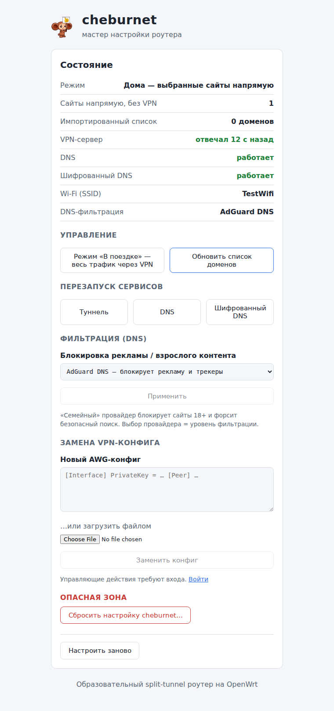
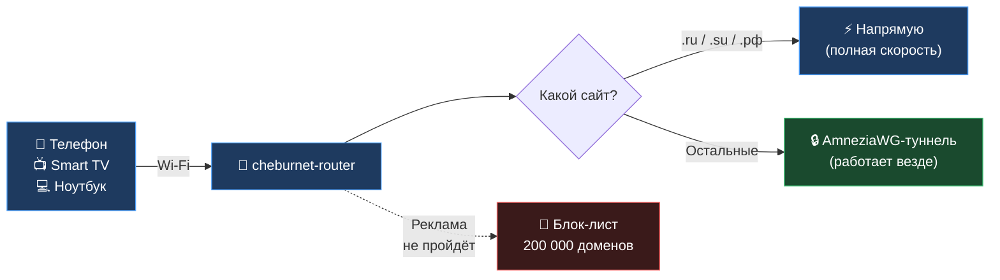
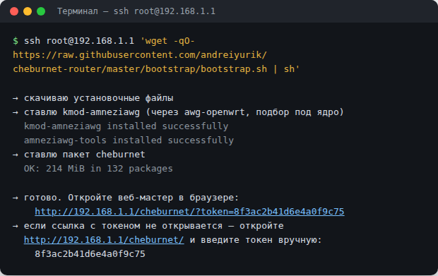
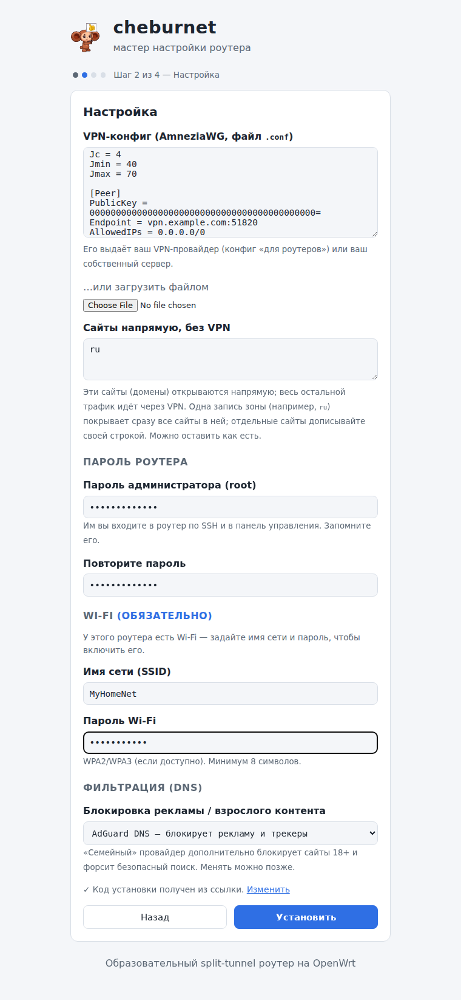
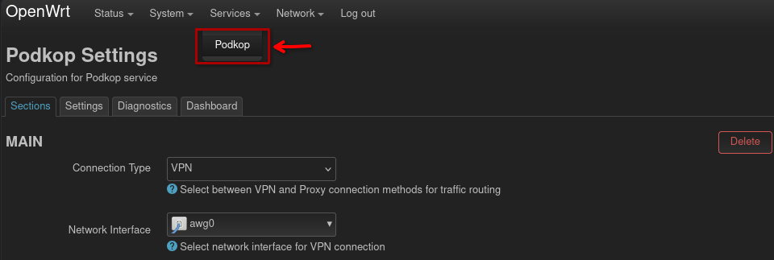
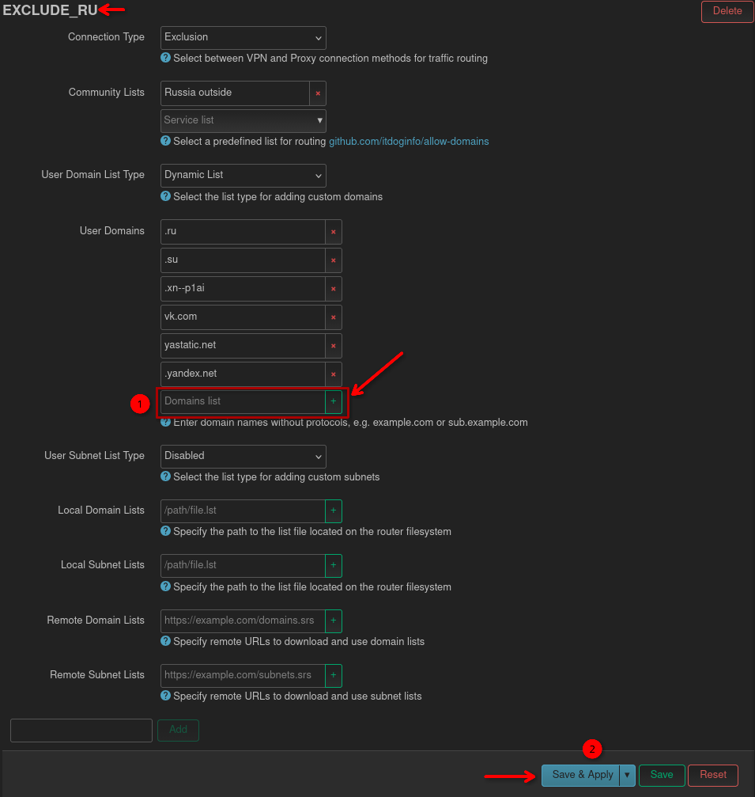
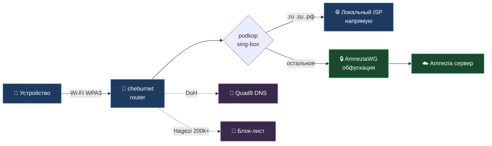

<div align="center">


# cheburnet-router

### Готовый OpenWrt-роутер за вечер. Настройка — 5 минут.

Open-source проект: помогает быстро превратить [совместимый OpenWrt-роутер](#совместимое-железо)
в удобную станцию для всей семьи. После установки роутер сам решает,
куда отправить трафик: российские сайты — напрямую, остальное —
через зашифрованный туннель. Реклама не загружается.

Если хотите углубиться — весь код открыт, и опытный пользователь
может донастроить роутер под свои задачи через LuCI или SSH.

[](https://github.com/yurik2718/cheburnet-router/stargazers)
[](https://openwrt.org/)
[](https://amnezia.org/)
[](LICENSE)
[](https://t.me/industrialprofi)

[**🚀 Установить за вечер**](#-установка-за-один-вечер) · [**💸 Сколько это стоит**](#-сколько-это-стоит) · [**🧒 Семейный режим**](#-семейный-режим) · [**❓ FAQ**](#-faq) · [**🔬 Под капотом**](#-под-капотом)

<a href="assets/web-mgmt.png"></a>

<sub>Веб-панель <code>/cheburnet/</code> — статус сервисов, переключение режимов, семейный фильтр, замена VPN-конфига одним кликом</sub>

</div>

---

## 💡 Зачем нужен этот проект

Идея простая: настроить **один** роутер так, чтобы все домашние устройства
получили VPN, защиту от рекламы и шифрованный DNS — без приложений на каждом
телефоне и без подписок на несколько VPN-сервисов.

Что обычно болит:

- VPN-приложение надо ставить на каждое устройство. На Smart TV его и
  не поставить.
- Платишь за несколько VPN-сервисов, потому что одного не хватает на всех.
- Если завтра приложение исчезнет — настраивать всё заново.
- Провайдер всё равно видит, куда ты ходишь — через DNS-запросы.

С `cheburnet-router` это решается на уровне сети: подключился к Wi-Fi —
всё работает. Для всех устройств в доме. Один раз настроил — годами
не вспоминаешь.

И второе: это open-source-проект. Каждый шаг установки (11 пронумерованных
скриптов в `setup/`) виден, каждая технология стандартная: AmneziaWG,
sing-box, dnsmasq, nftables. Хотите понять, как устроен split-routing
или как работает DoH — открываете `docs/`, читаете 10 минут.

---

## 🔄 Как это работает



Роутер на лету решает, куда отправить каждый пакет:

- **`.ru` / `.su` / `.рф`** — напрямую через провайдера. Без задержки VPN,
  на полной скорости. Банковские приложения и Госуслуги работают как раньше.
- **Остальное** — через AmneziaWG-туннель. С шифрованным DNS, чтобы провайдер
  не видел список открытых сайтов.
- **Реклама** — режется на роутере по DNS-блок-листу из ~200 000 доменов.

---

## 🚀 Установка

Если у вас уже OpenWrt 25.12+ на роутере — переходите сразу к [шагу 4](#команда-для-шага-4), займёт ~15 минут. С нуля (купить + прошить + установить) — около часа активного времени.

| # | Шаг | Время | Стоимость |
|---|---|---|---|
| 1 | Купить роутер c поддержкой OpenWrt 25.12+ и ≥ 256 МБ RAM | 5 мин + ~неделя ожидания | **~$35–60 разово** |
| 2 | Прошить OpenWrt — [пошаговая инструкция](docs/00-flash-openwrt.md) | ~30 мин | бесплатно |
| 3 | Купить VPN-подписку (см. ниже) | ~5 мин | **от 325 ₽/мес** на 7 устройств |
| 4 | Запустить установщик — 4 экрана с вопросами | ~15 мин | бесплатно |

**Итого:** ~1 час с нуля, или ~15 минут если OpenWrt уже стоит.

### Команда для шага 4

Когда роутер прошит и `.conf` VPN-сервера у тебя в руках — открой терминал и вставь команду. Она скачает установщик на роутер и запустит его.

> **Где взять терминал:** **Windows** — правый клик по «Пуск» → **Терминал** (Windows 11) или **PowerShell** (Windows 10). Не CMD — в нём команда требует другого синтаксиса (см. блок CMD ниже). **macOS** — Spotlight (⌘+Space) → `Terminal`. **Linux** — `Ctrl+Alt+T`.

> **Если терминал попросит пароль** (`root@192.168.1.1's password:`) — нажми **Enter**: на свежем OpenWrt пароль пустой, ты зададёшь его в мастере на шаге 2 из 4.

> **🌍 Под цензурой / DPI?** Провайдер может резать загрузку пакетов OpenWrt (`downloads.openwrt.org`). Установщик это сам обнаружит за 5 секунд и подскажет — но если хочешь подготовиться заранее, прочти **[docs/install-blocked.md](docs/install-blocked.md)** (2 варианта обхода: ноутбук с VPN или Android+USB+AmneziaVPN).

**Linux / macOS:**
```bash
ssh-keygen -R 192.168.1.1 2>/dev/null; ssh -o StrictHostKeyChecking=accept-new -o ConnectTimeout=10 root@192.168.1.1 'wget -qO- https://raw.githubusercontent.com/yurik2718/cheburnet-router/master/install.sh | sh'
```

**Windows (PowerShell или Терминал Windows):**
```powershell
ssh-keygen -R 192.168.1.1 2>$null; ssh -o StrictHostKeyChecking=accept-new -o ConnectTimeout=10 root@192.168.1.1 "wget -qO- https://raw.githubusercontent.com/yurik2718/cheburnet-router/master/install.sh | sh"
```

**Windows (CMD / `cmd.exe` / «Командная строка»):**
```cmd
ssh-keygen -R 192.168.1.1 2>nul & ssh -o StrictHostKeyChecking=accept-new -o ConnectTimeout=10 root@192.168.1.1 "wget -qO- https://raw.githubusercontent.com/yurik2718/cheburnet-router/master/install.sh | sh"
```
> Если в CMD выскочило `Системе не удается найти указанный путь` — это значит, ты случайно вставил Linux-вариант (с `2>/dev/null`). Вернись и скопируй именно CMD-блок выше (с `2>nul` и `&`).

> **⚠ Упало с `Operation not permitted` / `apk update не прошёл` / установщик сразу написал «За 5с не достучаться до downloads.openwrt.org»?**
> Провайдер режет загрузку пакетов OpenWrt (DPI). Cheburnet сам это обойти не может, пока не установлен — нужно на 10 минут установки поднять интернет через сторонний VPN. Подробно (2 схемы, шаги):
>
> **→ [docs/install-blocked.md](docs/install-blocked.md)**

<details>
<summary>Почему команды разные и что делать, если не работает</summary>

<br>

`ssh-keygen -R` нужен тем, кто уже ставил роутер раньше: после прошивки или factory reset роутер генерирует новый SSH host key, а ноутбук помнит старый и ругается `WARNING: REMOTE HOST IDENTIFICATION HAS CHANGED!` При первой установке этот префикс молча ничего не делает.

Команда **разная** в каждой оболочке — синтаксис перенаправления stderr, разделителя команд и кавычек у них отличается:

| | Linux / macOS (bash/zsh) | PowerShell | CMD (`cmd.exe`) |
|---|---|---|---|
| stderr → /dev/null | `2>/dev/null` | `2>$null` | `2>nul` |
| разделитель команд | `;` | `;` | `&` |
| кавычки для ssh-команды | `'...'` | `"..."` | `"..."` |

Если перепутать (вставить bash-команду в CMD) — увидишь `Системе не удается найти указанный путь` (CMD пытается создать файл `\dev\null`, не находит директорию) и команда не выполняется.

**Не работает?** Убедись, что запущен **PowerShell**, а не cmd (в заголовке окна должно быть «PowerShell»). Если `ssh` не найден — обнови Windows до 1809+.

</details>

### Что ты увидишь в терминале

Скрипт около минуты будет качать и ставить базовые пакеты, потом покажет ссылку с одноразовым токеном:

<div align="center">

<a href="assets/install-terminal.png"></a>

<sub>Финальный экран <code>install.sh</code> — ссылка с токеном и резервный токен для ручного ввода</sub>

</div>

**Что делать:** скопируй ссылку `http://192.168.1.1/cheburnet/?token=…` из терминала и открой её в браузере. Мастер сам подставит токен и пропустит первый шаг. Если URL с параметром не открывается (телефон не в той же Wi-Fi, или браузер режет ссылку) — открой `http://192.168.1.1/cheburnet/` без `?token=...` и вставь токен вручную на Шаге 1.

> **Зачем токен.** Одноразовый ключ доказывает, что мастер запустил именно ты — с физическим доступом к роутеру. Без него любой в той же LAN мог бы открыть `/cheburnet/` и захватить установку. После успешной установки токен удаляется автоматически.

Дальше — 4 экрана: `.conf`, пароль администратора, Wi-Fi, «Начать установку». Роутер сделает всё сам, ~12 минут, прогресс виден в браузере.

<div align="center">



<sub>Веб-мастер установки — шаг 1 из 4, загрузка <code>.conf</code> VPN-сервера</sub>

</div>

После установки на том же адресе открывается **панель управления** — статус сервисов, переключение режимов, рестарт VPN/DNS/блок-листа, семейный режим, замена `.conf` без переустановки, factory reset.

---

## 💸 Сколько это стоит

**Разово:** ~$35–60 за роутер с OpenWrt 25.12+ и ≥ 256 МБ RAM (совместимые модели — в разделе «Под капотом»).
**Подписка:** от 325 ₽/мес за VPN-сервер на 7 устройств.

<div align="center">

### 👉 [Купить Amnezia Premium со скидкой 15% →](https://storage.googleapis.com/amnezia/amnezia.org?m-path=premium&arf=EB5KDKXCJYQYP4MG&coupon=CHEBURNET15)

*Промокод `CHEBURNET15` — скидка 15%, поддерживает развитие проекта.*

</div>

**Почему AmneziaWG.** Это форк WireGuard с обфускацией пакетов: работает там, где обычный WireGuard блокируется DPI. Протокол и клиенты открытые — если сервис исчезнет, тот же стек можно поднять на собственном VPS, документация публичная.

**Без подписки или своего VPS не получится** — VPN-туннелю нужен сервер где-то за рубежом, и кто-то за него платит. Бесплатных вариантов с приличной скоростью под российский рынок сейчас нет.

---

## 🧒 Семейный режим

Один тумблер в веб-панели включает две вещи для всех устройств в Wi-Fi:

1. **Блокирует ~95 000 NSFW-сайтов** — список [Hagezi NSFW](https://github.com/hagezi/dns-blocklists) добавляется к обычному блок-листу. Браузер не получает IP, видит обычную ошибку «сайт недоступен».
2. **Принудительный SafeSearch** в Google, Bing, DuckDuckGo, Yandex и YouTube (Strict) — даже если в самом сервисе он выключен. Закрывает поиск картинок и YouTube-рекомендации, через которые обходят детские блокировки.

Можно включать только на время — например, на детское время.

<details>
<summary>Чего семейный режим НЕ делает</summary>

<br>

- Это **DNS-фильтр**, а не родительский контроль внутри сервисов. TikTok / Instagram-feed / Telegram-чат фильтру не виден — контент идёт по HTTPS внутри одного домена; для них нужны встроенные ограничения возраста.
- Не действует на устройство, у которого включён **свой VPN или свой DoH** в браузере — оно ходит мимо роутера. Для подростков, которые умеют это обходить, нужны другие методы.
- Покрытие — крупные NSFW-домены и зеркала; нишевые могут не попадать. Список обновляется автоматически.

Технические детали и полный список SafeSearch-перенаправлений — [docs/04-adblock.md](docs/04-adblock.md#-семейный-фильтр).

</details>

---

## ❓ FAQ

<details>
<summary><b>Это легально?</b></summary>

<br>

VPN, шифрованный DNS, split-routing — стандартные сетевые технологии, их используют корпорации, банки и удалённые сотрудники. Эти технологии сами по себе разрешены в большинстве стран. Проект образовательный — ответственность за соблюдение местных законов на пользователе.

</details>

<details>
<summary><b>Безопасно ли запускать <code>wget | sh</code>?</b></summary>

<br>

Подписи у установщика сейчас нет — это валидная претензия к формуле `wget | sh` в принципе. Что можно сделать:

- Прочитать код перед запуском: [install.sh](install.sh) — первый скрипт-загрузчик; затем [setup/](setup/) — 11 шагов установки (каждый ~50–200 строк).
- Альтернатива: клонировать репозиторий и запустить `./setup.sh` с ноутбука (см. раздел «Под капотом») — эквивалентный путь без пайпа через ssh.

Что делает скрипт: ставит базовые пакеты (uhttpd, rpcd, jsonfilter), раскладывает файлы веб-мастера, генерирует одноразовый токен доступа. Деструктивных действий (форматирование, заводской сброс) нет.

</details>

<details>
<summary><b>Скорость интернета упадёт?</b></summary>

<br>

На локальные сайты (`.ru/.su/.рф`) — нет, они идут напрямую через провайдера. На остальные — зависит от качества VPN-сервера и твоего канала; AmneziaWG работает на уровне ядра ОС, потолок для бытового роутера обычно 200–500 Мбит/с. Для просмотра видео, мессенджеров и веба разница не ощущается.

</details>

<details>
<summary><b>Что если VPN-сервер недоступен?</b></summary>

<br>

Включаются три независимых слоя kill switch — трафик не утечёт в открытую сеть. Локальные сайты (`.ru/.su/.рф`) продолжают работать. В веб-панели видно, что VPN упал, и можно одним кликом перезапустить или сменить `.conf`. Подробнее: [docs/08-killswitch.md](docs/08-killswitch.md).

</details>

<details>
<summary><b>Чем это отличается от NordVPN / Proton / коммерческого VPN?</b></summary>

<br>

Не «лучше», а **по-другому**. Коммерческий VPN — закрытое приложение на каждом устройстве, всё доверяешь одной компании. Здесь — открытый код на твоём роутере: одно подключение к Wi-Fi покрывает все устройства в доме, включая Smart TV. Плюс настраиваемый split-routing — `.ru` напрямую, остальное через VPN — коммерческие сервисы редко это делают.

Минус: нужен свой VPN-сервер. Либо подписка (Amnezia Premium), либо поднять самостоятельно на VPS.

</details>

<details>
<summary><b>А если я переезжаю или меняю провайдера?</b></summary>

<br>

Роутер можно брать с собой. Подключил к новому интернету — всё работает как раньше.

**Не хочешь менять основной роутер дома?** Подключи `cheburnet-router` через Ethernet (WAN-портом) к старому роутеру — получишь **вторую Wi-Fi-сеть** рядом со старой. Устройства, которые подключаются к новой сети, идут через VPN и блок рекламы; остальные продолжают работать через старый роутер как обычно. Удобно для постепенного перехода и для того, чтобы решать, какие именно устройства защищать.

Если нужен полный туннель (весь трафик через VPN, без исключений для `.ru`) — есть **TRAVEL-режим**: переключается одной командой `vpn-mode travel` или из веб-панели. Подробнее: [docs/07-modes.md](docs/07-modes.md).

</details>

<details>
<summary><b>Установка падает с «Operation not permitted» / «apk update не прошёл» — что делать?</b></summary>

<br>

Это значит, что твой провайдер блокирует загрузку пакетов c зеркала OpenWrt (`downloads.openwrt.org`) через DPI — типичная практика у RU-провайдеров. Cheburnet сам обойти это не может, пока не установлен: chicken-and-egg.

Решение — на время установки прокинуть интернет роутера через VPN. Два готовых варианта (выбор по железу):

- **На роутере есть USB-порт** → ставим через смартфон с AmneziaVPN по USB-tether.
- **USB нет** → ставим через ноутбук с AmneziaVPN и Internet Sharing (может потребоваться переходник USB-Ethernet ~$8, если на ноуте нет встроенного Ethernet).

После установки cheburnet сам уйдёт под VPN — эта проблема исчезнет навсегда.

**→ Полная инструкция (5–10 минут, пошагово): [docs/install-blocked.md](docs/install-blocked.md)**

</details>

<details>
<summary><b>Как добавить сайт, который должен идти без VPN (с реальным IP)?</b></summary>

<br>

Бывает нужно для банков, госуслуг, локального стриминга или любого сервиса с гео-привязкой к твоей стране. Добавляем домен в исключения podkop через LuCI:

**Шаг 1.** Открой `http://192.168.1.1/` в браузере, логин `root`. Перейди в **Services → Podkop**:



**Шаг 2.** Прокрути вниз до секции **EXCLUDE_RU**. В поле **User Domains** введи домен и нажми **`+`** ❶. Затем нажми **Save & Apply** ❷:



> **Формат домена:** пиши без `https://` и без `/` — только домен.
> Например: `example.com`. Все поддомены (`mail.example.com`, `api.example.com`) подхватятся автоматически.

Применяется сразу, перезагружать ничего не надо.

> ⚠️ Работает только в **HOME-режиме**. В TRAVEL все исключения игнорируются — весь трафик идёт через VPN.

</details>

<details>
<summary><b>Мой роутер подойдёт?</b></summary>

<br>

Любой современный с OpenWrt 25.12+ и ≥ 256 МБ RAM. Проверенные модели и совместимость — в разделе «Под капотом».

</details>

---

## 💬 Если что-то не получается

Я веду этот проект сам. Если ты застрял на любом шаге, или что-то не работает после установки, или просто есть вопросы — **пиши мне напрямую в Telegram: [@industrialprofi](https://t.me/industrialprofi)**.

Я отвечаю всем. Цель — чтобы установка реально работала у обычных людей, а не только у программистов. Если у тебя не получается — значит, мне есть что улучшить, и твоё сообщение поможет.

---

## ❤️ Поддержать проект

Я делаю всё один — код, документация, ответы в Telegram, разбор багов у конкретных людей. Это часы после основной работы. У меня большая семья, и каждый вечер на cheburnet-router конкурирует с подработкой. **Поэтому я считаю поддержку в часах: 100 ₽ ≈ 15 минут разбора чьего-то бага в TG, 500 ₽ ≈ вечер кода, 2000 ₽ ≈ выходной на новую фичу.** Любая сумма помогает — и это сигнал, что проект нужен.

**Три способа помочь** (от бесплатного к платному):

### ⭐ 1. Поставь звезду на GitHub — 2 секунды, бесплатно

Чем больше звёзд, тем выше проект в поиске GitHub — и больше людей, которым он нужен, его находят.

[](https://github.com/yurik2718/cheburnet-router/stargazers)

### 🔗 2. Купи Amnezia Premium со скидкой 15% — [промокод CHEBURNET15](https://storage.googleapis.com/amnezia/amnezia.org?m-path=premium&arf=EB5KDKXCJYQYP4MG&coupon=CHEBURNET15)

Промокод уже встроен в ссылку. Тебе −15% к цене, проекту — поддержка.

### 💳 3. Поддержать развитие — от 100 ₽

| Способ | Реквизиты |
|---|---|
| 💳 **CloudTips** (карта / СБП) | [pay.cloudtips.ru/p/61fe8ef3](https://pay.cloudtips.ru/p/61fe8ef3) |

<div align="center">

<a href="https://pay.cloudtips.ru/p/61fe8ef3"></a>

<sub>Отсканируй камерой телефона — откроется страница оплаты</sub>

</div>

<details>
<summary>💎 Криптовалюта (TON, Bitcoin)</summary>

<br>

| Сеть | Адрес |
|---|---|
| **TON** | `UQC2KsPX-Ad9P8x_VbN3GHbpacOMvYPIbZvLppb-sxJ88KfV` |
| **Bitcoin** | `bc1qen3tutepyqjtsn7meggcertp6x4m0492vkg4m2` |

Deep-link для Tonkeeper и нюансы по сетям — [docs/support.md](docs/support.md).

</details>

> Другие способы поддержать: поставь ⭐, расскажи друзьям, пришли PR или баг-репорт. Большое спасибо! 🙏

---

## ⚠️ Что нужно знать заранее

- **cheburnet — это не антивирус.** Защищает сеть, не лечит malware на устройствах.
- **Без VPN-сервера работает только локально:** блок рекламы и прямой роутинг `.ru/.su/.рф`.

---

<details>
<summary><h2>🔬 Под капотом</h2></summary>

<br>

> Архитектура, использованные технологии, CLI, документация. Для контрибьюторов и любопытных.


### Архитектура потока трафика



Ключевые приёмы под капотом, без которых split-routing бы не работал:

- **FakeIP.** Sing-box подменяет DNS-ответ для `.ru` / `.су` / `.рф` на адрес из служебного диапазона `198.18.0.0/15`. Клиент коннектится на этот fake-IP → ядро через TPROXY отдаёт пакет sing-box'у → тот по таблице кеша вспоминает домен и отправляет в `direct-out` (WAN). Без FakeIP домен теряется в TCP-пакете, и принять решение «куда отправить» становится невозможно.
- **TPROXY (`tproxy_tcp` + `tproxy_udp`).** Ядро Linux отдаёт sing-box'у пакеты LAN-клиентов прозрачно, без NAT — клиент даже не подозревает, что соединение перехвачено. Подkop вставляет правила `nftables` в таблицу `PodkopTable`.
- **DoH через локальный sing-box (`127.0.0.42:53`).** Dnsmasq форвардит туда все запросы → sing-box применяет правила DNS (FakeIP для одних доменов, real для других) → шифрует upstream-запрос через DoH к Quad9. Провайдер видит только зашифрованный поток к `9.9.9.9`, не сами домены.

Подробности — [docs/03-podkop-routing.md](docs/03-podkop-routing.md) (FakeIP + правила маршрутизации) и [docs/05-dns.md](docs/05-dns.md) (DoH).

### Использованные технологии

| Технология | Роль | Подробно |
|---|---|---|
| **AmneziaWG 2.0 + I1 CPS** | VPN-туннель с обфускацией: decoy-пакеты, маскировка под HTTPS, custom protocol signature | [docs/02](docs/02-amneziawg.md) |
| **Podkop + sing-box** | Policy-based routing на FakeIP: `.ru/.su/.рф` напрямую, остальное через VPN | [docs/03](docs/03-podkop-routing.md) |
| **Three-layer kill switch** | Defense-in-depth: sing-box bind + TPROXY + fw4 — три независимых слоя | [docs/08](docs/08-killswitch.md) |
| **Quad9 DoH** | DNS-over-HTTPS, провайдер не видит DNS-запросы | [docs/05](docs/05-dns.md) |
| **adblock-lean + Hagezi** | DNS-фильтр, ~200k рекламных доменов; защита для всех устройств в Wi-Fi | [docs/04](docs/04-adblock.md) |
| **WPA3 SAE + PMF** | Современное шифрование Wi-Fi: SAE handshake, защита фреймов управления | [docs/06](docs/06-wifi.md) |
| **AWG watchdog** | Авто-перезапуск туннеля при зависании handshake | cron + `awg-watchdog` |

### Альтернативы AmneziaWG, которые я рассматривал

- **Голый WireGuard** — отлично, если у тебя свой VPS и канал к нему стабильный.
- **OpenVPN** — заметно медленнее, выше нагрузка на CPU, без выигрыша в домашнем сценарии.
- **Shadowsocks / V2Ray / Xray** — мощные, но требуют ручной настройки и обслуживания.
- **Коммерческие VPN-сервисы** — закрытые клиенты, слабая интеграция с OpenWrt, нет настраиваемой обфускации.

### Альтернатива веб-мастеру — CLI

Для тех, кто предпочитает командную строку:

```bash
git clone https://github.com/yurik2718/cheburnet-router.git
cd cheburnet-router && ./setup.sh
```

`setup.sh` пройдёт через те же шаги, что и веб-мастер: скопирует репо в `/opt/cheburnet/` на роутере по SSH и запустит там `setup/install.sh` — тот же оркестратор, что использует и веб-мастер.

### Управление после установки

**Через веб (`/cheburnet/`):** статус компонентов и handshake, перезапуск VPN/DNS/Adblock одним кликом, переключение **HOME** ↔ **TRAVEL**, выбор тира Hagezi (light → ultimate), семейный режим (NSFW + Force SafeSearch), замена `.conf`, factory reset.

**Через CLI (SSH):**

```bash
ssh root@192.168.1.1
vpn-mode home      # .ru напрямую + остальное через VPN (по умолчанию)
vpn-mode travel    # весь трафик через VPN (полный туннель)
vpn-mode status    # текущий режим
logread | tail -50 # последние события системы
awg show awg0      # статус VPN-туннеля
```

### Совместимое железо

**Подойдёт любой роутер на OpenWrt 25.12+ с 256 MB RAM.** Архитектура определяется автоматически из `/etc/openwrt_release` — установка работает на aarch64, x86_64, mipsel и других платформах без правок кода.

#### Если у вас уже есть OpenWrt-роутер

Проверьте три пункта:

- Поддерживается ли OpenWrt 25.12+ — смотрите [openwrt.org/toh](https://openwrt.org/toh/start) (фильтр по версии).
- RAM ≥ 256 МБ, flash ≥ 64 МБ — там же в таблице.
- Архитектура есть в [awg-openwrt releases](https://github.com/Slava-Shchipunov/awg-openwrt/releases) — это критично, без `kmod-amneziawg` VPN не поднимется.

Если три галочки — переходите к [установке](#-установка).

#### Если покупаете с нуля

Рекомендую серию **Cudy** на чипсете MT7981B. Почему именно Cudy:

- Производитель лояльно относится к OpenWrt — официальные сборки прямо на [openwrt.org/toh/cudy](https://openwrt.org/toh/cudy/), прошивается стоковым web-интерфейсом без bootloader-танцев.
- 512 МБ RAM, цена ~$40–60 — железа с запасом под подkop, adblock и эксперименты.

Сценарии:

| Сценарий | Модель | Цена | Что особенного |
|---|---|---|---|
| **Travel / в командировку** | Cudy TR3000 | ~$40–55 | Компактный, USB-C 5V (от пауэрбанка), 2.5 GbE WAN |
| **Стационарно дома** | Cudy WR3000P | ~$50–65 | 4×GbE LAN + 2.5 GbE WAN, классический форм-фактор |
| **С запасом под пакеты** | Cudy AP3000 | ~$60–75 | 256 МБ flash под overlay — для экспериментов |

#### Альтернатива — GL.iNet Beryl AX

Тот же чипсет MT7981B и 512 МБ RAM, что у Cudy — производительность сопоставима, **не мощнее**. Покупают за дизайн, кулер и популярное мировое комьюнити. Цена ~$110–140 — втрое дороже Cudy.

#### Полный список совместимых моделей

- [openwrt.org/toh/views/toh_available_25](https://openwrt.org/toh/views/toh_available_25) — таблица всех моделей с поддержкой OpenWrt 25.x. Фильтруйте по RAM ≥ 256 МБ.
- [firmware-selector.openwrt.org](https://firmware-selector.openwrt.org) — удобный поиск прошивки по модели. Вводите название — получаете готовый `.bin`.

> ⚠️ Cudy с серийником `2543...` (ноябрь 2025+) — нужна OpenWrt 24.10.5+, иначе кирпич.
> ❌ MT7621-роутеры (WR1300, M1300, X6) **не подходят** — 128 МБ RAM не хватит.

**На 16–32 МБ flash-роутере** (Cudy WR3000 без P, Xiaomi 4A Gigabit, TP-Link Archer C7, и подобные) полный cheburnet не поместится — один подkop требует ~15 МБ. Для таких устройств есть отдельный гайд: [**split-routing без подkop'а на маленьком роутере**](docs/router-too-small.md) — VPN-туннель + домен-роутинг на штатных OpenWrt-пакетах (`dnsmasq-full` + `pbr`, ~300 КБ). Менее удобно, без блок-листа и kill-switch, но работает на вашем железе.

Подробнее про портирование: [setup/README.md](setup/README.md).

### Документация

| # | Тема | Что внутри |
|---|---|---|
| 📐 01 | [Архитектура](docs/01-architecture.md) | Большая схема потока трафика, слои защиты |
| 🌐 02 | [AmneziaWG](docs/02-amneziawg.md) | Туннель, обфускация по байтам, watchdog, hex-анализ |
| 🧭 03 | [Podkop и маршрутизация](docs/03-podkop-routing.md) | Split-routing, FakeIP, TPROXY, настройка списков |
| 🚫 04 | [Блокировка рекламы](docs/04-adblock.md) | adblock-lean, Hagezi Pro, выбор тира |
| 🔒 05 | [DNS](docs/05-dns.md) | Quad9 DoH, защита от подмены, failover |
| 📡 06 | [Wi-Fi](docs/06-wifi.md) | WPA3 SAE, PMF, country code |
| 🎚 07 | [Управление режимами](docs/07-modes.md) | HOME/TRAVEL, vpn-mode CLI, hotplug-кнопка |
| 🛡 08 | [Kill switch](docs/08-killswitch.md) | Три независимых слоя, threat model |
| 🔧 09 | [Диагностика](docs/09-troubleshooting.md) | «что-то не работает — куда смотреть» |
| 🔄 10 | [Обновления](docs/10-upgrades.md) | sysupgrade, apk upgrade, восстановление |
| 🔬 — | [Лаборатория сетей](docs/education.md) | tcpdump, DNS query logging, упражнения |

В каждой главе: «Что», «Зачем», «Как работает», «Какие альтернативы рассматривались», «Проверь себя» (Q&A), ссылки на RFC и whitepapers.

### Полный список ограничений

- ❌ Не защищает от физического доступа к роутеру
- ❌ Не гарантирует невидимость при продвинутом статистическом DPI
- ❌ Не блокирует 100% рекламы (YouTube-реклама идёт с тех же серверов, что и видео)
- ❌ Не лечит malware на устройствах в сети
- ❌ Нужен AmneziaWG-сервер — Premium-подписка или свой VPS

</details>

---

## 📜 Дисклеймер

Проект образовательный — рабочий стенд для изучения сетевых технологий: AmneziaWG/WireGuard, DoH, split-routing. Эти технологии — стандартные, применяются в корпоративных сетях, банкинге и при работе в публичных Wi-Fi.

Применять их законно в большинстве стран, но ответственность за соблюдение местного законодательства — на пользователе. Проект не предназначен для нарушения законов вашей юрисдикции.

---

## 🙏 Благодарности

**Open-source проекты:** [AmneziaVPN](https://amnezia.org/) · [itdoginfo/podkop](https://github.com/itdoginfo/podkop) · [SagerNet/sing-box](https://github.com/SagerNet/sing-box) · [Slava-Shchipunov/awg-openwrt](https://github.com/Slava-Shchipunov/awg-openwrt) · [lynxthecat/adblock-lean](https://github.com/lynxthecat/adblock-lean) · [hagezi/dns-blocklists](https://github.com/hagezi/dns-blocklists) · [Quad9](https://www.quad9.net/) · [OpenWrt](https://openwrt.org/)

**Люди:** проект живёт благодаря тем, кто тестирует, находит баги, предлагает улучшения и просто пишет — спасибо каждому. 
Особая благодарность **Сергею Ш.** — за активное участие в развитии проекта, ценные идеи и постоянную обратную связь.

---

[MIT License](LICENSE) — форкайте, адаптируйте, шлите PR.
