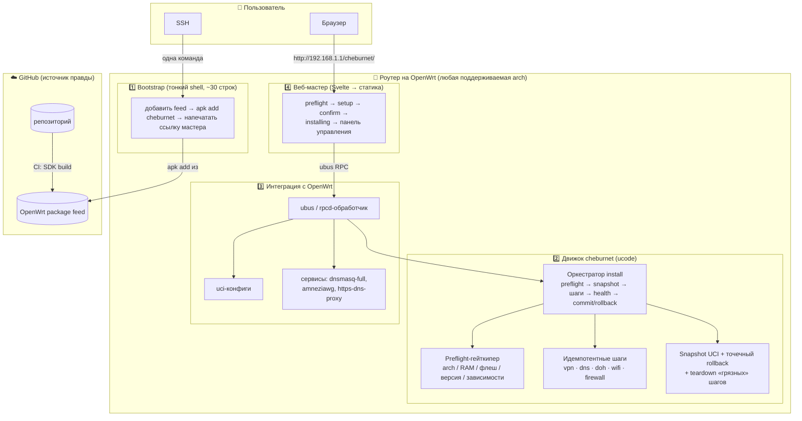
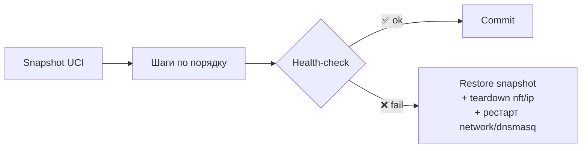
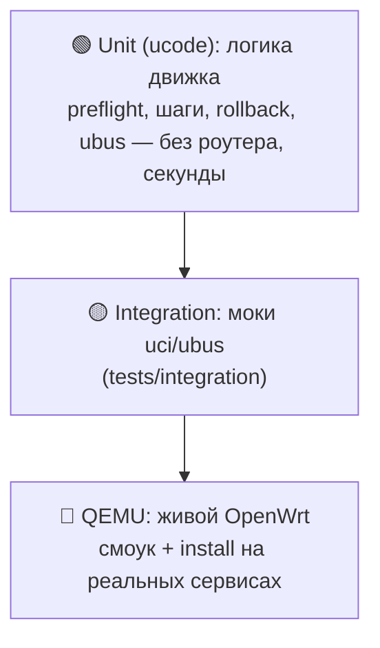

# 🏗 Архитектура v2

> **Статус:** целевая архитектура; ядро реализовано в ветке `feat/v2` (движок, шаги,
> ubus, веб-мастер, пакет, QEMU-тесты). Мотивация решений — здесь; детали надёжности —
> [v2/architecture/reliability.md](v2/architecture/reliability.md); текущая v1 —
> [01-architecture.md](01-architecture.md).

## TL;DR

Уходим от хрупкого bash к **движку на ucode** (родной язык OpenWrt, едет на любой
архитектуре без кросс-компиляции). Data-plane — на **примитивах ядра**: dnsmasq-nftset +
nftables + policy routing + AmneziaWG — легче sing-box и каждый шаг маршрутизации виден
(образовательность). Проект распространяется как **пакет в OpenWrt-feed** — `apk` сам
подбирает arch и зависимости, поэтому установщик **универсален** под все подходящие
роутеры. Надёжность держат **три простых кирпича** (не generic-движок): строгий
**preflight** как гейткипер железа, **идемпотентные шаги**, **точечный rollback** там,
где откат чистый. Обычный человек ставит OpenWrt, вставляет одну команду, проходит
**веб-мастер** (Svelte) — и всё работает. Качество держит **CI-матрица в QEMU** по
архитектурам и версиям OpenWrt: тестируем не модели, а arch-семейства.

---

## 🎯 Принципы

1. **Минимум поддержки — главный критерий.** Соло, в свободное время. Каждое решение
   оценивается вопросом «сколько времени это будет отнимать потом».
2. **Образовательность.** Никаких чёрных ящиков: ученик видит каждый шаг маршрутизации.
   Поэтому примитивы ядра вместо sing-box (Light-тир; sing-box возвращается только
   опционально в Full-тире — [ADR 0004](v2/decisions/0004-multi-protocol-tiers.md)).
3. **Простота = надёжность.** Надёжным можно сделать только то, что держишь в голове
   целиком. Никаких generic-абстракций, которые прячут баги.
4. **Fail-safe by design.** Дефолт — туннель; исключения (direct-список) — напрямую.
   Любой промах списка или детекта = трафик идёт через VPN (безопасно), а не утекает.
5. **Идемпотентность.** Повторный запуск установки/применения чинит, а не ломает.
6. **Гейткипер вместо списка моделей.** Не «поддерживаемые роутеры», а «требования к
   железу» + автоматический preflight, который честно отказывает.
7. **Универсальность через пакетный менеджер.** `apk` решает «правильный бинарь под
   arch» и «зависимости» — не детектим руками.
8. **Тестируем arch, а не модели.** Один прогон QEMU-матрицы покрывает тысячи реальных
   роутеров, сводящихся к нескольким arch-семействам.

---

## 🧱 Слоистая архитектура



### Слой 1 — Bootstrap (тонкий shell)
Намеренно остаётся на shell: ~30 строк, shell универсален на OpenWrt. Делает только:
добавляет feed → `apk add cheburnet` → печатает ссылку мастера с install-токеном.
Вся хрупкая логика — **не здесь**.

### Слой 2 — Движок `cheburnet` (ucode)
Сердце проекта. На ucode, потому что: интерпретируемый (нет кросс-компиляции под arch),
ноль роста флеша, нативные `uci`/`ubus`, настоящие типы/исключения/JSON. Каждый модуль —
чистая логика отдельно от импурного I/O: логика юнит-тестится интерпретатором в CI,
I/O проверяется в QEMU.

### Слой 3 — Интеграция с OpenWrt
ubus/rpcd-обработчик, запись `uci`, управление сервисами. Стандартные механизмы
OpenWrt — ничего экзотического.

### Слой 4 — Веб-мастер
Статический SPA на **Svelte** (Vite → статика, бандл в пакете), отдаётся с роутера,
общается через ubus RPC (uhttpd-mod-ubus). Мастер установки + панель управления.

---

## 🛡 Надёжность: три простых кирпича

Не generic-движок (desired-state модель и state-machine из ранних набросков сознательно
отвергнуты — почему, см. [reliability.md](v2/architecture/reliability.md)), а три
кирпича, каждый из которых держится в голове целиком:

### 1. Preflight-гейткипер
Заменяет «список поддерживаемых моделей». Перед **любыми** изменениями проверяет и
отказывает с понятным сообщением:

| Проверка | Зачем |
|---|---|
| arch ∈ поддерживаемых | бинарь зависимостей существует |
| версия OpenWrt ≥ 25.12 | API/пакеты совместимы |
| свободный флеш ≥ порога | пакеты влезут |
| RAM ≥ порога | сервисы не упадут под нагрузкой |
| **зависимости устанавливаются** (`kmod-amneziawg`, `dnsmasq-full`, `https-dns-proxy`) | **главный чек** — иначе install упрётся на середине |
| нет конфликта LAN/WAN | не отрезать себе доступ |

### 2. Идемпотентные шаги
Каждый шаг (vpn, dns, doh, wifi, firewall) приводит свой кусок системы к нужному
состоянию и безопасен при повторном запуске: именованные uci-секции с
delete-before-set, минимальный diff там, где он дешёвый, no-op — когда всё уже
применено. Чужие секции/записи шаг не трогает.

### 3. Точечный rollback + health-check
Snapshot UCI перед установкой; после шагов — health-check (DNS + туннель поднялись,
с поллингом на тёплый старт) → commit или откат:



**Честная граница:** чистые uci-конфиги откатывает snapshot; состояние ядра (nft/ip)
не откатывается чисто, как UCI, — «грязные» шаги снимаются teardown'ом, и мы не
маскируем это под транзакцию.

---

## 📦 Дистрибуция: универсальный установщик через feed

«Универсально под все роутеры» = **не** один бинарь под всё, а **пакетный feed**:

```
Пользователь (уже на OpenWrt):
  одна команда в SSH
    └─ bootstrap: добавить feed → apk add cheburnet
         └─ apk САМ выбирает пакет под arch + тянет зависимости   ← вот где «универсальность»
            └─ preflight: «✅ железо подходит» | «❌ нужно ≥ X флеша»
               └─ открыть http://192.168.1.1/cheburnet/ → веб-мастер
```

> **Честная граница:** «универсально» = «под все arch, для которых существуют
> зависимости». Где нет `kmod-amneziawg` — preflight честно откажет. Поэтому проверка
> устанавливаемости зависимостей обязательна, а наш feed несёт kmod-сборки под
> поддерживаемые релизы/target'ы (главная статья сопровождения дистрибуции).

Единственный barrier на пользователе — **поставить сам OpenWrt** (вне нашего софта):
гайд + ссылка на OpenWrt firmware-selector.

---

## 🧪 Тестирование и CI/CD



```
GitHub Actions:
  1. lint + unit-тесты движка (ucode)            ← быстро, без железа
  2. сборка пакета через OpenWrt SDK             ← матрица arch
  3. QEMU: смоук движка (hermetic) + install-тест с реальным feed'ом
     └─ данные-plane против настоящих dnsmasq-full / https-dns-proxy
        + проверка, что preflight КОРРЕКТНО ОТКАЗЫВАЕТ на негодном железе
  4. при git-теге: публикация feed + GitHub Release
```

Тестируем **архитектуры и версии**, а не модели. Урок живых прогонов: QEMU-ассерты
должны проверять **итоговое состояние системы** (сгенерированный конфиг, наполнение
nft-сета), а не только «uci-запись легла» — тихие отказы иначе не ловятся.

---

## 📂 Структура репозитория (v2)

```
cheburnet-router/
├── bootstrap/            # тонкий shell-установщик (~30 строк)
├── engine/               # движок на ucode
│   ├── preflight/        #   гейткипер железа/зависимостей
│   ├── routing/          #   генератор split-routing (чистая логика)
│   ├── steps/            #   идемпотентные шаги: vpn, dns, doh, wifi, firewall…
│   ├── rollback/         #   snapshot/restore/commit UCI
│   ├── install/          #   оркестратор: порядок шагов, health, commit/rollback
│   ├── list/             #   импорт community-списка direct-доменов
│   ├── ubus/             #   реестр методов + rpcd-обработчик
│   └── lib/              #   общие хелперы (uci diff, proc, тест-раннер)
├── web-v2/               # SPA (Svelte + Vite) → бандл коммитится в package/
├── package/cheburnet/    # OpenWrt Makefile (SDK), файлы пакета
├── tests/
│   ├── integration/      # моки
│   └── qemu/             # смоук v2 + install-тест v2 (+ наследие v1 до sunset)
├── docs/
└── .github/workflows/    # CI: unit → SDK build → QEMU → release
```

---

## 🔀 Миграция v1 → v2 (strangler-fig)

v1 (bash + монолитный web) остаётся рабочей страховкой, пока v2 не выйдет в релиз;
удаление v1 — строго по чек-листу [Sunset v1](v2/meta/sunset-v1.md).

Выполнено: движок целиком (preflight, шаги, rollback, install, ubus), пакет + SDK-сборка,
веб-мастер и панель на Svelte, QEMU-смоук и install-тест в CI, живой прогон движка на
реальном железе. Осталось до релиза: настоящий feed с подписью (+kmod-amneziawg под
поддерживаемые target'ы), полный install на реальном роутере, обкатка.

---

## ✅ Что это даёт

- **Надёжность:** preflight + идемпотентные шаги + точечный rollback → нельзя сломать
  роутер self-install'ом; провал установки возвращает систему в исходное состояние.
- **Простота:** одна команда → мастер; ucode вместо 10K строк хрупкого bash.
- **Образовательность:** каждый слой data-plane — стандартный примитив, который виден
  и объясняется в docs/.
- **Удобство:** универсально под подходящие роутеры через `apk`, без выбора образа.
- **Проверяемость:** пирамида тестов + QEMU → каждый релиз проверен по arch и версиям.
- **Open source:** репозиторий — источник правды, CI собирает feed; ничего проприетарного.
