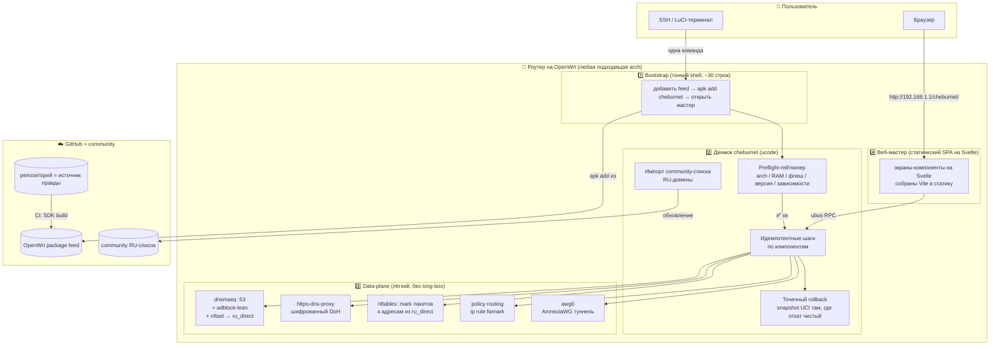
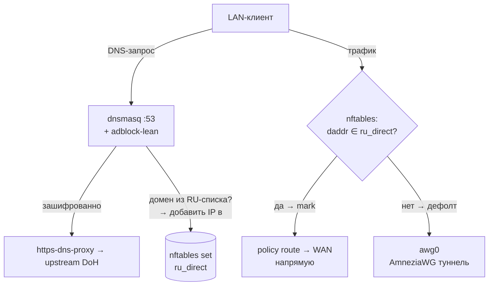
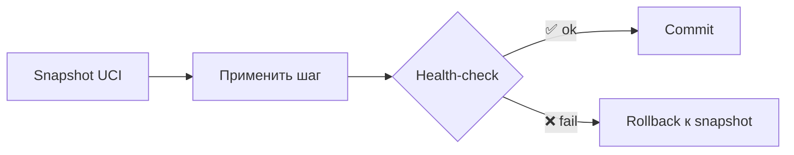
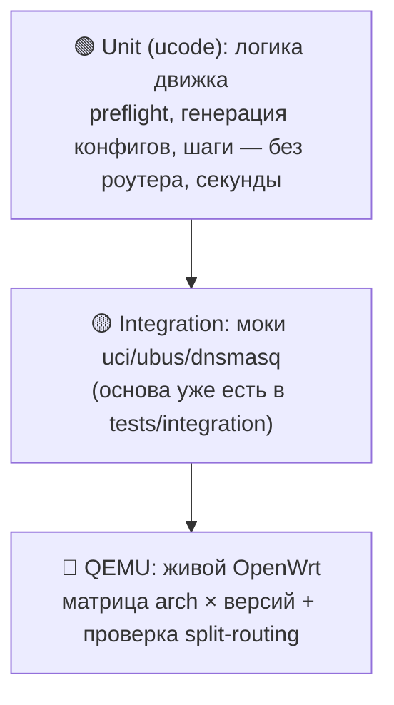
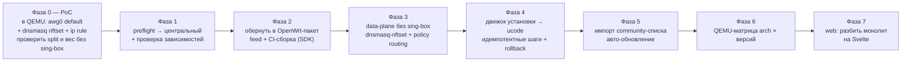

# 🏗 Целевая архитектура v2 (proposal)

> **Статус:** предложение / дизайн-документ. Описывает, каким проект должен стать —
> **простым, лёгким, надёжным и не требующим много времени на поддержку** одним
> человеком. Сознательно легче текущей реализации на podkop/sing-box
> (см. [01-architecture.md](01-architecture.md)).

## TL;DR

Главная ставка — **минимум поддержки для соло-разработчика** и **работа на слабом железе**.
Поэтому: **отказываемся от sing-box** в пользу классического лёгкого split-routing на
**dnsmasq-nftset + policy routing** — то, чем на OpenWrt делали обход по доменам годами.
Оркестрация и логика — на **ucode** (родной язык OpenWrt, нулевой footprint, едет на любой
архитектуре без кросс-компиляции). Распространение — **пакет в OpenWrt-feed**, `apk` сам
подбирает arch и зависимости → установщик **универсален**. Надёжность держат **три простых
кирпича** (не generic-движок): строгий **preflight**, **идемпотентные шаги**, **точечный
rollback** там, где откат чистый. Веб-мастер — на **Svelte**. Качество — **CI-матрица в QEMU**
по архитектурам и версиям. Список маршрутизации **импортируем** из community, а не владеем им.

---

## 🎯 Принципы

1. **Минимум поддержки — главный критерий.** Соло, в свободное время. Каждое решение
   оценивается вопросом «сколько времени это будет у меня отнимать потом». Простое и
   понятное побеждает мощное и хитрое.
2. **Простота = надёжность.** Надёжным можно сделать только то, что полностью понимаешь.
   Никаких generic-абстракций, которые прячут баги.
3. **Лёгкость ради слабого железа.** Отказ от sing-box экономит МБ флеша и RAM — это
   расширяет круг поддерживаемых роутеров.
4. **Fail-safe by design.** Дефолт — туннель; исключения — напрямую. Любой промах списка
   или детекта = трафик идёт через VPN (безопасно), а не утекает.
5. **Гейткипер вместо списка моделей.** Не «поддерживаемые роутеры», а «требования к
   железу» + автоматический preflight, который честно отказывает.
6. **Универсальность через пакетный менеджер.** `apk`/`opkg` решают «правильный бинарь
   под arch» и «зависимости» — не детектим руками.
7. **Не владеть данными.** Список маршрутизации импортируем из maintained-community —
   получаем актуальность без вечной ручной работы.
8. **PoC раньше решений.** Любую крупную ставку сначала проверяем маленьким прототипом
   в QEMU, потом закладываем в архитектуру.

---

## 🧱 Слоистая архитектура



### Слой 1 — Bootstrap (тонкий shell)
Намеренно на shell: ~30 строк, shell универсален на OpenWrt. Добавляет feed →
`apk add cheburnet` → открывает мастер. Вся хрупкая логика — **не здесь**.

### Слой 2 — Движок `cheburnet` (ucode)
Логика установки: preflight, идемпотентные шаги, rollback, импорт списка, ubus-обработчик.
ucode выбран ради **нулевого footprint** (важно для слабого железа) и нативных `uci`/`ubus`.
Минус — нишевость и мало доков — компенсируется изучением спецификации и ИИ-помощью.

### Слой 3 — Data-plane (главное упрощение)
**Без sing-box.** Split-routing делает связка dnsmasq-nftset + nftables + policy routing
+ AmneziaWG. Шифрованный DNS — отдельный лёгкий `https-dns-proxy`. Adblock — `adblock-lean`
напрямую с dnsmasq. Подробно — раздел ниже.

### Слой 4 — Веб-мастер (Svelte)
Статический SPA, отдаётся с роутера, общается через ubus RPC. Монолитный `index.html`
разбивается на компоненты-экраны на **Svelte**, собирается **Vite** в статику на CI.

**Почему Svelte:** компилятор «стирает» фреймворк → минимальный размер вывода, мало
boilerplate (удобно поддерживать соло), встроенные transitions идеальны для пошагового
мастера, декларативная реактивность ложится на живую статус-панель. Build-step — единственная
цена, с ИИ управляема.

---

## 🚦 Data-plane: лёгкий split-routing без sing-box

Это сердце упрощения. Задача — **«.ru напрямую, всё остальное через туннель»** — решается
классическим способом OpenWrt, который легче и неприхотливее sing-box.



**Как это работает по шагам:**

1. **Туннель по умолчанию.** `awg0` — дефолтный маршрут: весь трафик идёт через VPN.
2. **dnsmasq заполняет сет.** Для доменов из RU-списка dnsmasq сам кладёт резолвнутый IP
   в nftables-сет `ru_direct`:
   ```
   # /etc/config/dhcp (dnsmasq)
   list nftset '/ru/4#inet#fw4#ru_direct'
   list nftset '/xn--p1ai/4#inet#fw4#ru_direct'   # .рф (punycode)
   # + импортированный community-список доменов
   ```
3. **nftables метит «прямые» пакеты:**
   ```
   nft add rule inet fw4 mangle_prerouting ip daddr @ru_direct meta mark set 0x1
   ```
4. **policy routing разводит:**
   ```
   ip rule add fwmark 0x1 lookup 100      # помеченные → таблица 100
   ip route add default via <WAN-gw> table 100   # таблица 100 = напрямую через WAN
   # main-таблица: default dev awg0        # всё остальное → туннель
   ```
5. **Killswitch** (fw4) — drop LAN→WAN, если туннель упал и трафик не помечен как direct.

**Шифрованный DNS:** функцию DoH, которую раньше нёс sing-box, берёт лёгкий
`https-dns-proxy` перед dnsmasq. **Adblock** (`adblock-lean`) работает с dnsmasq напрямую,
независимо. **Режимы HOME/TRAVEL:** HOME = правила выше; TRAVEL = убрать direct-правила →
всё в туннель (тривиально).

**Почему это надёжно именно здесь:** направление *fail-safe*. Клиент в обход DNS (Chrome
с DoH, смарт-ТВ) просто не попадёт в `ru_direct` → пойдёт **через туннель** (работает, чуть
медленнее), а не утечёт. Промах списка = тоже через туннель. Это снимает главный риск DIY.

---

## 📋 Список маршрутизации — импортируем, не владеем

Самая дорогая часть split-routing — **не код, а актуальный список** «что считать RU».
`.ru`/`.рф` как TLD — тривиально. Но реальные RU-сервисы есть и на `.com`, плюс CDN-диапазоны.

**Решение, экономящее время:** не поддерживать список вручную, а **импортировать
maintained community-список** (подписка на обновляемый набор RU-доменов/IP). Движок
периодически тянет его и регенерит конфиг dnsmasq/nftset. Получаем актуальность без
вечной ручной работы — прямой вклад в «минимум поддержки».

---

## 🛡 Надёжность: три простых кирпича (без generic-движка)

Сознательно **не строим** generic desired-state reconciler (путь Ansible/Puppet — годы и
команды; для соло это over-engineering и источник скрытых багов). Вместо него — три понятных
механизма, каждый из которых ты держишь в голове целиком:

### 1. Строгий preflight (гейткипер)
Перед **любыми** изменениями проверяет и отказывает с понятным сообщением:

| Проверка | Зачем |
|---|---|
| arch ∈ поддерживаемых | бинарь зависимостей существует |
| версия OpenWrt ≥ 25.12 | API/пакеты совместимы |
| свободный флеш ≥ порога | пакеты влезут |
| RAM ≥ порога | dnsmasq/awg не упадут под нагрузкой |
| **зависимости устанавливаются** (`kmod-amneziawg`, `https-dns-proxy`…) | **главный чек** — иначе install упрётся на середине |
| нет конфликта LAN/WAN | не отрезать себе доступ |

### 2. Идемпотентные шаги по компонентам
Установка — набор шагов (DNS, firewall, vpn, wifi, adblock), **каждый можно запустить
дважды без вреда**. Повторный install чинит, а не ломает. Никакого общего «состояния
системы» — каждый шаг сам проверяет «уже сделано? → пропустить».

### 3. Точечный rollback — только там, где откат чистый



UCI-конфиги откатываются чисто — на них транзакция. **Операции с грязным откатом**
(загруженный kmod, изменённое состояние сети) **не маскируем под транзакцию**: для них —
честный **safe-fail + понятная ошибка пользователю**, а не иллюзия отката. Эта честность
важнее красивой абстракции.

---

## 📦 Дистрибуция: универсальный установщик через feed

«Универсально под все роутеры» = **не** один бинарь под всё, а **пакетный feed**:

```
Пользователь (уже на OpenWrt):
  одна команда в SSH
    └─ bootstrap: добавить feed → apk add cheburnet
         └─ apk САМ выбирает пакет под arch + тянет зависимости   ← «универсальность»
            └─ preflight: «✅ железо подходит» | «❌ нужно ≥ X флеша»
               └─ открыть http://192.168.1.1/cheburnet/ → веб-мастер
```

> **Честная граница:** «универсально» = «под все arch, для которых существуют зависимости».
> Где нет `kmod-amneziawg` — preflight честно откажет. Поэтому проверка устанавливаемости
> зависимостей обязательна.

Единственный barrier на пользователе — **поставить сам OpenWrt** (вне нашего софта):
гайд + видео + ссылка на OpenWrt firmware-selector.

---

## 🧪 Тестирование и CI/CD

Пирамида тестов — ответ на «максимально проверить сборку перед релизом»:



```
GitHub Actions:
  1. lint + unit-тесты движка (ucode)            ← быстро, без железа
  2. сборка пакета через OpenWrt SDK             ← матрица: x86_64, mips, mipsel, arm, aarch64
  3. boot в QEMU × {x86_64, mips, armvirt}
        × {OpenWrt 25.12, snapshot}
     └─ apk add cheburnet → интеграционные тесты:
        • split реально работает (.ru → WAN, прочее → awg0)
        • preflight КОРРЕКТНО ОТКАЗЫВАЕТ на негодном железе
  4. при git-теге: публикация feed + GitHub Release
```

Тестируем **архитектуры и версии**, а не модели — один прогон покрывает тысячи роутеров.
QEMU-слой у проекта уже есть (`tests/qemu`), расширяем до матрицы.

---

## 📂 Предлагаемая структура репозитория

```
cheburnet-router/
├── bootstrap/            # тонкий shell-установщик (~30 строк) + feed-setup
├── engine/               # движок на ucode
│   ├── preflight/        #   гейткипер железа/зависимостей
│   ├── steps/            #   идемпотентные шаги по компонентам
│   ├── rollback/         #   snapshot/restore UCI (точечно)
│   ├── routing/          #   генерация dnsmasq-nftset + nft + ip rule
│   ├── list/             #   импорт и обновление community-списка
│   └── tests/            #   unit-тесты ucode
├── ubus/                 # rpcd-обработчик (наследник rpcd-cheburnet)
├── web/                  # SPA на Svelte → Vite собирает в статику
├── package/              # OpenWrt Makefile для сборки пакета через SDK
├── tests/
│   ├── integration/      # моки (есть)
│   └── qemu/             # QEMU-матрица (есть, расширяем)
├── docs/
└── .github/workflows/    # CI: unit → SDK build → QEMU-матрица → release
```

---

## 🔀 План миграции (strangler-fig, без big-bang rewrite)

Bash-скрипты и bats-тесты остаются страховкой, пока куски переезжают по одному.
**Начинаем с PoC**, чтобы проверить главную ставку до больших вложений.



| Фаза | Результат | Риск |
|---|---|---|
| 0. **PoC split без sing-box** | честный ответ «годится / нет» за вечер | минимальный |
| 1. Preflight-гейткипер | self-install не стартует на негодном железе | низкий |
| 2. Пакет + feed | `apk add cheburnet`, воспроизводимая сборка | низкий |
| 3. Data-plane без sing-box | ↓ МБ флеша/RAM → слабые роутеры тянут | средний (ядро системы) |
| 4. Движок на ucode | уходит самый хрупкий bash | средний (изолирован) |
| 5. Импорт списка | актуальность без ручной поддержки | низкий |
| 6. QEMU-матрица | проверка перед релизом по arch × версиям | низкий |
| 7. Web-рефактор | поддерживаемый UI вместо монолита 90 КБ | низкий |

**Ключевая идея:** каждая фаза самостоятельно полезна; Фаза 0 (PoC) валидирует главную
ставку до того, как ты вложишься.

---

## ⚖️ Честные ограничения и риски

Чтобы документ не переобещал:

1. **«Универсально» уже, чем звучит.** Роутеры с 8/16 МБ флеша и 64 МБ RAM физически не
   потянут VPN-стек, как ни облегчай. Реальная полоса — **middle-range и выше**. Отказ от
   sing-box расширяет её, но не до «любого роутера». Preflight будет отказывать — это честно.
2. **ucode — нишевый.** Мало доков, незрелый тулинг, ИИ знает его хуже популярных языков.
   Принято сознательно ради footprint; компенсация — изучение спеки + проверка ИИ-вывода.
   Если footprint вдруг перестанет быть критичным — пересмотреть в пользу Go (ИИ-friendly,
   лучшие тесты), ценой нескольких МБ.
3. **DIY split-routing слабее sing-box против обхода DNS.** Клиент с хардкодным DoH не
   попадёт в `ru_direct`. Для нас это **fail-safe** (уйдёт в туннель), но «.ru напрямую»
   для такого клиента не сработает. Осознанный размен ради лёгкости.
4. **Архитектура чинит установщик, а не весь мир.** Стабильность VPN/DNS, доступность
   пакетов под arch, дрейф версий OpenWrt, провайдер пользователя — вне её контроля.
5. **CDN и IPv6** — общий IP для RU и не-RU сервисов чисто по IP не делится. Деление по
   доменам в dnsmasq покрывает большинство, но не все edge-кейсы.

---

## ✅ Что это даёт

- **Минимум поддержки:** простые кирпичи вместо generic-движка, импорт списка вместо
  владения данными, один человек держит всю систему в голове.
- **Лёгкость:** без sing-box → меньше флеша/RAM → слабые роутеры в игре.
- **Надёжность:** preflight + идемпотентность + точечный rollback + fail-safe направление →
  self-install нельзя оставить в битом состоянии и нельзя «утечь».
- **Удобство:** одна команда → веб-мастер на Svelte; универсально под подходящие роутеры
  через `apk`.
- **Проверяемость:** пирамида тестов + QEMU-матрица → каждый релиз проверен по arch и версиям.
- **Open source:** репозиторий — источник правды, CI собирает feed; ничего проприетарного.
