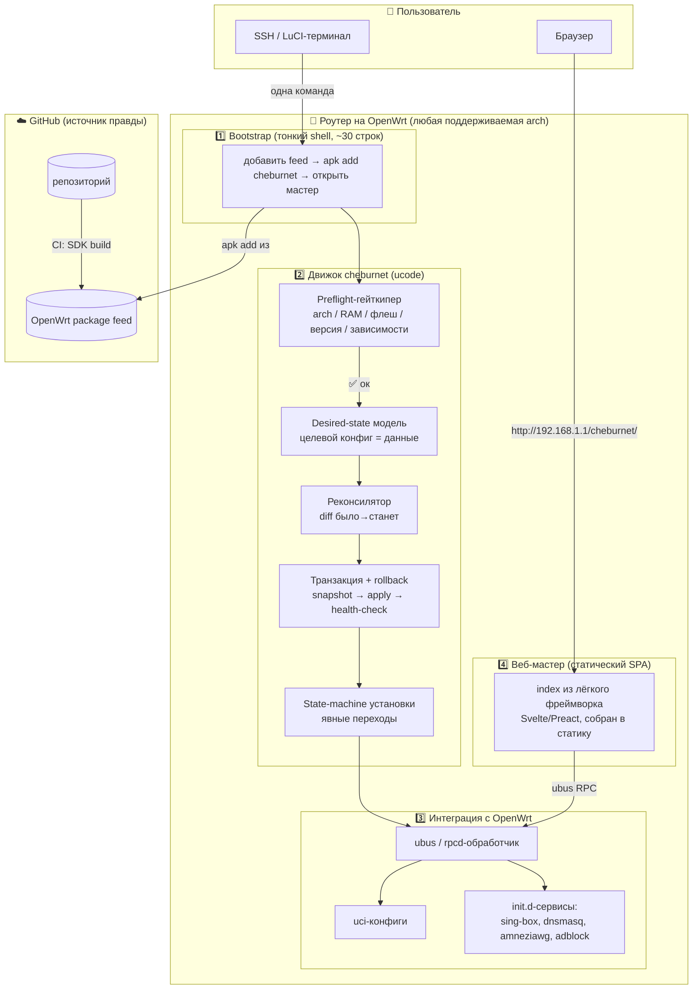
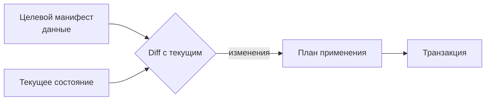
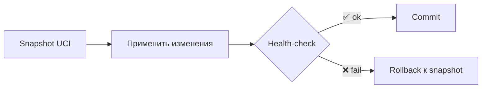
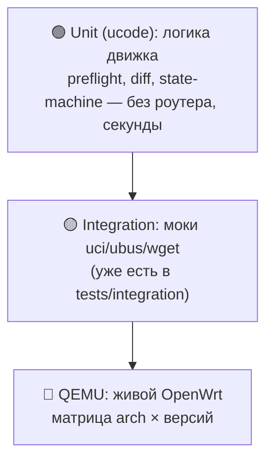
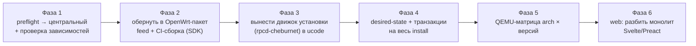

# 🏗 Целевая архитектура v2 (proposal)

> **Статус:** предложение / дизайн-документ. Описывает, каким проект должен стать —
> надёжным, простым в установке и удобным для обычных людей, оставаясь open source
> и идиоматичным для OpenWrt. Не описывает текущую реализацию (см. [01-architecture.md](01-architecture.md)).

## TL;DR

Уходим от хрупкого bash к **движку на ucode** (родной язык OpenWrt, едет на любой
архитектуре без кросс-компиляции). Проект распространяется как **пакет в OpenWrt-feed** —
`apk` сам подбирает arch и зависимости, поэтому установщик **универсален** под все
подходящие роутеры. Ядро надёжности — три паттерна: **строгий preflight** как гейткипер
железа, **desired-state модель** (целевой конфиг = данные), и **транзакции с авто-rollback**
(применил → health-check → не взлетело → откат). Обычный человек ставит OpenWrt, вставляет
одну команду, проходит **веб-мастер** — и всё работает. Качество держит **CI-матрица в QEMU**
по архитектурам и версиям OpenWrt: тестируем не модели, а arch-семейства.

---

## 🎯 Принципы

1. **Нельзя оставить систему в полу-состоянии.** Любая операция — транзакция: либо
   применилась целиком, либо откатилась к рабочему состоянию.
2. **Идемпотентность.** Повторный запуск установки/применения ничего не ломает.
3. **Гейткипер вместо списка моделей.** Не «поддерживаемые роутеры», а «требования к
   железу» + автоматический preflight, который честно отказывает.
4. **Универсальность через пакетный менеджер.** `apk`/`opkg` решают «правильный бинарь
   под arch» и «зависимости» — не детектим руками.
5. **Zero-footprint логика.** Движок на ucode не растит флеш — важно для слабого железа,
   которое мы не контролируем.
6. **Тестируем arch, а не модели.** Один прогон QEMU-матрицы покрывает тысячи реальных
   роутеров, сводящихся к нескольким arch-семействам.
7. **Open source без компромиссов.** Репозиторий — источник правды; CI делает из него
   пакеты и feed. Ничего проприетарного.

---

## 🧱 Слоистая архитектура



### Слой 1 — Bootstrap (тонкий shell)
Намеренно остаётся на shell: ~30 строк, shell универсален на OpenWrt. Делает только:
добавляет feed → `apk add cheburnet` → открывает мастер. Вся хрупкая логика — **не здесь**.

### Слой 2 — Движок `cheburnet` (ucode)
Сердце проекта. Здесь живут все паттерны надёжности (см. ниже). На ucode, потому что:
интерпретируемый (нет кросс-компиляции под arch), ноль роста флеша, нативные `uci`/`ubus`,
настоящие типы/исключения/JSON, логику можно юнит-тестить интерпретатором в CI.

### Слой 3 — Интеграция с OpenWrt
ubus/rpcd-обработчик (наследник текущего `rpcd-cheburnet`), запись `uci`, управление
сервисами. Стандартные механизмы OpenWrt — ничего экзотического.

### Слой 4 — Веб-мастер
Статический SPA, отдаётся с роутера, общается через ubus RPC. Монолитный `index.html`
разбивается лёгким компилируемым-в-статику фреймворком (**Svelte/Preact**, не Angular).
Собирается в один статический файл на CI.

---

## 🛡 Паттерны надёжности

### 1. Preflight-гейткипер
Заменяет «список поддерживаемых моделей». Перед **любыми** изменениями проверяет и
отказывает с понятным сообщением:

| Проверка | Зачем |
|---|---|
| arch ∈ поддерживаемых | бинарь зависимостей существует |
| версия OpenWrt ≥ 25.12 | API/пакеты совместимы |
| свободный флеш ≥ порога | пакеты и образы влезут |
| RAM ≥ порога | sing-box/dnsmasq не упадут под нагрузкой |
| **зависимости устанавливаются** (`kmod-amneziawg`, podkop…) | **главный чек** — иначе install упрётся на середине |
| нет конфликта LAN/WAN | не отрезать себе доступ |

### 2. Desired-state модель
Вместо императивных мутаций UCI — **целевая конфигурация как данные** (манифест).
Движок считает diff «текущее → целевое» и приводит систему к нужному состоянию.
Идемпотентно по определению.



### 3. Транзакция с авто-rollback
Уже есть для замены awg-конфига — распространяется на **весь** install (DNS, firewall,
wifi, режимы):



### 4. State-machine установки
Вместо россыпи флагов в `/tmp` (install-token, done-файлы) — один конечный автомат с
явными состояниями и переходами. Прозрачно для мастера (показывает текущий шаг) и для
восстановления после обрыва.

---

## 📦 Дистрибуция: универсальный установщик через feed

«Универсально под все роутеры» = **не** один бинарь под всё, а **пакетный feed**:

```
Пользователь (уже на OpenWrt):
  одна команда в SSH
    └─ bootstrap: добавить feed → apk add cheburnet
         └─ apk САМ выбирает пакет под arch + тянет зависимости   ← вот где «универсальность»
            └─ preflight: «✅ железо подходит» | «❌ нужно ≥ X флеша»
               └─ открыть http://192.168.1.1/cheburnet/ → веб-мастер
```

> **Честная граница:** «универсально» = «под все arch, для которых существуют
> зависимости». Где нет `kmod-amneziawg` — preflight честно откажет. Поэтому проверка
> устанавливаемости зависимостей обязательна.

Единственный barrier на пользователе — **поставить сам OpenWrt** (вне нашего софта):
гайд + видео + ссылка на OpenWrt firmware-selector.

---

## 🧪 Тестирование и CI/CD

Пирамида тестов — главный ответ на «максимально проверить сборку перед релизом»:



```
GitHub Actions:
  1. lint + unit-тесты движка (ucode)            ← быстро, без железа
  2. сборка пакета через OpenWrt SDK             ← матрица: x86_64, mips, mipsel, arm, aarch64
  3. boot в QEMU × {x86_64, mips, armvirt}
        × {OpenWrt 25.12, snapshot}
     └─ apk add cheburnet → интеграционные тесты
        + проверка, что preflight КОРРЕКТНО ОТКАЗЫВАЕТ на негодном железе
  4. при git-теге: публикация feed + GitHub Release
```

Тестируем **архитектуры и версии**, а не модели — один прогон покрывает тысячи роутеров.
QEMU-слой у проекта уже есть (`tests/qemu`), его расширяем до матрицы.

---

## 📂 Предлагаемая структура репозитория

```
cheburnet-router/
├── bootstrap/            # тонкий shell-установщик (~30 строк) + feed-setup
├── engine/               # движок на ucode
│   ├── preflight/        #   гейткипер железа/зависимостей
│   ├── desired/          #   манифест + реконсилятор
│   ├── tx/               #   транзакции и rollback
│   ├── statemachine/     #   автомат установки
│   └── tests/            #   unit-тесты ucode
├── ubus/                 # rpcd-обработчик (наследник rpcd-cheburnet)
├── web/                  # SPA (Svelte/Preact) → собирается в статику
├── package/              # OpenWrt Makefile для сборки пакета через SDK
├── tests/
│   ├── integration/      # моки (есть)
│   └── qemu/             # QEMU-матрица (есть, расширяем)
├── docs/
└── .github/workflows/    # CI: unit → SDK build → QEMU-матрица → release
```

---

## 🔀 План миграции (strangler-fig, без big-bang rewrite)

Bash-скрипты и bats-тесты остаются страховкой, пока куски переезжают по одному.



| Фаза | Результат | Риск |
|---|---|---|
| 1. Preflight-гейткипер | self-install не стартует на негодном железе | низкий |
| 2. Пакет + feed | `apk add cheburnet`, воспроизводимая сборка в CI | низкий |
| 3. Движок на ucode | уходит самый хрупкий bash | средний (изолирован) |
| 4. Desired-state + tx | «без глюков», нельзя оставить полу-состояние | средний |
| 5. QEMU-матрица | проверка перед релизом по arch × версиям | низкий |
| 6. Web-рефактор | поддерживаемый UI вместо монолита 90 КБ | низкий |

**Ключевая идея:** каждая фаза самостоятельно полезна и не требует переписать всё разом.
Начинаем с самого хрупкого (preflight, движок), UI — последним.

---

## ✅ Что это даёт

- **Надёжность:** транзакции + rollback + идемпотентность + строгий preflight → нельзя
  сломать роутер self-install'ом.
- **Простота:** одна команда → мастер; ucode вместо 10K строк хрупкого bash.
- **Удобство:** универсально под все подходящие роутеры через `apk`, без выбора образа.
- **Проверяемость:** пирамида тестов + QEMU-матрица → каждый релиз проверен по arch и версиям.
- **Open source:** репозиторий — источник правды, CI собирает feed; ничего проприетарного.
