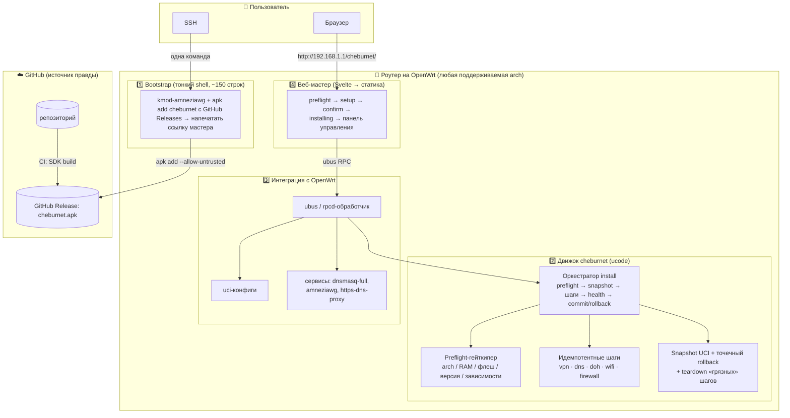
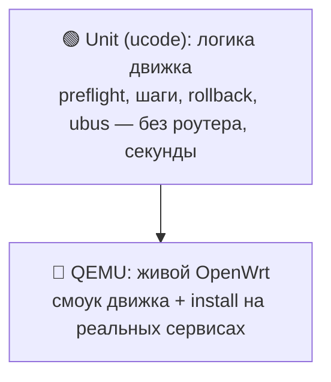

# Архитектура

> **Статус:** реализовано и смерджено в `master` (движок, шаги, ubus, веб-мастер, пакет,
> QEMU-тесты); v1 удалён по чек-листу [Sunset v1](kb/decisions/sunset-v1.md). Мотивация решений —
> здесь; детали надёжности — [kb/architecture/reliability.md](kb/architecture/reliability.md).

## TL;DR

Уходим от хрупкого bash к **движку на ucode** (родной язык OpenWrt, едет на любой
архитектуре без кросс-компиляции). Data-plane — на **примитивах ядра**: dnsmasq-nftset +
nftables + policy routing + AmneziaWG — легче sing-box и каждый шаг маршрутизации виден
(образовательность). Проект распространяется через **GitHub Releases**, не свой feed: пакет
`cheburnet` — один `.apk` на все архитектуры (`PKGARCH:=all`), kmod AmneziaWG ставит
vendored `awg-openwrt` (сам подбирает arch/ядро), остальное — из штатного feed'а OpenWrt.
Установщик от этого всё равно **универсален** под все подходящие роутеры. Надёжность держат
**три простых кирпича** (не generic-движок): строгий
**preflight** как гейткипер железа, **идемпотентные шаги**, **точечный rollback** там,
где откат чистый. Обычный человек ставит OpenWrt, вставляет одну команду, проходит
**веб-мастер** (Svelte) — и всё работает. Качество держит **CI-матрица в QEMU** по
архитектурам и версиям OpenWrt: тестируем не модели, а arch-семейства.

---

## Принципы

1. **Минимум поддержки — главный критерий.** Соло, в свободное время. Каждое решение
   оценивается вопросом «сколько времени это будет отнимать потом».
2. **Образовательность.** Никаких чёрных ящиков: ученик видит каждый шаг маршрутизации.
   Поэтому примитивы ядра вместо sing-box (Light-тир; sing-box возвращается только
   опционально в Full-тире — [ADR 0004](kb/decisions/0004-multi-protocol-tiers.md)).
3. **Простота = надёжность.** Надёжным можно сделать только то, что держишь в голове
   целиком. Никаких generic-абстракций, которые прячут баги.
4. **Fail-safe by design.** Дефолт — туннель; исключения (direct-список) — напрямую.
   Любой промах списка или детекта = трафик идёт через VPN (безопасно), а не утекает.
5. **Идемпотентность.** Повторный запуск установки/применения чинит, а не ломает.
6. **Гейткипер вместо списка моделей.** Не «поддерживаемые роутеры», а «требования к
   железу» + автоматический preflight, который честно отказывает.
7. **Универсальность через пакетный менеджер.** `apk` решает «правильный бинарь под
   arch» и «зависимости» — не детектим руками.
8. **Тестируем arch, а не модели.** Один прогон QEMU-матрицы покрывает тысячи реальных
   роутеров, сводящихся к нескольким arch-семействам.

---

## Слоистая архитектура



### Слой 1 — Bootstrap (тонкий shell)
Намеренно остаётся на shell: ~150 строк, shell универсален на OpenWrt. Делает только:
ставит kmod-amneziawg (vendored `awg-openwrt`) → `apk add --allow-untrusted` пакет
`cheburnet` с GitHub Releases → печатает ссылку мастера с install-токеном.
Вся хрупкая логика — **не здесь**.

### Слой 2 — Движок `cheburnet` (ucode)
Сердце проекта. На ucode, потому что: интерпретируемый (нет кросс-компиляции под arch),
ноль роста флеша, нативные `uci`/`ubus`, настоящие типы/исключения/JSON. Каждый модуль —
чистая логика отдельно от импурного I/O: логика юнит-тестится интерпретатором в CI,
I/O проверяется в QEMU.

### Слой 3 — Интеграция с OpenWrt
ubus/rpcd-обработчик, запись `uci`, управление сервисами. Стандартные механизмы
OpenWrt — ничего экзотического.

### Слой 4 — Веб-мастер
Статический SPA на **Svelte** (Vite → статика, бандл в пакете), отдаётся с роутера,
общается через ubus RPC (uhttpd-mod-ubus). Мастер установки + панель управления.

---

## Надёжность: три простых кирпича

Не generic-движок (desired-state модель и state-machine из ранних набросков сознательно
отвергнуты) — три кирпича, каждый из которых держится в голове целиком:

1. **Preflight-гейткипер** — заменяет «список поддерживаемых моделей»: перед любыми изменениями
   проверяет arch/версию/флеш/RAM/зависимости/LAN-конфликт и честно отказывает с понятным
   сообщением.
2. **Идемпотентные шаги** — vpn/dns/doh/wifi/firewall безопасны при повторном запуске
   (delete-before-set, no-op на уже применённом), чужого не трогают.
3. **Точечный rollback + health-check** — snapshot UCI → шаги → health-check → commit или откат;
   грязный откат ядра (nft/ip) снимается честным teardown'ом, а не маскируется под транзакцию.

Полная таблица проверок с severity (hard/soft) и диаграмма отката —
[kb/architecture/reliability.md](kb/architecture/reliability.md).

---

## Дистрибуция: универсальный установщик через GitHub Releases

«Универсально под все роутеры» = **не** один бинарь под всё, а **один arch-независимый
пакет + vendored kmod-инсталлятор**:

```
Пользователь (уже на OpenWrt):
  одна команда в SSH
    └─ bootstrap: kmod-amneziawg (vendored awg-openwrt, сам детектит arch/ядро)
         + cheburnet.apk с GitHub Releases (PKGARCH=all, apk add --allow-untrusted)
            └─ apk доустанавливает остальные зависимости из штатного feed'а OpenWrt
               └─ preflight: «✅ железо подходит» | «❌ нужно ≥ X флеша»
                  └─ открыть http://192.168.1.1/cheburnet/ → веб-мастер
```

> **Честная граница:** «универсально» = «под все arch, для которых существуют
> зависимости». Где нет `kmod-amneziawg` — preflight честно откажет. Поэтому проверка
> устанавливаемости зависимостей обязательна, а kmod-сборки под поддерживаемые
> релизы/target'ы несёт vendored `awg-openwrt` (пинуем к коммиту вручную — главная статья
> сопровождения дистрибуции).

Единственный barrier на пользователе — **поставить сам OpenWrt** (вне нашего софта):
гайд + ссылка на OpenWrt firmware-selector.

---

## Тестирование и CI/CD



```
GitHub Actions:
  1. lint + unit-тесты движка (ucode)            ← быстро, без железа
  2. сборка пакета через OpenWrt SDK             ← матрица arch
  3. QEMU: смоук движка (hermetic) + install-тест с реальным пакетом
     └─ данные-plane против настоящих dnsmasq-full / https-dns-proxy
        + проверка, что preflight КОРРЕКТНО ОТКАЗЫВАЕТ на негодном железе
  4. при git-теге: публикация ассета в GitHub Release
```

Тестируем **архитектуры и версии**, а не модели. Урок живых прогонов: QEMU-ассерты
должны проверять **итоговое состояние системы** (сгенерированный конфиг, наполнение
nft-сета), а не только «uci-запись легла» — тихие отказы иначе не ловятся.

---

## Структура репозитория

```
cheburnet-router/
├── bootstrap/            # тонкий shell-установщик (~150 строк)
├── engine/               # движок на ucode
│   ├── preflight/        #   гейткипер железа/зависимостей
│   ├── routing/          #   генератор split-routing (чистая логика)
│   ├── steps/            #   идемпотентные шаги: vpn, dns, doh, wifi, firewall…
│   ├── rollback/         #   snapshot/restore/commit UCI
│   ├── install/          #   оркестратор: порядок шагов, health, commit/rollback
│   ├── list/             #   импорт community-списка direct-доменов
│   ├── ubus/             #   реестр методов + rpcd-обработчик
│   └── lib/              #   общие хелперы (uci diff, proc, тест-раннер)
├── web/               # SPA (Svelte + Vite) → бандл коммитится в package/
├── package/cheburnet/    # OpenWrt Makefile (SDK), файлы пакета
├── tests/
│   ├── lint.sh           # T1: shellcheck + sh -n + JSON
│   ├── poc/              # Фаза 0: split-routing на примитивах в netns
│   └── qemu/             # смоук движка + install-тест на реальных сервисах
├── docs/
└── .github/workflows/    # CI: unit → SDK build → QEMU → release
```

---

## Как здесь оказались (одна сноска)

Первая версия проекта была на bash с монолитным веб-интерфейсом. Переход на нынешнюю
архитектуру шёл по стратегии strangler-fig (старый стек работал страховкой, пока куски
переезжали по одному) и **завершён**: прежний код удалён, в репозитории остался только
описанный выше. Решение и чек-лист снятия сохранены как исторический документ —
[Sunset v1](kb/decisions/sunset-v1.md); больше нигде старая архитектура не описывается.

Что подтверждено живьём: полный прогон всех трёх протоколов на физическом роутере через
арендованный VPS, автооткат, перезагрузка, PMTU — см. [ADR 0004](kb/decisions/0004-multi-protocol-tiers.md).
Осталось: автофолбэк AWG→Reality (см. CLAUDE.md). Свой подписанный feed —
необязательная будущая фаза, не блокер релиза (см. [bootstrap.md](kb/architecture/bootstrap.md)).

---

## Что это даёт

- **Надёжность:** preflight + идемпотентные шаги + точечный rollback → нельзя сломать
  роутер self-install'ом; провал установки возвращает систему в исходное состояние.
- **Простота:** одна команда → мастер; ucode вместо 10K строк хрупкого bash.
- **Образовательность:** каждый слой data-plane — стандартный примитив, который виден
  и объясняется в docs/.
- **Удобство:** универсально под подходящие роутеры через `apk`, без выбора образа.
- **Проверяемость:** пирамида тестов + QEMU → каждый релиз проверен по arch и версиям.
- **Open source:** репозиторий — источник правды, CI собирает пакет и публикует его ассетом
  в GitHub Release; ничего проприетарного.
