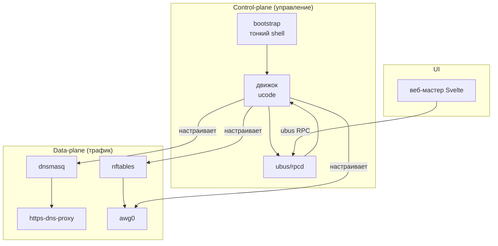

# 🏗 Архитектура — обзор слоёв

> [!tip] TL;DR
> Четыре слоя: тонкий [[bootstrap|bootstrap]] (shell) → [[engine-ucode|движок]] (ucode) →
> [[data-plane|data-plane]] (ядро: dnsmasq + nftables + awg) → [[web-wizard|веб-мастер]]
> (Svelte). Полный дизайн — [docs/architecture.md](../../architecture.md).

## Карта слоёв

## Кто за что отвечает

| Слой | Технология | Заметка | Роль |
|---|---|---|---|
| Bootstrap | shell (~150 строк) | [[bootstrap]] | kmod-amneziawg + `apk add` с GitHub Releases → открыть мастер |
| Движок | ucode | [[engine-ucode]] | preflight, шаги, генерация конфигов, ubus |
| Data-plane | dnsmasq, nftables, awg, https-dns-proxy | [[data-plane]] | через что реально идёт трафик |
| UI | Svelte | [[web-wizard]] | мастер настройки в браузере |

## Control-plane vs data-plane

Движок работает только при установке/изменении настроек и затем молчит; трафик в рантайме
обрабатывает исключительно ядро ([[data-plane]]) — подробный разбор, почему это даёт надёжность,
в [[engine-ucode#Принцип: control-plane, не data-plane|engine-ucode]].

## Дальше

- [[data-plane]] — детально про плоскость данных
- [[engine-ucode]] — детально про движок
- [[reliability]] — паттерны надёжности
- [docs/architecture.md](../../architecture.md) — полный дизайн-документ
