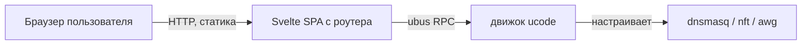

# Веб-мастер на Svelte

> [!tip] TL;DR
> Статический SPA на **Svelte**, отдаётся прямо с роутера, общается с [[engine-ucode|движком]]
> через **ubus RPC**. Задача — провести обычного человека через настройку за несколько экранов
> с минимумом вопросов. Почему Svelte — [[0003-svelte-for-ui]].

## Роль

Целевой пользователь — **не разработчик**. Он открывает `http://192.168.1.1/cheburnet/` и
проходит мастер. UI — главная точка контакта с продуктом.

## Принцип: минимум решений

Обычный человек не должен выбирать DNS-провайдера, режимы, подсети. Мастер спрашивает
**только необходимое**, остальное — разумные дефолты, «продвинутое» спрятано:

1. Имя Wi-Fi
2. Пароль Wi-Fi
3. [[amneziawg|VPN-конфиг]] (загрузка файла или вставка текста)
4. Пароль роутера

> [!important] VPN-конфиг — самый трудный шаг
> Вставить AWG-конфиг нормису тяжело. Поэтому два способа ввода (файл или вставка текста) +
> валидация с понятной ошибкой на непонятный ввод.

## Перед применением — preflight-экран

Мастер сначала показывает результат [[reliability|preflight]]: «✅ железо подходит» или
«❌ нужно ≥ X флеша» — **до** любых изменений. Пользователь не должен упереться в сбой на
середине установки.

### Роутер слабее рекомендуемого — тупик или выбор?

Отказ «не подходит, до свидания» — плохой ответ, когда не хватает пары мегабайт. Провалы делятся
по severity — [[reliability#Кирпич 1 — Preflight (гейткипер)|hard остаётся честным отказом, soft
даёт выбор]]. На **soft**-провале экран отмечает «!» и разворачивает разбор: чем это грозит и что
можно сделать **вместо** риска (освободить флеш, extroot, `zram-swap`).

Если провалены только soft-проверки, внизу — большая красная кнопка «Всё равно установить»,
неактивная до явной галочки согласия. Порядок намеренный: сначала объяснение и безопасные
варианты, риск — последним. Флаг едет как `install.accept_risk`, движок перепроверяет preflight
сам (`--allow-soft`), а решение остаётся видимым: напоминание на экране настройки и подтверждения,
плашка в панели (`status.forced`).

## Почему Svelte (кратко)

Компилятор «стирает» фреймворк → **минимальный бандл** (важно для флеша), мало boilerplate
(поддержка соло), встроенные **transitions** идеальны для пошагового мастера, реактивность
хорошо ложится на **живую статус-панель** (поллинг состояния через ubus). Полное обоснование —
[[0003-svelte-for-ui]].

## Сборка

Svelte → **Vite** собирает в один статический файл на CI → кладётся в пакет → отдаётся
роутером. Единственная цена — build-step, с ИИ-помощью управляем.

## Что умеет панель (после установки)

- статус сервисов и [[amneziawg|туннеля]] (handshake)
- переключение [[home-travel-modes|HOME ⇄ TRAVEL]]
- замена VPN-конфига и смена туннеля (с авто-откатом)
- выбор фильтрующего DNS-провайдера ([[adblock|реклама/семейный]], `set_dns_provider`)
- сбор диагностики и сброс настройки

> [!note] Что раскрыто по умолчанию
> Панель делает восемь разных вещей, и всё сразу на одном экране означало десять прокруток на
> телефоне ради кнопки «перезапустить туннель». Развёрнуто то, ради чего сюда заходят: состояние,
> режим, перезапуск сервисов, фильтрация и путь «спросить помощь». Свёрнуты (`details.group`)
> управление туннелем (`#tunnel-group`) и опасная зона (`#danger-group`) — при этом ссылки
> hero-баннера раскрывают нужный блок сами, иначе якорь прыгал бы в закрытый `
`.

## Дальше

- [[0003-svelte-for-ui]] — почему этот фреймворк
- [[bootstrap]] — как мастер попадает на роутер
- [[engine-ucode]] — что по ту сторону ubus
