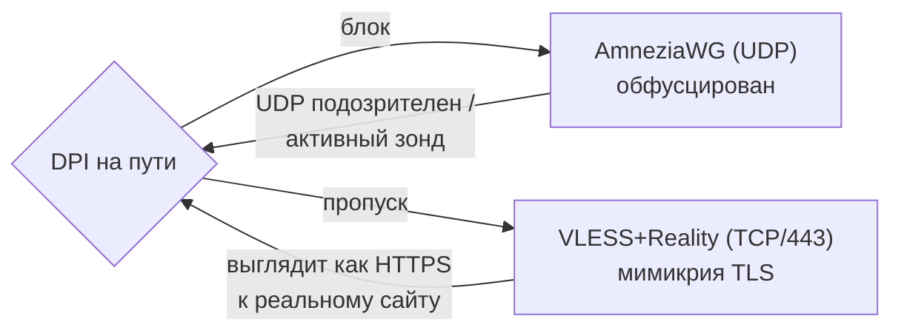
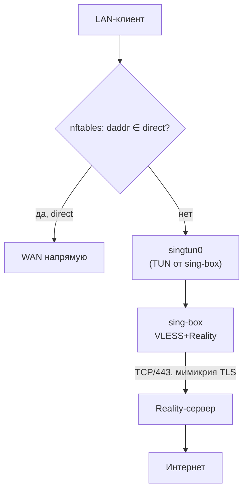

# VLESS + Reality — туннель, который выглядит как обычный HTTPS

> [!info] Когда это нужно
> Когда трафик через VPN **вообще не проходит**: DPI режет WireGuard/UDP, работает активное
> зондирование. Если туннель поднимается, но **тормозит и рвётся** — это другая поломка, и лечит
> её [[hysteria2]]. Если роутер слабый — только [[amneziawg|Light-тир]]: он легче, быстрее и едет
> на слабом железе. Full-тир (этот) — **только на мощном роутере**
> (см. [[0004-multi-protocol-tiers]]).

## Зачем вообще второй протокол

[[amneziawg|AmneziaWG]] прячет сигнатуру WireGuard обфускацией — этого достаточно против
DPI, который ищет «фингерпринт WG». Но есть сети, где блокируется **сам факт неопознанного
UDP-трафика** или работает **активное зондирование**: фильтр сам стучится на ваш сервер и
спрашивает «ты прокси?». Против этого нужен не «спрятанный WireGuard», а трафик, который
**неотличим от настоящего HTTPS к настоящему сайту**. Это и делает Reality.

## Что такое Reality (в двух идеях)

Обычный VPN-через-TLS выдаёт себя сертификатом: у вас нет валидного сертификата на чужой
домен, а самоподписанный виден сразу. **Reality решает это так:**

1. **Заимствованное рукопожатие (SNI).** Клиент начинает TLS-рукопожатие, представляясь именем
   реального крупного сайта (`sni`, например `www.microsoft.com`). Для наблюдателя на пути это
   рукопожатие к этому сайту — потому что Reality-сервер **проксирует** настоящий TLS-ответ
   этого сайта зонду, который не знает секрета.
2. **Аутентификация по X25519, а не по сертификату.** «Свой» клиент знает публичный ключ
   сервера (`pbk`) и короткий идентификатор (`sid`); он распознаёт, что это его Reality-сервер,
   и переключается на туннель. Чужой (сторонний наблюдатель на пути) ключа не знает → получает в ответ
   **настоящий** сайт и видит обычный HTTPS. Зондировать нечего.

Поверх Reality ходит **VLESS** — лёгкий транспорт без собственного шифрования (его даёт TLS),
с `flow=xtls-rprx-vision` для производительности. `fp=chrome` — uTLS-отпечаток, чтобы ClientHello
был байт-в-байт как у браузера Chrome.

> [!note] Почему именно VLESS+Reality, а не «голый» VLESS/Trojan/Shadowsocks
> См. [[0004-multi-protocol-tiers]]: «голый» VLESS детектируем, Trojan требует своего валидного
> сертификата/домена, Shadowsocks всё чаще ловят по статистике. Ценность — в слое **Reality**.

## Как это встроено в cheburnet (без чёрного ящика в маршрутизации)

Reality реализует **sing-box** (userspace-демон). Но мы намеренно **не отдаём ему
маршрутизацию** — иначе вернулся бы «магический» чёрный ящик, против которого
[[0001-why-not-singbox|ADR 0001]]. Вместо этого:

- sing-box поднимает **TUN-интерфейс `singtun0`** с `auto_route: false` — маршрут в него ставит
  наш netifd-конфиг (half-routes), не сам sing-box. Аналог у [[amneziawg|AmneziaWG]] —
  `route_allowed_ips='1'`: обоими маршрутами владеет netifd, а не сам туннельный демон.
- Тот же [[policy-routing|policy-routing]] и [[kill-switch|kill-switch]], что и в Light-тире,
  направляют «весь не-direct трафик» в `singtun0` вместо `awg0`. **Туннель взаимозаменяем** —
  data-plane (dnsmasq-nftset, пометка, ip rule, NAT-зона) переиспользуется без изменений.
- `auto_detect_interface: true` — соединение sing-box к Reality-серверу уходит в реальный WAN,
  не зацикливаясь в собственный TUN.

Итог: маршрутизация остаётся **прозрачной и в ядре**, sing-box отвечает только за один
исходящий туннель. Ученик видит ту же схему [[split-routing|split-routing]], что и в Light.

## Место в продукте: запасной путь, а не второй «режим»

Порядок для пользователя намеренно такой:

1. **Начинаем с AmneziaWG.** Он в ядре, лёгкий, идёт даже на слабом роутере — это дефолт мастера.
2. **AWG не поднимается** (типичная причина — сеть режет UDP): панель сама предлагает запасной
   путь ровно в этот момент — баннер «туннель не работает» ведёт к догрузке VLESS+Reality.
3. **Reality догружается по кнопке** (`install_full_tier` → `apk add sing-box`: ~15 МБ скачать,
   ~42 МБ на флеше) уже на
   работающем роутере: **мастер проходить заново не нужно**, AmneziaWG остаётся на месте.
4. **Переключение туда-обратно** — из панели (`switch_to_reality` / `switch_to_awg`), с
   автооткатом: не поднялся новый туннель — вернулся прежний.

Можно выбрать Reality и сразу в мастере (на подходящем железе строка активна) — это осознанный
выбор для тех, кто уже знает, что UDP в их сети не живёт.

## Требования к железу (и почему)

Reality — это TLS/AES-GCM в userspace. Без аппаратного AES (которого нет на MIPS) это медленно,
поэтому Full-тир гейтится preflight'ом: **AES-arch (ARMv8/x86), от 256 МБ RAM, ≥ 56 МБ свободного
флеша** (установленный `sing-box` весит ~42 МБ — замер `make qemu-reality`) **и устанавливаемый
`sing-box`** из feed'а. Слабый роутер честно остаётся на
AmneziaWG — не «сломанная установка», а явный выбор, и панель прямо говорит, чего не хватает
(иначе кажется, что кнопку спрятали).

> [!important] Порог RAM сравнивается с `MemTotal`, не с паспортной планкой (см. [[hardware-requirements]])
> Порог — **240 МБ** («плата на 256 МБ»). Прежние 256 не пропускали НИ ОДИН 256-МБ роутер: Full
> молча не предлагался ни в мастере, ни в панели. На рекомендуемых 512-МБ платах это не
> проявлялось.

Точные пороги подтверждаются замером на реальном железе; вес `sing-box` меряет
`make qemu-reality` и сравнивает с порогом флеша (см. [[0004-multi-protocol-tiers]]).

## Как панель понимает, что Reality работает

У AmneziaWG есть рукопожатие: видно, что **сервер отвечал** N секунд назад. У VLESS такого
сигнала нет — поэтому движок отдаёт панели признак `tunnel_health` для **активного** протокола:

| Протокол | Чем мерим | Что честно можно сказать |
|---|---|---|
| AmneziaWG | возраст рукопожатия (`awg show … latest-handshakes`) | «сервер отвечал N сек назад» |
| VLESS+Reality | процесс `sing-box` жив **и** TUN-устройство поднято | «туннель поднят» (не «сервер отвечает») |

Поэтому формулировки в панели разные, и это не небрежность: обещать «всё работает» на основании
живого процесса нельзя. Полная проверка достижимости — `connectivity-probe` (пин host-route +
запрос через туннель, см. `engine/install/probe.uc`): она дорогая, поэтому идёт при установке и
замене сервера, а не на каждый 15-секундный поллинг панели.

> [!warning] Регресс, который это чинило
> Панель судила о туннеле **только** по AWG-рукопожатию. На работающем Reality (где `awg0` не
> существует) она показывала «⚠️ VPN не работает» и предлагала заменить AWG-конфиг — а движок такую
> замену при активном Reality отвергает. То есть панель пугала и вела в тупик.

## Серверная сторона

Reality требует **своего сервера** с настроенным `sni`-таргетом (реальный сайт, чьё рукопожатие
заимствуется) и парой ключей. cheburnet берёт готовую `vless://`-ссылку из вашей панели
(3x-ui / Hiddify и т.п.) — настройка самого сервера и доставка конфигов вне рамок роутера.

Связанное: [[amneziawg]], [[policy-routing]], [[kill-switch]], [[split-routing]],
[[0004-multi-protocol-tiers]], [[0001-why-not-singbox]].
