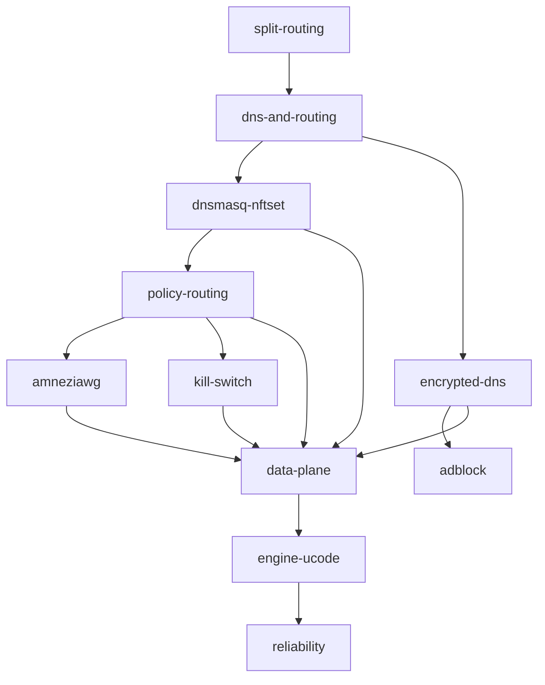

# 🏠 Home — Map of Content

Хаб навигации по базе знаний cheburnet-router v2. Всё связано отсюда.
Не знаешь, с чего начать — читай сверху вниз.

> [!tip] TL;DR проекта
> Роутер на OpenWrt: **домены из direct-списка — напрямую, остальной интернет — через VPN-туннель**,
> плюс блокировка рекламы и защита от утечек. Реализовано на примитивах ядра (без sing-box),
> чтобы было **легко** (слабое железо) и **понятно** (учебная цель).

## 🎓 Учебная траектория (от первых принципов)

Читай по порядку — каждая заметка опирается на предыдущую:

1. [[split-routing]] — что такое «раздельная маршрутизация» и почему это сложно
2. [[dns-and-routing]] — почему маршрут зависит от DNS (домен → IP → решение)
3. [[dnsmasq-nftset]] — как DNS «на лету» помечает адреса для прямого пути
4. [[policy-routing]] — как ядро разводит трафик: туннель vs напрямую
5. [[amneziawg]] — сам VPN-туннель
6. [[encrypted-dns]] — почему и как шифруем DNS (DoH)
7. [[kill-switch]] — защита от утечки, если туннель упал
8. [[adblock]] — блокировка рекламы на уровне DNS

## 🏗 Архитектура (как примитивы собраны в систему)

- [[architecture-overview]] — слои целиком
- [[data-plane]] — плоскость данных (то, через что идёт трафик)
- [[engine-ucode]] — движок управления на ucode
- [[bootstrap]] — как устанавливается (feed + apk)
- [[web-wizard]] — веб-мастер на Svelte
- [[reliability]] — три кирпича надёжности: preflight, идемпотентность, rollback

## 🤔 Решения и их причины (ADR)

- [[0001-why-not-singbox]] — почему ушли от sing-box к примитивам ядра
- [[0002-ucode-over-go]] — почему движок на ucode, а не на Go
- [[0003-svelte-for-ui]] — почему Svelte для веб-мастера
- [[0004-multi-protocol-tiers]] — тиры железа + AmneziaWG/Reality/Hysteria2 под устойчивость к DPI
- [[0005-dns-filtering-not-local-adblock]] — фильтрация рекламы/контента = выбор DNS-провайдера

## 📖 Справка

- [[glossary]] — все термины в одном месте
- [[hardware-requirements]] — какое железо подходит
- [[troubleshooting]] — что смотреть, когда сломалось

## 🧭 Мета

- [[conventions]] — как устроен vault, конвенции заметок, ингест для ИИ
- [[architecture-v2]] — полный дизайн-документ (вне vault'а, в `docs/`)

## 🗺 Граф зависимостей концепций

