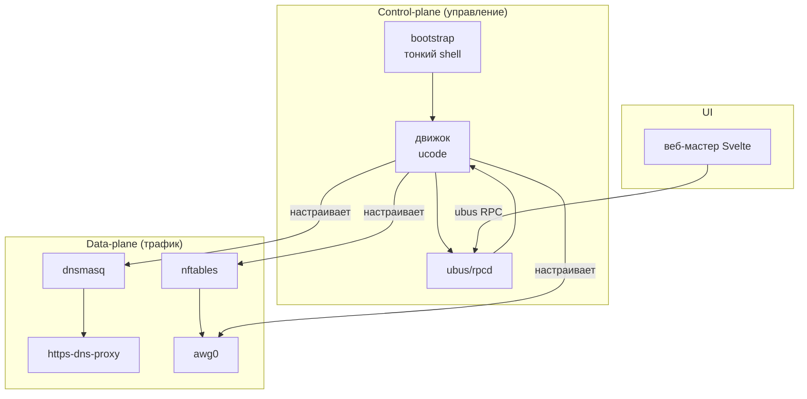

# 🏗 Архитектура — обзор слоёв

> [!tip] TL;DR
> Четыре слоя: тонкий [[bootstrap|bootstrap]] (shell) → [[engine-ucode|движок]] (ucode) →
> [[data-plane|data-plane]] (ядро: dnsmasq + nftables + awg) → [[web-wizard|веб-мастер]]
> (Svelte). Полный дизайн — [[architecture-v2]].

## Карта слоёв

## Кто за что отвечает

| Слой | Технология | Заметка | Роль |
|---|---|---|---|
| Bootstrap | shell (~30 строк) | [[bootstrap]] | добавить feed → `apk add` → открыть мастер |
| Движок | ucode | [[engine-ucode]] | preflight, шаги, генерация конфигов, ubus |
| Data-plane | dnsmasq, nftables, awg, https-dns-proxy | [[data-plane]] | через что реально идёт трафик |
| UI | Svelte | [[web-wizard]] | мастер настройки в браузере |

## Control-plane vs data-plane

Важное разделение для понимания:

- **Control-plane** (движок) работает **только при установке/изменении настроек**. Настроил —
  он молчит. Не висит в data-path.
- **Data-plane** (ядро) работает **постоянно**, но это нативные механизмы Linux — без
  пользовательских демонов в пути пакета. Поэтому легко и надёжно.

> [!note] Почему это даёт надёжность и лёгкость
> В рантайме трафик обрабатывает только ядро. Нет процесса, который «упадёт и всё сломается».
> Движок может вообще не запускаться неделями — система работает. См. [[reliability]].

## Дальше

- [[data-plane]] — детально про плоскость данных
- [[engine-ucode]] — детально про движок
- [[reliability]] — паттерны надёжности
- [[architecture-v2]] — полный дизайн-документ
