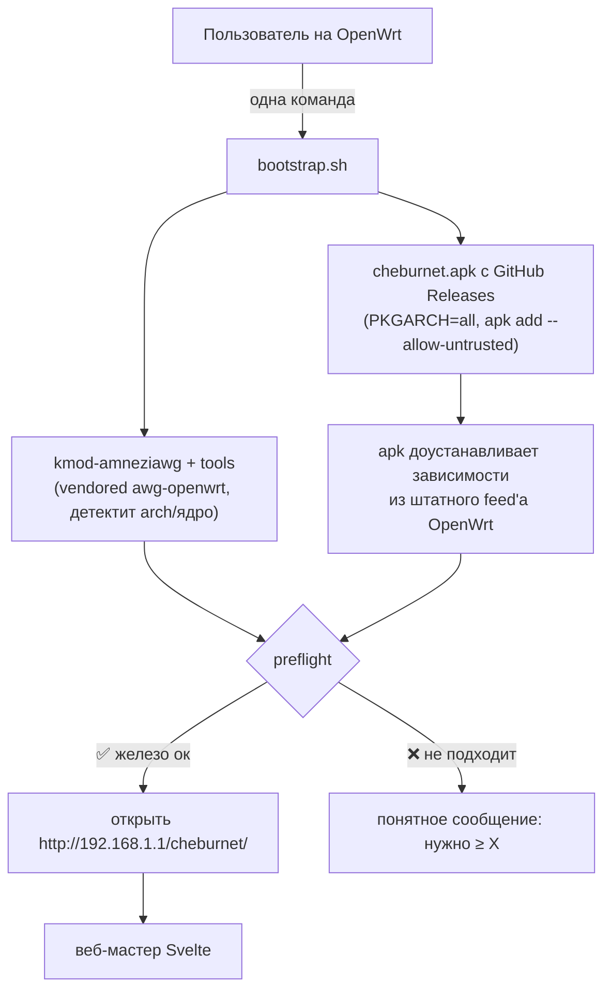

# 📦 Bootstrap и дистрибуция

> [!tip] TL;DR
> Установка = одна команда. Тонкий shell-bootstrap ставит **kmod-amneziawg** (arch/ядро-
> зависимый, через vendored-инсталлятор `awg-openwrt`) и пакет **cheburnet** (`PKGARCH:=all` —
> arch-независимый, один `.apk` на всех) с наших **GitHub Releases**, `apk add
> --allow-untrusted`. Остальные зависимости (`dnsmasq-full`, `https-dns-proxy`, …) `apk`
> доустанавливает сам из штатного, уже подписанного feed'а OpenWrt.

## Почему два источника пакетов, а не свой feed

Своего пакетного feed'а (репозитория с подписанным `APKINDEX`) у проекта **нет** — это
осознанный MVP-выбор, не пробел. Два разных источника закрывают два разных случая:

- **`kmod-amneziawg`** — модуль ядра, привязан к vermagic конкретной сборки. Собирать его самим
  под каждую OpenWrt-версию×target — неподъёмная матрица для соло-мейнтейнера. Его уже собирает
  upstream `awg-openwrt` под каждый стоковый релиз (сам детектит version/target/arch) —
  импортируем, а не владеем.
- **`cheburnet`** — arch-независим (ucode + shell + web, `PKGARCH:=all`), поэтому нужен ровно
  **один `.apk`**, а не матрица под arch. Собирается один раз в CI и лежит ассетом в наших
  GitHub Releases; `bootstrap.sh` качает его напрямую (`releases/latest/download/…`) — хостинг
  feed-индекса не нужен.
- Ставится `apk add --allow-untrusted`: apk-tools 3 доверяет пакету только через подписанный
  индекс репозитория (`APKINDEX`), а не через подпись отдельного файла — `apk add ./x.apk`
  всегда «untrusted», даже для официального пакета OpenWrt (проверено вживую). Аутентичность
  здесь = HTTPS с нашего GitHub Release, тот же уровень доверия, что и unsigned kmod из
  `awg-openwrt`. Настоящий подписанный feed (свой `APKINDEX` на GitHub Pages) — возможная
  будущая фаза, не текущее состояние.
- Всё остальное (`dnsmasq-full`, `https-dns-proxy`, `nftables`, …) — обычные пакеты из
  штатного, уже подписанного feed'а OpenWrt, который есть на любой установке из коробки. Здесь
  добавлять нечего, `apk` тянет их сам как зависимости пакета `cheburnet`.

## Поток установки

## Почему bootstrap остаётся на shell

~30 строк, shell универсален на OpenWrt (busybox есть везде). Вся **хрупкая логика — не здесь**,
а в [[engine-ucode|движке]]. Тонкий загрузчик на shell — это нормально и не противоречит уходу
от bash; мы убираем bash из *логики*, а не из 30-строчного загрузчика.

## Честная граница «универсальности»

> [!warning] «Универсально» = «где есть зависимости»
> Где под архитектуру нет `kmod-amneziawg` или `https-dns-proxy` — [[reliability|preflight]]
> честно откажет. Поэтому проверка устанавливаемости зависимостей обязательна. И помни:
> очень слабое железо (8/16 МБ флеш) физически не потянет стек — реальная полоса
> middle-range и выше. См. [[hardware-requirements]].

## Единственный barrier на пользователе

Поставить **сам OpenWrt** — вне нашего софта. Тут помогаем гайдом, видео и ссылкой на
OpenWrt firmware-selector. Всё после — одна команда.

## Сборка пакета

Пакет собирается через **OpenWrt SDK** в CI (`release.yml`, один SDK-контейнер — `PKGARCH:=all`
даёт одинаковый `.apk` независимо от arch сборки) и публикуется **ассетом GitHub Release** по
git-тегу `v*` (не в feed — см. выше). Воспроизводимо и проверяемо — см. пирамиду тестов в
[[reliability]].

## Обновление

Отдельного механизма обновления нет — **та же команда, что и установка**. Повторный запуск
`bootstrap.sh` (или ручной `apk add --allow-untrusted cheburnet.apk` свежей версии) скачивает
актуальный ассет с `releases/latest/download/…` и ставит его: `apk` сравнивает `PKG_VERSION` из
`package/cheburnet/Makefile` с уже установленным и заменяет пакет, если версия выросла — если
версия не поднята, `apk add` молча ничего не делает (урок: перед тегом релиза `PKG_VERSION`
обязан быть увеличен, иначе апгрейд на роутерах не доедет).

Конфигурация не теряется: `postinst` пакета сеет install-токен и печатает ссылку мастера
**только если `/etc/cheburnet/install.json` ещё нет** — то есть только при установке на чистую
систему. На уже настроенном роутере upgrade — no-op сверх замены файлов пакета и `rpcd reload`
(подхватить новый обработчик/ACL); сам `bootstrap.sh` тоже переиспользует существующий
install-token, если он уже создан, вместо того чтобы всегда генерировать новый.

## Дальше

- [[web-wizard]] — что открывается после установки
- [[hardware-requirements]] — что значит «подходящее железо»
- [[reliability]] — preflight как гейткипер
