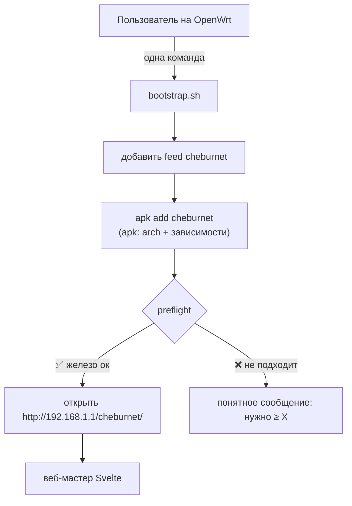

# 📦 Bootstrap и дистрибуция

> [!tip] TL;DR
> Установка = одна команда. Тонкий shell-bootstrap добавляет наш **OpenWrt-feed** и делает
> `apk add cheburnet`. `apk` сам подбирает пакет под архитектуру и тянет зависимости — отсюда
> **универсальность** под все подходящие роутеры.

## Почему feed, а не «один бинарь под всё»

«Универсально под все роутеры» технически = **разные архитектуры** (mips, arm, aarch64, x86_64).
Решать это вручную (детектить arch, качать правильный файл) — хрупко. Пакетный менеджер уже
решает обе задачи:

> `apk`/`opkg` сами выбирают **правильный пакет под arch** и доустанавливают **зависимости**.

Поэтому дистрибуция — это **feed** (репозиторий пакетов), а не самодельный установщик.

## Поток установки

## Почему bootstrap остаётся на shell

~30 строк, shell универсален на OpenWrt (busybox есть везде). Вся **хрупкая логика — не здесь**,
а в [[engine-ucode|движке]]. Тонкий загрузчик на shell — это нормально и не противоречит уходу
от bash; мы убираем bash из *логики*, а не из 30-строчного загрузчика.

## Честная граница «универсальности»

> [!warning] «Универсально» = «где есть зависимости»
> Где под архитектуру нет `kmod-amneziawg` или `https-dns-proxy` — [[reliability|preflight]]
> честно откажет. Поэтому проверка устанавливаемости зависимостей обязательна. И помни:
> очень слабое железо (8/16 МБ флеш) физически не потянет стек — реальная полоса
> middle-range и выше. См. [[hardware-requirements]].

## Единственный barrier на пользователе

Поставить **сам OpenWrt** — вне нашего софта. Тут помогаем гайдом, видео и ссылкой на
OpenWrt firmware-selector. Всё после — одна команда.

## Сборка пакета

Пакет собирается через **OpenWrt SDK** в CI (матрица архитектур), публикуется в feed при
git-теге. Воспроизводимо и проверяемо — см. пирамиду тестов в [[reliability]].

## Дальше

- [[web-wizard]] — что открывается после установки
- [[hardware-requirements]] — что значит «подходящее железо»
- [[reliability]] — preflight как гейткипер
