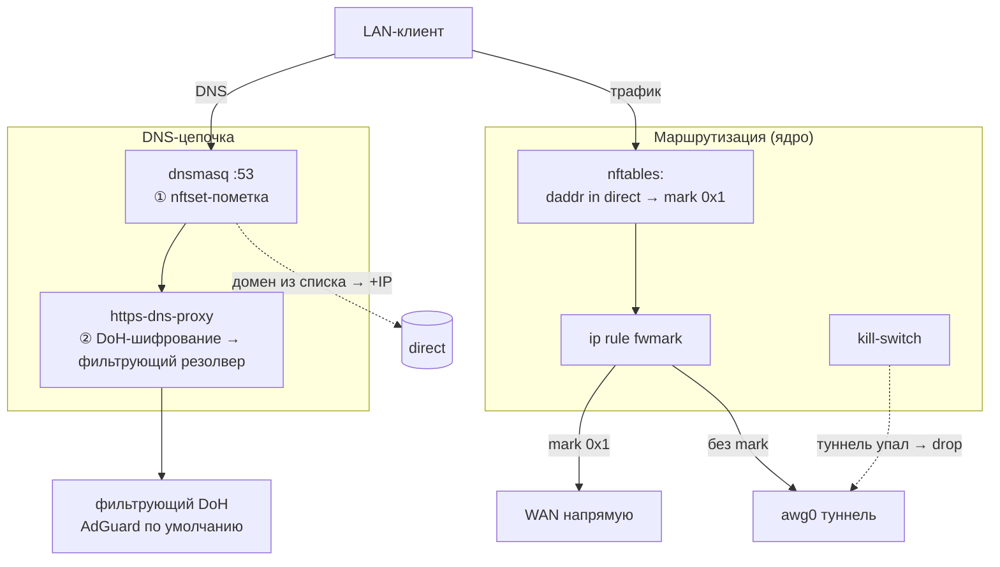

# 🌐 Data-plane — плоскость данных

> [!tip] TL;DR
> Это то, **через что реально идёт трафик** — в Light-тире (дефолт) собрано из нативных
> примитивов Linux, без sing-box: dnsmasq + https-dns-proxy + nftables + awg0. Каждый кусок
> разобран в своей концепции; здесь — как они работают вместе. (Опциональный Full-тир заменяет
> только туннель awg0 на sing-box/`singtun0` — data-plane вокруг тот же, см. [[vless-reality]].)

## Полная картина

## Два потока: DNS и трафик

### DNS-цепочка (одна на две функции)
Один резолв проходит последовательно:
1. **[[dnsmasq-nftset|nftset-пометка]]** — домен из direct-списка? → положить IP в `direct`.
2. **[[encrypted-dns|DoH]]** — upstream-запрос шифруется через https-dns-proxy и уходит в
   выбранный резолвер. **[[adblock|Блокировка рекламы/контента]]** — там же: фильтрующий провайдер
   (по умолчанию AdGuard) сам не отдаёт рекламные домены, локального блок-листа на роутере нет
   ([[0005-dns-filtering-not-local-adblock|ADR 0005]]).

### Поток трафика
1. **[[policy-routing]]** — адрес в `direct`? → mark → WAN напрямую; иначе → awg0.
2. **[[amneziawg|awg0]]** — туннель для всего непрямого.
3. **[[kill-switch]]** — если awg0 упал, непрямой трафик не утекает в WAN.

## Что мы НЕ используем (и почему)

| Не используем (в Light-тире) | Вместо этого | Причина |
|---|---|---|
| sing-box для маршрутизации | dnsmasq-nftset + policy routing | легче, нагляднее — [[0001-why-not-singbox]] |
| FakeIP | реальный IP + nftset | проще, без отдельного демона |
| TProxy-демон | нативный `ip rule` | трафик обрабатывает только ядро |
| локальный adblock-lean | выбор фильтрующего DoH-резолвера | легче, без блок-листа в RAM — [[0005-dns-filtering-not-local-adblock]] |

## Ресурсы

Весь рантайм — это ядро + dnsmasq (и так нужен) + лёгкий https-dns-proxy. Нет тяжёлого
Go-бинаря sing-box → **экономия МБ флеша и RAM** → слабые роутеры в игре. Это прямая
реализация принципа «легко ради слабого железа».

## Дальше

- [[engine-ucode]] — кто всё это настраивает
- [[reliability]] — как это не ломается
- концепции: [[dnsmasq-nftset]], [[policy-routing]], [[kill-switch]]
