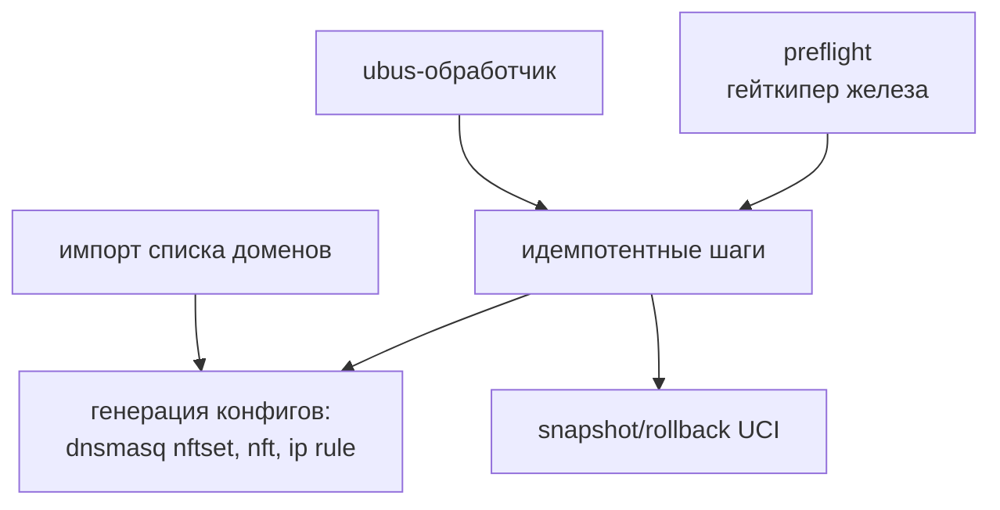

# ⚙️ Движок на ucode

> [!tip] TL;DR
> Вся логика управления (preflight, шаги установки, генерация конфигов, ubus-обработчик) —
> на **ucode**, родном языке OpenWrt. Работает только в control-plane: настроил систему и
> замолчал. Почему ucode, а не Go — [[0002-ucode-over-go]].

## Что такое ucode

[ucode](https://ucode.mediatek.org/) — встроенный в OpenWrt JS-подобный язык (автор —
мейнтейнер OpenWrt). Создан, чтобы заменить shell и Lua в системных задачах. На нём написаны
`fw4` (фаервол), `rpcd`, новый LuCI.

Даёт то, чего нет у shell: настоящие массивы/объекты, исключения, JSON из коробки, нативные
биндинги `uci`/`ubus`/`fs`. При этом **интерпретируемый** — едет на любой архитектуре без
кросс-компиляции и **не растит флеш**.

## Что делает движок

| Модуль (`engine/`) | Роль | Связь |
|---|---|---|
| `preflight/` | проверка arch/RAM/флеша/зависимостей | [[reliability]] |
| `steps/` | идемпотентные шаги по компонентам (vpn, dns, doh, wifi, firewall, rootpass, singbox) | [[reliability]] |
| `routing/` | генерация [[dnsmasq-nftset]] + [[policy-routing]] | [[data-plane]] |
| `rollback/` | snapshot/restore UCI там, где откат чистый | [[reliability]] |
| `install/` | оркестратор: preflight → snapshot → шаги → health → commit/rollback | [[reliability]] |
| `list/` | импорт и обновление community-списка доменов | [[architecture-overview]] |
| `ubus/` | RPC-обработчик для [[web-wizard]] | — |
| `lib/` | общие хелперы (`assert`, `uci`, `proc`, `conf`) | — |

## Принцип: control-plane, не data-plane

> [!important] Движок НЕ в пути трафика
> ucode-движок запускается при установке/изменении настроек и завершается. В рантайме трафик
> идёт **только через ядро** ([[data-plane]]). Поэтому даже если бы движок упал — работающая
> система не страдает. Это сознательное разделение ради надёжности.

## Тестируемость

Логика движка (preflight, генерация конфигов, диффы) — **чистые функции**, тестируются юнит-тестами
ucode **без роутера**, за секунды в CI. Это то, чего почти невозможно добиться на shell, и
главная причина ухода от bash. См. пирамиду тестов в [[reliability]] и [[architecture-v2]].

## Честный размен

ucode нишевый: мало доков, ИИ знает его хуже популярных языков. Принято сознательно ради
footprint; компенсируем изучением спеки и проверкой ИИ-вывода. Полное обоснование и условие
пересмотра — [[0002-ucode-over-go]].

## Дальше

- [[reliability]] — preflight, идемпотентность, rollback детально
- [[bootstrap]] — как движок попадает на роутер
- [[0002-ucode-over-go]] — почему этот язык
