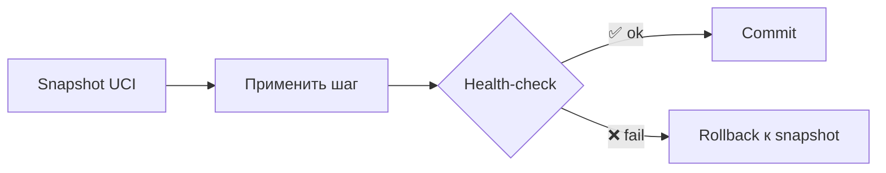
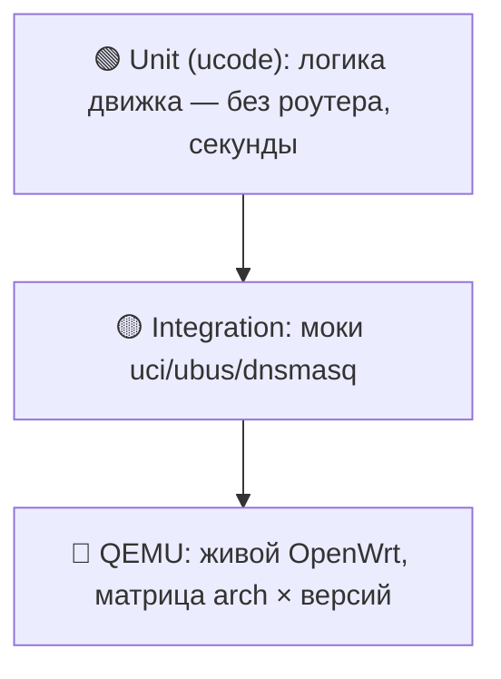

# 🛡 Надёжность — три кирпича

> [!tip] TL;DR
> Сознательно **не** строим generic desired-state движок (это путь Ansible — годы и команды,
> и источник скрытых багов). Вместо него — три простых механизма, каждый понятен целиком:
> **preflight · идемпотентные шаги · точечный rollback**. Простота = надёжность.

## Почему не generic-движок

Полноценный reconciler звучит красиво, но для соло-мейнтейнера это over-engineering: годы
разработки, а полу-готовая абстракция **прячет** баги и оказывается ненадёжнее простых шагов.
Принцип проекта: *надёжным делаем только то, что держим в голове целиком.*
Подробный разбор размена — [[0001-why-not-singbox]] (та же философия «без чёрных ящиков»).

## Кирпич 1 — Preflight (гейткипер)

Перед **любыми** изменениями движок проверяет железо и отказывает с понятной ошибкой:

| Проверка | Зачем |
|---|---|
| arch ∈ поддерживаемых | бинарь зависимостей существует |
| версия OpenWrt ≥ 25.12 | API/пакеты совместимы |
| свободный флеш / RAM ≥ порога | стек влезет и не упадёт |
| **зависимости устанавливаются** (`kmod-amneziawg`, `https-dns-proxy`…) | **главный чек** |
| нет конфликта LAN/WAN | не отрезать себе доступ |

Это заменяет «список поддерживаемых моделей»: не тестируем каждую модель, а честно проверяем
требования. См. [[hardware-requirements]].

## Кирпич 2 — Идемпотентные шаги

Установка — набор шагов (DNS, firewall, vpn, wifi, adblock). **Каждый можно запустить дважды
без вреда**: шаг сам проверяет «уже сделано? → пропустить». Повторный запуск **чинит**, а не
ломает. Нет глобального «состояния системы» — каждый шаг самодостаточен.

> [!example] Идемпотентность на практике
> Перед `uci add` — удалить существующее правило с тем же именем. Перед добавлением cron —
> `grep -v PATTERN`. Иначе повторная установка плодит дубликаты.

## Кирпич 3 — Точечный rollback

UCI-конфиги откатываются чисто → на них транзакция со snapshot.

> [!warning] Честность важнее красивой абстракции
> Операции с **грязным откатом** (загруженный kmod, изменённое состояние сети) **не маскируем
> под транзакцию**. Для них — честный **safe-fail + понятная ошибка пользователю**, а не
> иллюзия отката. Притворяться, что откатили то, что не откатывается — хуже, чем честно сказать.

## Поверх всего: fail-safe направление

Архитектурный выбор «дефолт-туннель» означает, что даже при сбое логики трафик уходит в VPN,
а не утекает. См. [[split-routing#Почему направление именно «дефолт-туннель»]] и [[kill-switch]].

## Пирамида тестов

CI: lint + unit → сборка пакета (OpenWrt SDK, матрица arch) → boot в QEMU (проверка split и
корректных отказов preflight) → при теге публикация feed. **Тестируем архитектуры, не модели.**

## Дальше

- [[engine-ucode]] — где живут эти кирпичи
- [[hardware-requirements]] — что проверяет preflight
- [[architecture-v2]] — полный дизайн и план фаз
