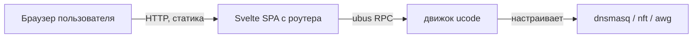

# 🪄 Веб-мастер на Svelte

> [!tip] TL;DR
> Статический SPA на **Svelte**, отдаётся прямо с роутера, общается с [[engine-ucode|движком]]
> через **ubus RPC**. Задача — провести обычного человека через настройку за несколько экранов
> с минимумом вопросов. Почему Svelte — [[0003-svelte-for-ui]].

## Роль

Целевой пользователь — **не разработчик**. Он открывает `http://192.168.1.1/cheburnet/` и
проходит мастер. UI — главная точка контакта с продуктом.

## Принцип: минимум решений

Обычный человек не должен выбирать DNS-провайдера, режимы, подсети. Мастер спрашивает
**только необходимое**, остальное — разумные дефолты, «продвинутое» спрятано:

1. Имя Wi-Fi
2. Пароль Wi-Fi
3. [[amneziawg|VPN-конфиг]] (файл / **QR-код** / вставка текста)
4. Пароль роутера

> [!important] VPN-конфиг — самый трудный шаг
> Вставить AWG-конфиг нормису тяжело. Поэтому три способа ввода + валидация с понятной
> ошибкой. **QR-код камерой телефона** — самый дружелюбный.

## Перед применением — preflight-экран

Мастер сначала показывает результат [[reliability|preflight]]: «✅ железо подходит» или
«❌ нужно ≥ X флеша» — **до** любых изменений. Пользователь не должен упереться в сбой на
середине установки.

## Почему Svelte (кратко)

Компилятор «стирает» фреймворк → **минимальный бандл** (важно для флеша), мало boilerplate
(поддержка соло), встроенные **transitions** идеальны для пошагового мастера, реактивность
хорошо ложится на **живую статус-панель** (поллинг состояния через ubus). Полное обоснование —
[[0003-svelte-for-ui]].

## Сборка

Svelte → **Vite** собирает в один статический файл на CI → кладётся в пакет → отдаётся
роутером. Единственная цена — build-step, с ИИ-помощью управляем.

## Что умеет панель (после установки)

- статус сервисов и [[amneziawg|туннеля]] (handshake)
- переключение [[home-travel-modes|HOME ⇄ TRAVEL]]
- замена VPN-конфига (с авто-откатом)
- семейный фильтр / [[adblock]]

## Дальше

- [[0003-svelte-for-ui]] — почему этот фреймворк
- [[bootstrap]] — как мастер попадает на роутер
- [[engine-ucode]] — что по ту сторону ubus
