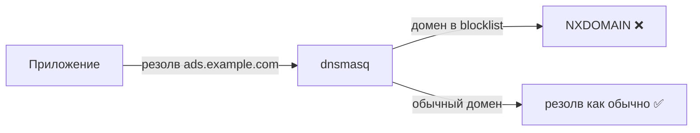

# 🚫 Adblock — блокировка рекламы через DNS

> [!tip] TL;DR
> Реклама грузится с известных доменов. Если **dnsmasq отвечает «не существует» на эти домены**,
> реклама просто не загружается — для всех устройств в сети, без приложений на каждом.

## Принцип

Большие списки рекламных/трекерных доменов (Hagezi, ~200k записей) загружаются в dnsmasq.
Когда устройство пытается резолвить рекламный домен — dnsmasq возвращает «нет такого»,
и браузер/приложение не загружает рекламу.



Реализует это `adblock-lean` — лёгкий инструмент, который скармливает blocklist'ы dnsmasq.

## Почему на уровне роутера — это правильно

- **Одно место на всю сеть** — работает для телефонов, смарт-ТВ, IoT, где adblock не поставить.
- **Никаких приложений** на каждом устройстве.
- **Бесплатно по ресурсам** — это просто DNS-ответы, без разбора трафика.

## Место в цепочке DNS

Adblock встроен в ту же цепочку, что и [[encrypted-dns|DoH]] и [[dnsmasq-nftset|пометка адресов]]:

```
Клиент → dnsmasq [adblock-фильтр + nftset-пометка] → https-dns-proxy → DoH upstream
```

То есть один резолв проходит три функции сразу: блокировка → пометка для маршрута → шифрование.

## Не блокирует слишком много

> [!note] Баланс
> Берём списки уровня «реклама и трекеры», не «агрессивная фильтрация», чтобы не ломать
> легитимные сайты. Цель — чтобы у бабушки ничего не отвалилось, а не максимальная паранойя.

## Дальше

- [[encrypted-dns]] — шифрование в той же цепочке
- [[data-plane]] — общая картина DNS + маршрутизации
