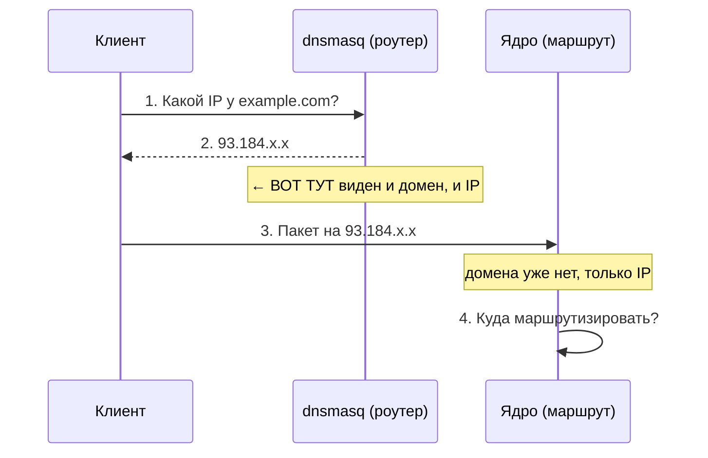

# 🔗 DNS и маршрутизация — почему они связаны

> [!tip] TL;DR
> DNS — **единственный момент, когда роутер видит и домен, и будущий IP одновременно.**
> Поэтому именно в DNS мы принимаем решение «этот сайт — прямой или туннельный».

## Что происходит при открытии сайта

Шаг 2 — **золотая точка**: dnsmasq знает, что `example.com` (домен) резолвится в `93.184.x.x`
(IP). К шагу 4 домен потерян. Значит, всё, что зависит от домена, надо решить **на шаге 2**.

## Идея: «обогащаем» DNS-ответ решением о маршруте

Раз на шаге 2 виден домен — пусть dnsmasq не только ответит клиенту, но и **запомнит**:
«адрес `93.184.x.x` принадлежит домену из direct-списка → пометить как прямой». Эту пометку
потом прочитает ядро на шаге 4.

Технически пометка — это запись IP в **nftables-множество** (set) `direct`. Как именно —
[[dnsmasq-nftset]].

## Почему нельзя просто «маршрутизировать по списку IP»

Наивный вариант: завести статический список IP и маршрутизировать по нему. Не работает
надёжно, потому что:

- **IP меняются** — сервисы переезжают, используют CDN с динамическими адресами.
- **Один IP ≠ один сайт** — CDN-адрес обслуживает много доменов.
- **Список огромен и устаревает** — поддерживать вручную нереально.

Домен — стабильный и осмысленный идентификатор. Поэтому решаем **по домену в момент DNS**,
а IP-множество строим динамически и автоматически.

## Зависимость от того, что клиент использует НАШ DNS

У подхода есть условие: клиент должен резолвить через dnsmasq роутера. Если устройство
использует **свой DoH** (Chrome, смарт-ТВ с захардкоженным DNS) — мы не увидим его резолв,
и его домены из списка не попадут в `direct`.

> [!note] Это не ломает нас — благодаря fail-safe
> Такой клиент просто пойдёт **через туннель** (наш дефолт). Он потеряет «прямой путь» для
> доменов из списка, но не утечёт. См. [[split-routing#Почему направление именно «дефолт-туннель»]].

## Дальше

- [[dnsmasq-nftset]] — как именно DNS помечает адреса
- [[encrypted-dns]] — как мы при этом ещё и шифруем DNS
- [[policy-routing]] — как ядро читает пометку
