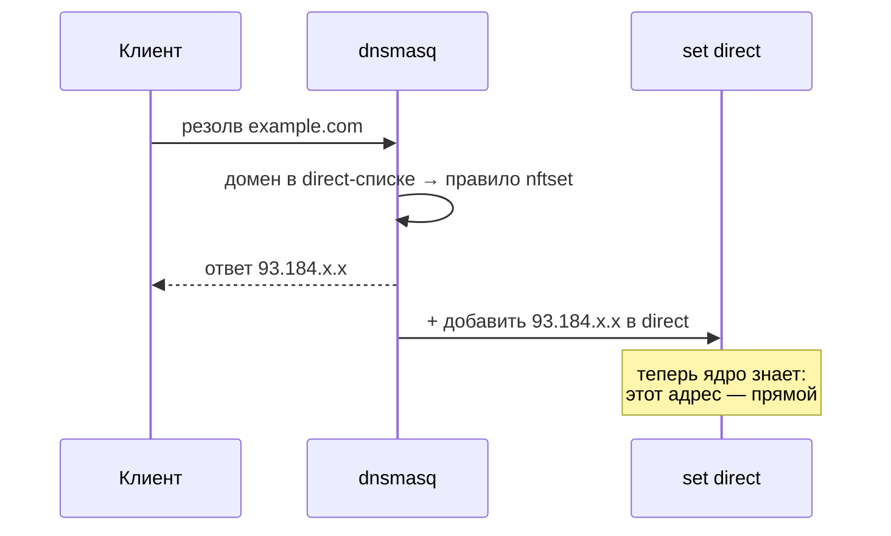

# 🏷 dnsmasq-nftset — как DNS помечает адреса

> [!tip] TL;DR
> dnsmasq умеет: «если резолвится домен из списка — положи полученный IP в nftables-множество».
> Это и есть мост [[dns-and-routing|домен → IP]]. Директива — `nftset`.

## Что такое nftset

`nftables` (фаервол OpenWrt, таблица `inet fw4`) поддерживает **именованные множества** (sets) —
динамические наборы адресов. dnsmasq может **наполнять** такое множество на лету: при резолве
домена из заданного списка он добавляет ответный IP в set.

Объявляем множество (адреса IPv4 и IPv6):

```
# nftables: множество для «прямых» адресов
nft add set inet fw4 direct  { type ipv4_addr\; flags interval\; }
nft add set inet fw4 direct6 { type ipv6_addr\; flags interval\; }
```

## Связываем домены с множеством

В конфиге dnsmasq (OpenWrt: `/etc/config/dhcp`) перечисляем, какие домены наполняют `direct`.
Что попадёт в этот список — задаёт пользователь (или импортируемый им community-список):

```
# /etc/config/dhcp — секция dnsmasq
list nftset '/example.com/4#inet#fw4#direct'      # конкретный домен
list nftset '/example.com/6#inet#fw4#direct6'
list nftset '/example.org/4#inet#fw4#direct'      # и любые домены/TLD из вашего списка
list nftset '/example.org/6#inet#fw4#direct6'
```

Формат значения: `/<домен>/<семейство>#<таблица-family>#<таблица>#<имя-set>`.
Можно матчить как конкретные домены, так и целые TLD (`/<tld>/...`).

> [!warning] IDN-домены — это punycode
> Не-ASCII домены в DNS представлены в punycode (`xn--...`). Если в direct-список нужны такие
> домены — матчить надо их punycode-форму, а не юникод.

## Что происходит в рантайме



После этого любой пакет на `93.184.x.x` ядро увидит в множестве `direct` и отправит
напрямую — см. [[policy-routing]].

## Почему это лучше FakeIP/sing-box для нашей задачи

sing-box решает ту же задачу через FakeIP (выдаёт фейковый `198.18.x.x` и перехватывает).
Мощно, но это **чёрный ящик** и тяжёлый бинарь. nftset:

- **легче** — ничего лишнего, только dnsmasq + ядро (важно для слабого железа);
- **нагляднее** — видно каждый шаг (учебная цель);
- **проще поддерживать** — нет отдельного демона со своим конфигом.

Размен (обход DNS клиентом, общие CDN-IP) разобран в [[0001-why-not-singbox]] и
[[dns-and-routing#Зависимость от того, что клиент использует НАШ DNS]].

## Где это живёт в проекте

Генерацией `nftset`-строк и объявлением множеств занимается [[engine-ucode|движок]]
(модуль `engine/routing/`), на основе пользовательского/импортированного списка
(см. [[architecture-overview]]).

## Дальше

- [[policy-routing]] — как ядро использует множество
- [[encrypted-dns]] — DNS при этом ещё и зашифрован
