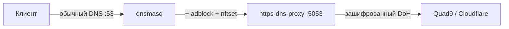

# 🔒 Зашифрованный DNS (DoH)

> [!tip] TL;DR
> Обычный DNS идёт открытым текстом — провайдер видит, какие сайты ты резолвишь, и может
> подменять ответы. **DoH (DNS over HTTPS)** шифрует резолв. У нас его обеспечивает лёгкий
> демон `https-dns-proxy` перед dnsmasq.

## Проблема обычного DNS

DNS по умолчанию — это UDP/53 открытым текстом. Последствия:

- **Приватность:** любой на пути (провайдер, публичный Wi-Fi) видит каждый домен, который ты
  запрашиваешь — даже если сам сайт по HTTPS.
- **Целостность:** DNS-ответ по открытому каналу можно перехватить и подменить (man-in-the-middle).

## Решение: DoH

**DNS over HTTPS** заворачивает DNS-запросы в обычный HTTPS к доверенному резолверу
(например, Quad9 `9.9.9.9`). Снаружи это неотличимо от обычного web-трафика → нельзя ни
прочитать, ни подменить.

## Как встроено у нас

В v1 DoH давал sing-box. В v2 (без sing-box, см. [[0001-why-not-singbox]]) — отдельный
**лёгкий** демон `https-dns-proxy`:

- Клиент → **dnsmasq** (тут же [[adblock]] и [[dnsmasq-nftset|пометка адресов]]).
- dnsmasq форвардит upstream-запросы в **https-dns-proxy** (локально, :5053).
- https-dns-proxy шифрует и шлёт в Quad9/Cloudflare по HTTPS.

Так мы совмещаем три вещи в одной цепочке DNS: **блокировка рекламы**, **пометка для
split-routing** и **шифрование upstream**.

> [!note] Почему именно так, а не «DoH на клиенте»
> Если каждое устройство делает свой DoH — мы теряем [[dnsmasq-nftset|пометку адресов]]
> (роутер не видит резолв) и adblock. Централизованный DNS на роутере даёт и приватность,
> и наши функции. Размен описан в [[dns-and-routing]].

## Выбор резолвера

По умолчанию — **Quad9** (швейцарский, no-log, блокирует malware-домены). Fallback —
Cloudflare. Пользователь не обязан в этом разбираться; продвинутый — может сменить.

## Дальше

- [[adblock]] — блокировка рекламы в той же цепочке
- [[dnsmasq-nftset]] — пометка адресов в той же цепочке
