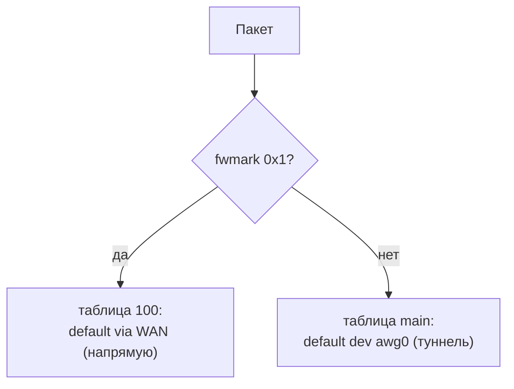

# 🧭 Policy routing — как ядро разводит трафик

> [!tip] TL;DR
> У Linux может быть **несколько таблиц маршрутизации**, и `ip rule` выбирает, какую применить
> к пакету. Мы помечаем «прямые» пакеты fwmark'ом и отправляем их в таблицу с маршрутом через
> WAN; всё остальное идёт в таблицу с маршрутом через [[amneziawg|туннель]].

## Обычная маршрутизация vs policy routing

Обычно у Linux одна таблица маршрутов (`main`) и одно решение: «куда default route». Нам этого
мало — нужно **два разных default'а** для разного трафика. Решение — **policy routing**:

1. Несколько таблиц маршрутизации (например, `main` и `100`).
2. `ip rule` — правила «какой пакет в какую таблицу».



## Собираем по шагам

### 1. Помечаем «прямые» пакеты

Пакет, чей адрес назначения лежит в множестве [[dnsmasq-nftset|direct]], помечаем
fwmark `0x1`:

```
nft add rule inet fw4 mangle_prerouting ip daddr  @direct  meta mark set 0x1
nft add rule inet fw4 mangle_prerouting ip6 daddr @direct6 meta mark set 0x1
```

### 2. Правило: помеченные → таблица 100

```
ip rule add fwmark 0x1 lookup 100
```

### 3. Таблица 100 = напрямую через WAN

```
ip route add default via <WAN-gateway> dev <wan-if> table 100
```

### 4. Основная таблица = в туннель

```
# main-таблица: весь прочий трафик уходит в awg0
ip route add default dev awg0
```

Итог: адрес в `direct` → mark `0x1` → таблица 100 → **WAN напрямую**.
Любой другой адрес → mark нет → таблица `main` → **awg0 туннель**.

## Режимы HOME / TRAVEL

- **HOME** — правила выше активны: домены из direct-списка напрямую, остальное в туннель.
- **TRAVEL** — убираем правила направления `direct` → **весь** трафик идёт в туннель
  (full tunnel). Реализуется снятием `ip rule`/правил пометки. См. [[home-travel-modes]].

## Связь с kill-switch

Policy routing решает «куда идёт трафик», а [[kill-switch]] гарантирует, что если туннель
упал — непрямой трафик **не уйдёт в WAN мимо туннеля** (иначе утечка). Эти два механизма
дополняют друг друга.

## Почему это надёжно и легко

Всё делает **ядро** — никаких пользовательских демонов в data-path. Минимум CPU/RAM,
нет процесса, который может упасть. Идеально для слабого железа и для понимания: каждый
`ip rule`/`nft` виден и проверяем (`ip rule show`, `nft list ruleset`).

## Дальше

- [[amneziawg]] — сам туннель
- [[kill-switch]] — защита от утечки
- [[data-plane]] — полная картина
