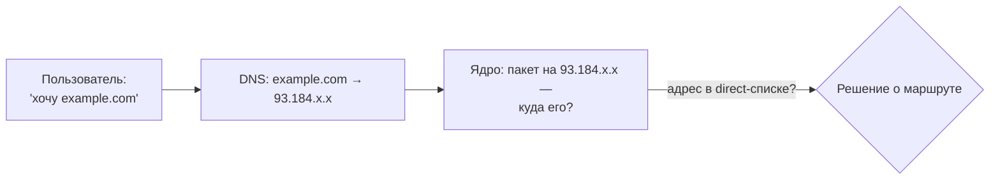

# 🚦 Split-routing — раздельная маршрутизация

> [!tip] TL;DR
> «Часть трафика — в туннель, часть — напрямую». Звучит просто, но сложность в одном:
> **решение о маршруте принимается по домену, а ядро маршрутизирует по IP-адресу.**
> Весь наш data-plane — это мост между «доменом» и «адресом».

## Что это

Split-routing (split-tunnel) — это когда роутер отправляет **разный трафик разными путями**.
Пользователь задаёт **список доменов прямого доступа** (direct-список), и роутер делит:

- Домены из **direct-списка** → **напрямую через WAN** (без туннеля). Зачем напрямую — у каждого
  своё: локальные сервисы, низкая задержка, или сайты, которые иначе ведут себя по-другому
  (например, чувствительные к источнику соединения или геолокации) при доступе через VPN.
- Весь **остальной** трафик → **через зашифрованный [[amneziawg|VPN-туннель]]**.

Противоположность — «full tunnel», когда вообще всё идёт в VPN (наш режим TRAVEL,
см. [[home-travel-modes]]).

> [!note] direct-список — это пользовательская настройка
> Что попадёт в direct-список — решает пользователь (или импортируемый им community-список).
> Проект даёт **механизм** разделения, а не зашитый выбор «что куда».

## В чём фундаментальная сложность

Вот ключевая идея, которую важно понять:

> **Пользователь думает доменами («открой `example.com`»), а ядро Linux маршрутизирует пакеты
> по IP-адресам.** Между ними — DNS.

Проблема: к моменту, когда пакет доходит до маршрутизатора ядра, **домена уже нет** — есть
только IP назначения. А принадлежность к direct-списку — это свойство *домена*, не всегда
очевидное из IP (один CDN-адрес может обслуживать много разных сайтов).

## Как мы это решаем (обзор)

Идея: **поймать связь «домен → IP» в момент DNS-резолва** и запомнить «эти IP — прямые».

1. [[dns-and-routing]] — почему DNS это точка, где ещё виден домен.
2. [[dnsmasq-nftset]] — dnsmasq при резолве домена из списка кладёт его IP в nftables-множество
   `direct`.
3. [[policy-routing]] — ядро смотрит: адрес в `direct`? → напрямую; иначе → в туннель.

Это **классический способ OpenWrt**, проверенный годами. Мы выбрали его вместо sing-box
ради лёгкости и наглядности — см. [[0001-why-not-singbox]].

## Почему направление именно «дефолт-туннель»

Критично для надёжности: **по умолчанию всё идёт в туннель**, а direct-список — это *исключения*.

> [!important] Fail-safe
> Если список неполон или клиент обошёл наш DNS — трафик просто пойдёт **через VPN**
> (работает, чуть медленнее), а **не утечёт** напрямую. Промах безопасен.
> Обратное направление («дефолт напрямую, часть в VPN») было бы опасным: промах = утечка.

## Дальше

- [[dns-and-routing]] — следующий шаг траектории
- [[data-plane]] — как всё собрано вместе
- [[glossary]] — термины
