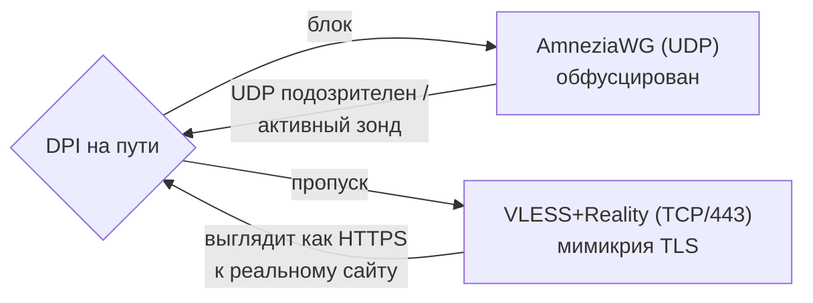
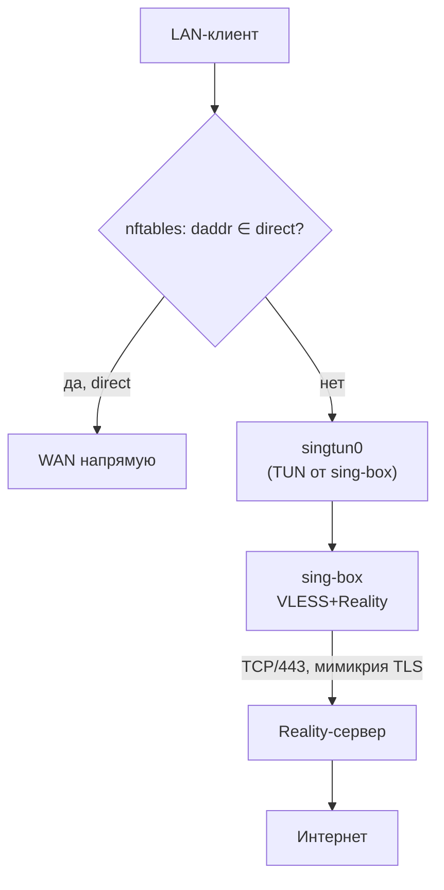

# VLESS + Reality — туннель, который выглядит как обычный HTTPS

> [!info] Когда это нужно
> Только если **AmneziaWG не проходит** в вашей сети (DPI режет WireGuard/UDP). В большинстве
> сетей хватает [[amneziawg|Light-тира]] — он легче, быстрее и едет на слабом железе. Full-тир
> (этот) — для сетей с агрессивным DPI и **только на мощном роутере** (см. [[0004-multi-protocol-tiers]]).

## Зачем вообще второй протокол

[[amneziawg|AmneziaWG]] прячет сигнатуру WireGuard обфускацией — этого достаточно против
DPI, который ищет «фингерпринт WG». Но есть сети, где блокируется **сам факт неопознанного
UDP-трафика** или работает **активное зондирование**: фильтр сам стучится на ваш сервер и
спрашивает «ты прокси?». Против этого нужен не «спрятанный WireGuard», а трафик, который
**неотличим от настоящего HTTPS к настоящему сайту**. Это и делает Reality.

## Что такое Reality (в двух идеях)

Обычный VPN-через-TLS выдаёт себя сертификатом: у вас нет валидного сертификата на чужой
домен, а самоподписанный виден сразу. **Reality решает это так:**

1. **Заимствованное рукопожатие (SNI).** Клиент начинает TLS-рукопожатие, представляясь именем
   реального крупного сайта (`sni`, например `www.microsoft.com`). Для наблюдателя на пути это
   рукопожатие к этому сайту — потому что Reality-сервер **проксирует** настоящий TLS-ответ
   этого сайта зонду, который не знает секрета.
2. **Аутентификация по X25519, а не по сертификату.** «Свой» клиент знает публичный ключ
   сервера (`pbk`) и короткий идентификатор (`sid`); он распознаёт, что это его Reality-сервер,
   и переключается на туннель. Чужой (зонд цензора) ключа не знает → получает в ответ
   **настоящий** сайт и видит обычный HTTPS. Зондировать нечего.

Поверх Reality ходит **VLESS** — лёгкий транспорт без собственного шифрования (его даёт TLS),
с `flow=xtls-rprx-vision` для производительности. `fp=chrome` — uTLS-отпечаток, чтобы ClientHello
был байт-в-байт как у браузера Chrome.

> [!note] Почему именно VLESS+Reality, а не «голый» VLESS/Trojan/Shadowsocks
> См. [[0004-multi-protocol-tiers]]: «голый» VLESS детектируем, Trojan требует своего валидного
> сертификата/домена, Shadowsocks всё чаще ловят по статистике. Ценность — в слое **Reality**.

## Как это встроено в cheburnet (без чёрного ящика в маршрутизации)

Reality реализует **sing-box** (userspace-демон). Но мы намеренно **не отдаём ему
маршрутизацию** — иначе вернулся бы «магический» чёрный ящик, против которого
[[0001-why-not-singbox|ADR 0001]]. Вместо этого:

- sing-box поднимает **TUN-интерфейс `singtun0`** с `auto_route: false` — он **не трогает**
  таблицы маршрутизации. Это прямой аналог инварианта `route_allowed_ips='0'` у
  [[amneziawg|AmneziaWG]].
- Тот же [[policy-routing|policy-routing]] и [[kill-switch|kill-switch]], что и в Light-тире,
  направляют «весь не-direct трафик» в `singtun0` вместо `awg0`. **Туннель взаимозаменяем** —
  data-plane (dnsmasq-nftset, пометка, ip rule, NAT-зона) переиспользуется без изменений.
- `auto_detect_interface: true` — соединение sing-box к Reality-серверу уходит в реальный WAN,
  не зацикливаясь в собственный TUN.

Итог: маршрутизация остаётся **прозрачной и в ядре**, sing-box отвечает только за один
исходящий туннель. Ученик видит ту же схему [[split-routing|split-routing]], что и в Light.

## Требования к железу (и почему)

Reality — это TLS/AES-GCM в userspace. Без аппаратного AES (которого нет на MIPS) это медленно,
поэтому Full-тир гейтится preflight'ом: **AES-arch (ARMv8/x86), ≥256 МБ RAM, ≥128 МБ флеша,
устанавливаемый `sing-box`** (пакет `cheburnet-full`). Слабый роутер честно остаётся на
AmneziaWG — не «сломанная установка», а явный выбор. Точные пороги подтверждаются замером
throughput/RAM на реальном железе (см. [[0004-multi-protocol-tiers]]).

## Серверная сторона

Reality требует **своего сервера** с настроенным `sni`-таргетом (реальный сайт, чьё рукопожатие
заимствуется) и парой ключей. cheburnet берёт готовую `vless://`-ссылку из вашей панели
(3x-ui / Hiddify и т.п.) — настройка самого сервера и доставка конфигов вне рамок роутера.

Связанное: [[amneziawg]], [[policy-routing]], [[kill-switch]], [[split-routing]],
[[0004-multi-protocol-tiers]], [[0001-why-not-singbox]].
